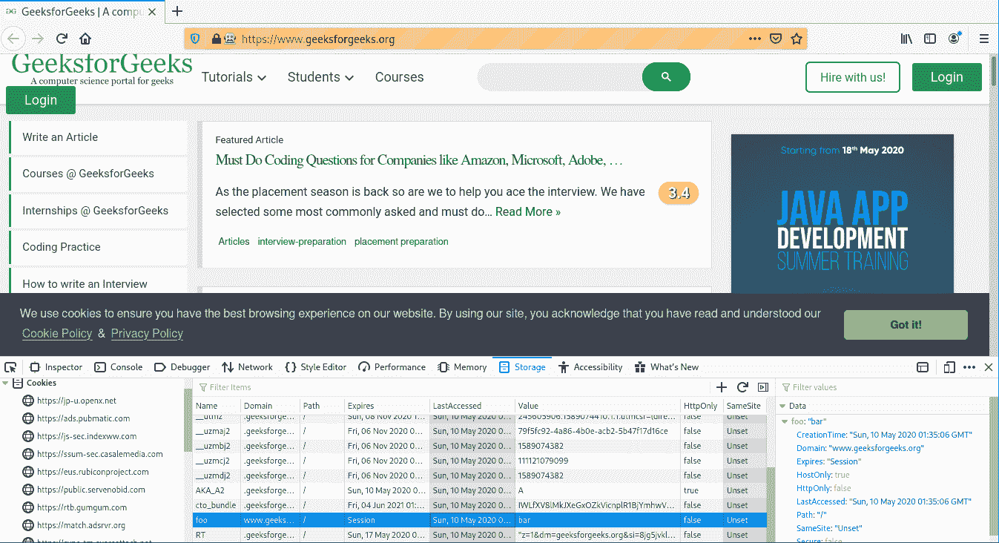
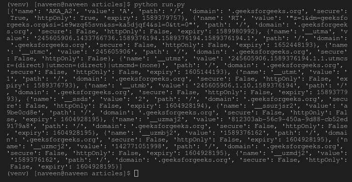

# 在Selenium Python中添加和删除Cookies

> 原文：[https://www.geeksforgeeks.org/adding-and-deleting-cookies-in-selenium-python/](https://www.geeksforgeeks.org/adding-and-deleting-cookies-in-selenium-python/)

Selenium的Python模块是为使用Python执行自动化测试而构建的。Selenium Python绑定提供了一个简单的API，可以使用Selenium WebDriver编写功能/验收测试。要使用Selenium Python打开网页，请使用`get`方法 - [Selenium Python绑定 - 导航链接](https://www.geeksforgeeks.org/navigating-links-using-get-method-selenium-python/)。仅仅能够去一些地方并没有多大用处。我们真正想做的是与页面交互，或者更具体地说，与页面中的HTML元素交互。使用Selenium有多种元素定位策略 - [定位策略](https://www.geeksforgeeks.org/locator-strategies-selenium-python/)。Selenium WebDriver提供了各种有用的方法来控制会话，或者换句话说，浏览器。例如，添加cookie、按后退按钮、在选项卡间导航等。

操作cookie通常是必不可少的。cookie可能需要手动添加或手动删除，以实现网站的某个阶段，如身份验证。在Selenium Python中操作cookie的各种方法有：

## `add_cookie` 驱动程序方法

`add_cookie`方法用于将cookie添加到您当前的会话中。这个cookie可以被网站本身使用，也可以被你使用。

**语法：**

```py
add_cookie(cookie_dict)
```

**示例：**
现在可以使用`add_cookie`方法作为驱动程序方法，如下所示：

```py
driver.add_cookie({'name' : 'foo', 'value' : 'bar'})
```

检查项目访问中`add_cookie`方法的单独实现 - [`add_cookie`驱动程序方法](https://www.geeksforgeeks.org/add_cookie-driver-method-selenium-python/)。

## `get_cookie` 驱动程序方法

`get_cookie`方法用于获取指定名称的cookie。如果找到，它返回cookie，如果没有，则返回None。

**语法：**

```py
driver.get_cookie(name)
```

**示例：**
现在可以使用`get_cookie`方法作为驱动程序方法，如下所示：

```py
driver.get("https://www.geeksforgeeks.org/")
driver.get_cookie("foo")
```

检查项目访问中`get_cookie`方法的单独实现 - [`get_cookie`驱动程序方法](https://www.geeksforgeeks.org/get_cookie-driver-method-selenium-python/)。

## `delete_cookie` 驱动程序方法

`delete_cookie`方法用于删除指定值的cookie。

**语法：**

```py
driver.delete_cookie(name)
```

**示例：**
现在可以使用`delete_cookie`方法作为驱动程序方法，如下所示：

```py
driver.get("https://www.geeksforgeeks.org/")
driver.delete_cookie("foo")
```

检查项目访问中`delete_cookie`方法的个别实现 - [`delete_cookie`驱动程序方法](https://www.geeksforgeeks.org/delete_cookie-driver-method-selenium-python/)。

## `get_cookies` 驱动程序方法

`get_cookies`方法用于获取当前会话中的所有cookies。它返回一组字典，对应于当前会话中可见的cookies。

**语法：**

```py
driver.get_cookies()
```

**示例：**
现在可以使用`get_cookies`方法作为驱动程序方法，如下所示：

```py
driver.get("https://www.geeksforgeeks.org/")
driver.get_cookies()
```

检查项目访问中`get_cookies`方法的个别实现 - [`get_cookies`驱动程序方法](https://www.geeksforgeeks.org/get_cookies-driver-method-selenium-python/)。

## Selenium Python如何使用Cookies？

演示一下，Selenium Python操作cookies。让我们访问`https://www.geeksforgeeks.org/`，对驱动程序对象进行操作。

**程序：**

```py
# import webdriver
from selenium import webdriver

# create webdriver object
driver = webdriver.Firefox()

# get geeksforgeeks.org
driver.get("https://www.geeksforgeeks.org/")

# add_cookie method driver
driver.add_cookie({"name" : "foo", "value" : "bar"})

# get browser cookie
driver.get_cookie("foo")

# get all cookies in scope of session
print(driver.get_cookies())

# delete browser cookie
driver.delete_cookie("foo")

# clear all cookies in scope of session
driver.delete_all_cookies()
```

**输出：**
添加名称为`foo`且值为`bar`的Cookie，如下所示验证：


**终端输出：**
