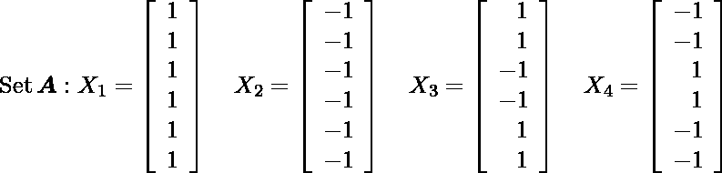
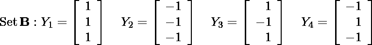
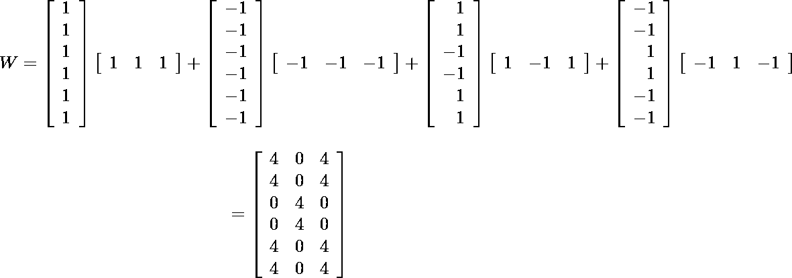
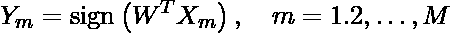
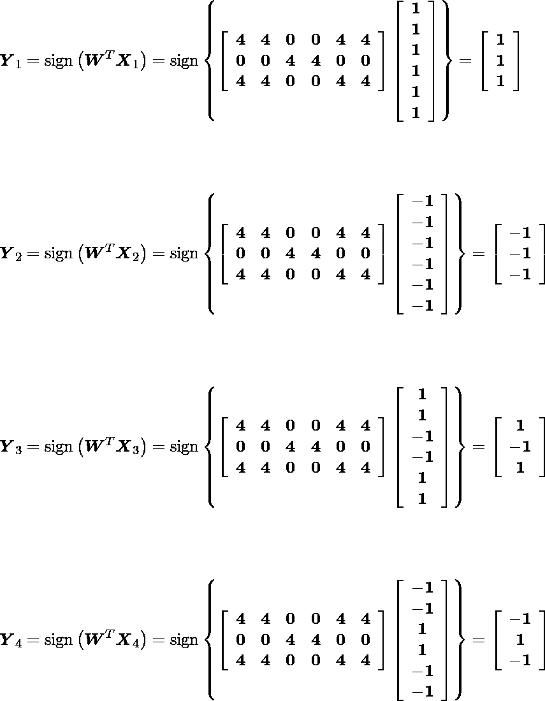
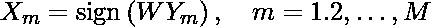
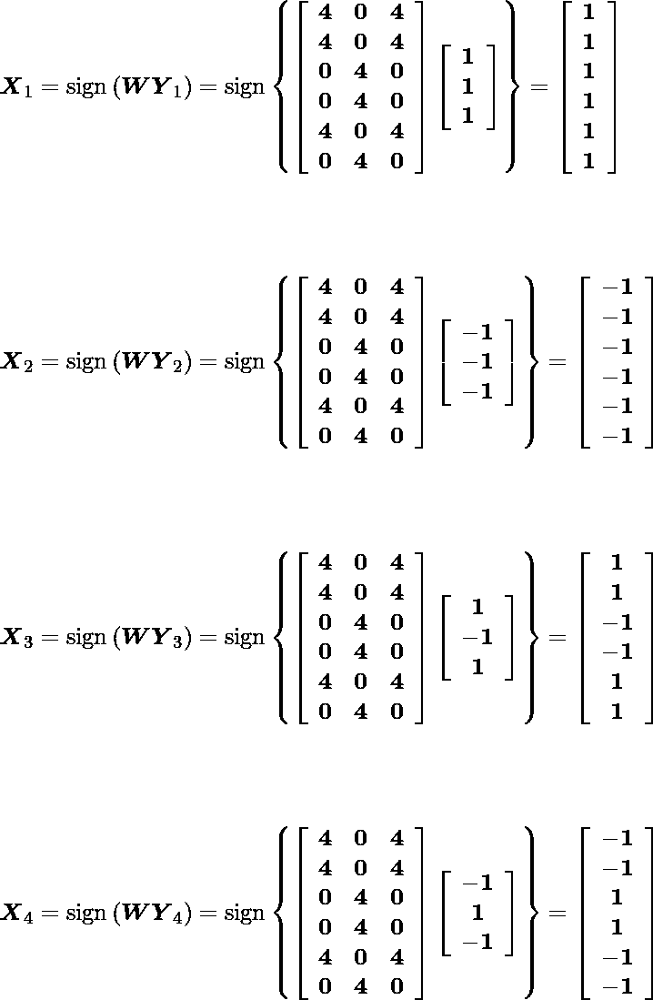

# ANN–双向联想记忆(BAM)学习算法

> 原文: [https://www.geeksforgeeks.org/ann-bidirectional-associative-memory-bam-learning-algorithm/](https://www.geeksforgeeks.org/ann-bidirectional-associative-memory-bam-learning-algorithm/)

**先决条件:** [ANN |双向联想记忆(BAM)](https://www.geeksforgeeks.org/ann-bidirectional-associative-memory-bam/)

构建 BAM 模型有三个主要步骤。

1.  学习
2.  测试
3.  检索

在《人工神经网络|双向联想记忆》一文中，每一步都用数学公式进行了描述。

**这里用一个例子迭代说明这个学习算法。**
假设，
集合 A:输入模式

集合 B:对应的目标模式

***第一步:*** 这里，M(图案对数)的值为 4。
***第二步:*** 分配输入输出层的神经元。这里，输入层的神经元是 6 个，输出层是 3 个

***第三步:*** 现在，计算权重矩阵(W):

***第四步:*** 测试 BAM 模型学习算法——对于输入模式 BAM 会返回相应的目标模式作为输出。对于每个目标模式，BAM 将返回相应的输入模式。

*   Test on input patterns (Set A) using-

*   Test on target patterns (Set B) using-

这里，对于每个输入模式，BAM 模型将给出正确的目标模式，对于目标模式，模型也将给出相应的输入模式。
这表示内存或模型网络中的双向关联。