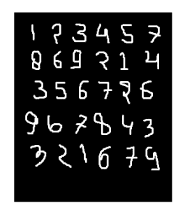
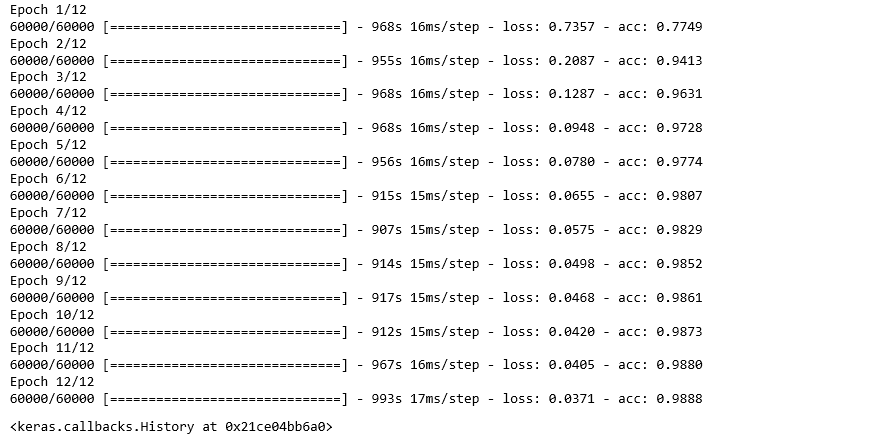
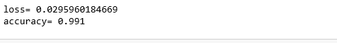

# 将卷积神经网络应用于MNIST数据集

> 原文：[https://www.geeksforgeeks.org/applying-convolutional-neural-network-on-mnist-dataset/](https://www.geeksforgeeks.org/applying-convolutional-neural-network-on-mnist-dataset/)

`CNN`基本上是一个被称为**卷积神经网络**的模型，最近因为它的有用性而获得了大量的普及。`CNN`使用多层感知器进行计算工作。与其他图像分类算法相比，`CNN`使用的预处理相对较少。这意味着网络通过过滤器学习传统算法是手工设计的。所以，对于图像处理任务，`CNN`是最适合的选择。

## MNIST数据集

`mnist`数据集是如下图所示的手写图像数据集。



使用带函数模型的卷积神经网络可以得到99.06%的准确率。使用功能模型的原因是为了在连接各层时保持简单。

### 首先，包括所有必要的库

```py
import numpy as np
import keras
from keras.datasets import mnist
from keras.models import Model
from keras.layers import Dense, Input
from keras.layers import Conv2D, MaxPooling2D, Dropout, Flatten
from keras import backend as k
```

### 创建训练数据和测试数据

*   **测试数据：**用于测试我们的模型是如何被训练的。
*   **训练数据：**用来训练我们的模型。

```py
(x_train, y_train), (x_test, y_test) = mnist.load_data()
```

*   在继续进行的同时，使用`img_rows`和`img_cols`作为图像尺寸。在`mnist`数据集中，它是28和28。我们还需要检查数据格式，即`channels_first`或`channels_last`。在`CNN`中，我们可以在训练之前标准化数据，这样大项的计算可以减少到较小项。比如，我们可以通过将`x_train`和`x_test`数据除以255来对其进行归一化。
*   **检查数据格式：**

```py
img_rows, img_cols=28, 28

if k.image_data_format() == 'channels_first':
   x_train = x_train.reshape(x_train.shape[0], 1, img_rows, img_cols)
   x_test = x_test.reshape(x_test.shape[0], 1, img_rows, img_cols)
   inpx = (1, img_rows, img_cols)

else:
   x_train = x_train.reshape(x_train.shape[0], img_rows, img_cols, 1)
   x_test = x_test.reshape(x_test.shape[0], img_rows, img_cols, 1)
   inpx = (img_rows, img_cols, 1)

x_train = x_train.astype('float32')
x_test = x_test.astype('float32')
x_train /= 255
x_test /= 255
```

### 输出类的描述

*   因为模型的输出可以包括0到9之间的任何数字。所以，我们在输出中需要10个类。要输出10个类，请使用`keras.utils.to_categorical`函数，它将提供10列。在这10列中，只有一个值是1，其余9个值是0，输出的这一个值表示数字的类别。

```py
y_train = keras.utils.to_categorical(y_train)
y_test = keras.utils.to_categorical(y_test)
```

*   现在，数据集已经准备好了，让我们转向`CNN`模型：

```py
inpx = Input(shape=inpx)
layer1 = Conv2D(32, kernel_size=(3, 3), activation='relu')(inpx)
layer2 = Conv2D(64, (3, 3), activation='relu')(layer1)
layer3 = MaxPooling2D(pool_size=(3, 3))(layer2)
layer4 = Dropout(0.5)(layer3)
layer5 = Flatten()(layer4)
layer6 = Dense(250, activation='sigmoid')(layer5)
layer7 = Dense(10, activation='softmax')(layer6)
```

*   **解释CNN模型中每一层的工作方式：**
    *   第1层是`Conv2D`层，它使用32个大小(3*3)的滤镜对图像进行卷积。
    *   第2层也是一个`Conv2D`层，也用于卷积图像，使用64个大小(3*3)的滤镜。
    *   第3层是`MaxPooling2D`层，从大小矩阵(3*3)中选择最大值。
    *   第4层显示辍学率为0.5。
    *   第5层对从第4层获得的输出进行平坦化，该平坦化的输出被传递到第6层。
    *   `layer6`是包含250个神经元的神经网络的隐藏层。
    *   `layer7`是输出层，具有10个神经元，用于使用`softmax`功能的10类输出。
*   **调用编译拟合函数：**

```py
model = Model([inpx], layer7)
model.compile(optimizer=keras.optimizers.Adadelta(),
              loss=keras.losses.categorical_crossentropy,
              metrics=['accuracy'])

model.fit(x_train, y_train, epochs=12, batch_size=500)
```



*   首先，我们制作了一个模型对象，如上面给出的代码所示，其中`[inpx]`是模型中的输入，`layer7`是模型的输出。我们使用所需的优化器、损失函数编译了模型，并打印了精度，在最后一个模型中，`fit`与`x_train`（表示图像向量）、`y_train`（表示标签）、`epochs`和`batch_size`等参数一起被调用。使用`fit`函数`x_train`，`y_train`数据集被馈送到特定批量的模型中。
*   **评估功能：**
    `model.evaluate`为测试数据提供分数，即向模型提供测试数据。现在，模型将预测数据的类别，预测的类别将与`y_test`标签相匹配，以给出我们的准确性。

```py
score = model.evaluate(x_test, y_test, verbose=0)
print('loss=', score[0])
print('accuracy=', score[1])
```

*   **输出：**

