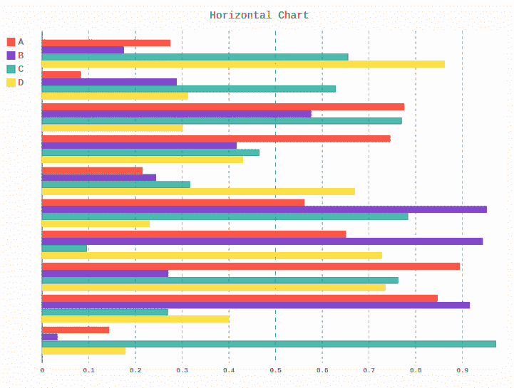
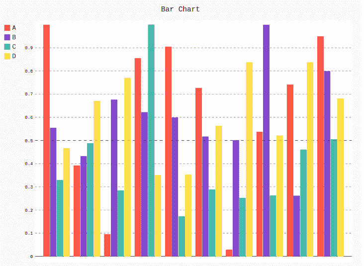

# Pygal 中的条形图

> 原文:[https://www.geeksforgeeks.org/bar-chart-in-pygal/](https://www.geeksforgeeks.org/bar-chart-in-pygal/)

`Pygal` 是一个 Python 模块，主要用于构建 SVG(标量矢量图形)图形和图表。SVG 是一种基于矢量的 XML 格式的图形，可以在任何编辑器中编辑。Pygal 可以用最少的代码行创建图表，这些代码行易于理解和编写。

## 条形图

条形图或图表是用矩形条以分类形式表示数据，矩形条的高度或长度与图表中表示的值成比例。条形图可以垂直或水平绘制。垂直条形图有时也称为柱形图。图表的一个轴显示正在比较的特定类别，另一个轴表示测量值。

### Horizontal bar graph

`Horizontal bar graph` 是一个水平表示数据的图表。水平图中的所有数据值都显示在水平轴上。这种类型的柱形图有助于更有效地理解数据，因为数据是彼此平行的。可以使用 `HorizontalBar()` 方法创建。

**语法:**

```py
line_chart = pygal.HorizontalBar()
```

**Example :**

```py
# importing pygal
import pygal
import numpy

# creating the chart object
horizontal_chart = pygal.HorizontalBar()

# naming the title
horizontal_chart.title = 'Horizontal Chart'

# Random data
horizontal_chart.add('A', numpy.random.rand(10))
horizontal_chart.add('B', numpy.random.rand(10))
horizontal_chart.add('C', numpy.random.rand(10))
horizontal_chart.add('D', numpy.random.rand(10))

horizontal_chart
```

**输出:**



### Vertical bar graph

`Vertical bar graph` 通过使用从底部向上的垂直条来显示数据，其长度与它们所代表的量成比例。当一个轴不能有数字刻度时可以使用它。在展示随时间变化的数据系列时，一个基本的简单条形图非常有用。可以使用 `Bar()` 方法创建。

**语法:**

```py
line_chart = pygal.Bar()
```

**示例:**

```py
# importing pygal
import pygal
import numpy

# creating the chart object
bar_chart = pygal.Bar()

# naming the title
bar_chart.title = 'Bar Chart'

# Random data
bar_chart.add('A', numpy.random.rand(10))
bar_chart.add('B', numpy.random.rand(10))
bar_chart.add('C', numpy.random.rand(10))
bar_chart.add('D', numpy.random.rand(10))

bar_chart
```

**输出:**

