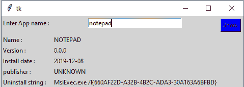
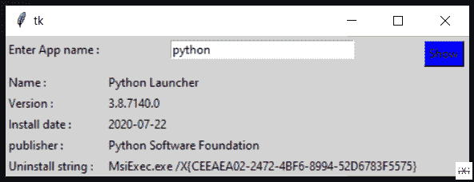

# 使用 Python 构建应用程序来搜索已安装的应用程序

> 原文：[https://www.geeksforgeeks.org/build-an-application-to-search-installed-application-using-python/](https://www.geeksforgeeks.org/build-an-application-to-search-installed-application-using-python/)

## 先决条件

[Python 中的 Tkinter](https://www.geeksforgeeks.org/create-first-gui-application-using-python-tkinter/)。

在本文中，我们将编写 Python 脚本来搜索在 Windows 上安装的应用程序，并将其与 GUI 应用程序绑定。我们正在使用 `winapps` 模块来管理 Windows 上安装的应用程序。

要安装该模块，请在您的终端中运行以下命令：

```
pip install winapps
```

**下面是 GUI 的样子：**



## 从 winapps 模块使用的方法

要打印已安装的应用程序，`winapps` 模块有 `winapps.list_installed()` 方法。

```py
# import modules
import winapps

# get each application with list_installed()
for item in winapps.list_installed():
    print(item)
```

**输出：**

> InstalledApplication(name='Mi 智能共享', version='1.0.0.452', install_date=None, install_location=None, install_source=None, modify_path=None, publisher='Xiaomi Inc', uninstall_string='C:\\Program Files\\Mi\\AIoT\\MiShare\\1.0.0.452\\uninstall.exe')
>
> InstalledApplication(name='Git version 2.27.0', version='2.27.0', install_date=datetime.date(2020, 7, 22), install_location=WindowsPath('D:/Installation_bulk/Git'), install_source=None, modify_path=None, publisher='The Git Development Community', uninstall_string='D:\\Installation_bulk\\Git\\uninstall.exe')
>
> InstalledApplication(name='Microsoft 365 - en-us', version='16.0.13127.20408', install_date=None, install_location=WindowsPath('C:/Program Files/Microsoft Office'), install_source=None, modify_path='"C:\\Program Files\\Common Files\\Microsoft Shared\\ClickToRun\\officeclicktorun.exe" scenario=Repair platform=x64 culture=en-us', publisher='Microsoft Corporation', uninstall_string='"C:\\Program Files\\Common Files\\Microsoft Shared\\ClickToRun\\officeclicktorun.exe" scenario=Repair platform=x64 culture=en-us')
>
> InstalledApplication(name='屏上显示实用程序', version='1.0.0.140', install_date=None, install_location=None, install_source=None, modify_path=None, publisher='小米公司', uninstall_string='C:\\Program Files\\MI\\OSD Utility\\1.0.0.140\\uninstall.exe')
>
> InstalledApplication(name='Intel(R) 管理引擎组件', version='1921.14.0.1280', install_date=None, install_location=WindowsPath('C:/Program Files (x86)/Intel/Intel(R) Management Engine Components'), install_source=None, modify_path=None, publisher='Intel Corporation', uninstall_string='C:\\ProgramData\\Intel\\Package Cache\\{1ceac85d-2590-4760-800f-88...')
>
> ………

为了搜索现有的应用程序，该模块提供了 `search_installed('App_name')` 方法。

```py
for item in winapps.search_installed('chrome'):
    print(item)
```

**输出：**

> InstalledApplication(name='Google Chrome', version='85.0.4183.102', install_date=datetime.date(2020, 9, 11), install_location=WindowsPath('C:/Program Files (x86)/Google/Chrome/Application'), install_source=None, modify_path=None, publisher='Google LLC', uninstall_string='"C:\\Program Files (x86)\\Google\\Chrome\\Application\\85.0.4183.102\\Installer\\setup.exe" --uninstall --system-level')

## 使用 Tkinter 在窗口中搜索应用程序

```py
# import modules
from tkinter import *
import winapps

# function to attach output
def app():
    for item in winapps.search_installed(e.get()):
        name.set(item.name)
        version.set(item.version)
        Install_date.set(item.install_date)
        publisher.set(item.publisher)
        uninstall_string.set(item.uninstall_string)

# object of tkinter
# and background set for grey
master = Tk()
master.configure(bg='light grey')

# Variable Classes in tkinter
name = StringVar()
version = StringVar()
Install_date = StringVar()
publisher = StringVar()
uninstall_string = StringVar()

# Creating label for each information
# name using widget Label
Label(master, text="Enter App name : ",
      bg="light grey").grid(row=0, sticky=W)
Label(master, text="Name : ",
      bg="light grey").grid(row=2, sticky=W)
Label(master, text="Version :",
      bg="light grey").grid(row=3, sticky=W)
Label(master, text="Install date :",
      bg="light grey").grid(row=4, sticky=W)
Label(master, text="publisher :",
      bg="light grey").grid(row=5, sticky=W)
Label(master, text="Uninstall string :",
      bg="light grey").grid(row=6, sticky=W)

# Creating label for class variable
# name using widget Entry
Label(master, text="", textvariable=name,
      bg="light grey").grid(row=2, column=1, sticky=W)
Label(master, text="", textvariable=version,
      bg="light grey").grid(row=3, column=1, sticky=W)
Label(master, text="", textvariable=Install_date,
      bg="light grey").grid(row=4, column=1, sticky=W)
Label(master, text="", textvariable=publisher,
      bg="light grey").grid(row=5, column=1, sticky=W)
Label(master, text="", textvariable=uninstall_string,
      bg="light grey").grid(row=6, column=1, sticky=W)

e = Entry(master, width=30)
e.grid(row=0, column=1)

# creating a button using the widget
b = Button(master, text="Show", command=app, bg="Blue")
b.grid(row=0, column=2, columnspan=2, rowspan=2, padx=5, pady=5,)

mainloop()
```

**输出：**



<video class="wp-video-shortcode" id="video-487091-1" width="640" height="360" preload="metadata" controls=""><source type="video/mp4" src="https://media.geeksforgeeks.org/wp-content/uploads/20210214180015/FreeOnlineScreenRecorderProject7.mp4?_=1">[https://media.geeksforgeeks.org/wp-content/uploads/20210214180015/FreeOnlineScreenRecorderProject7.mp4](https://media.geeksforgeeks.org/wp-content/uploads/20210214180015/FreeOnlineScreenRecorderProject7.mp4)</video>