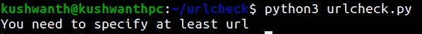
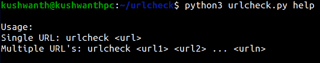
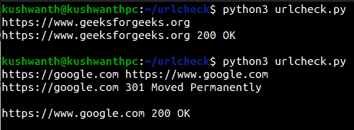
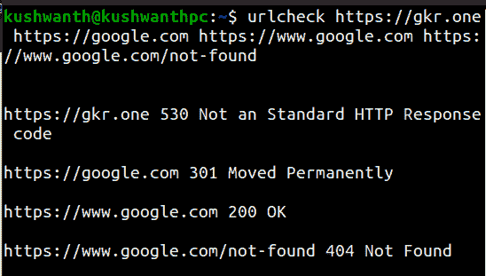

# 使用 Python 构建命令行界面检查网址状态

> 原文：[https://www.geeksforgeeks.org/building-cli-to-check-status-of-url-using-python/](https://www.geeksforgeeks.org/building-cli-to-check-status-of-url-using-python/)

在本文中，我们将使用 Python 构建一个 CLI（命令行界面）程序来验证 URL 的状态。Python 命令行界面将一个或多个网址作为参数，并检查该网址是否可访问。

## 逐步实施

### 步骤 1：设置文件和安装要求

首先，创建一个名为 `urlcheck` 的目录，并在目录中创建一个新文件 `urlcheck.py`（您可以为目录和 Python 文件使用任何名称）。

```py
mkdir urlcheck && cd urlcheck
touch urlcheck.py
```

**安装 Python `requests` 和 `validators` 库：**

```py
pip3 install requests validators
```

现在创建一个基础 Python 文件，导入所有必需的库。

```py
import sys
import requests
from http.client import responses
import validators

if len(sys.argv) < 2:
    print('You need to specify atleast one URL')
    sys.exit()

def main():
    # main function

if __name__ == "__main__":
    main()
```

**输出：**



错误：至少需要 1 个参数。

在上面的代码中，`sys` 库提供了用于操作 Python 运行时环境不同部分的函数和变量。它用于通过使用 `argv` 模块将参数作为输入，`requests` 库有助于建立 HTTP 连接，来自 Python HTTP 客户端库的 `responses` 模块为 HTTP 响应代码提供了一个小描述，`validators` 库用于验证 URL。

如果条件验证用户已经传递了至少一个参数，如果条件失败，程序将退出，并显示一个错误，指出用户需要指定至少一个 URL。

### 步骤 2：创建帮助功能

帮助功能显示可用的命令，并作为命令的文档。它在 `help` 作为参数传递时运行。

```py
def usage():
    print("\nUsage:\nSingle URL: urlcheck <url>\
    nMultiple URL's: urlcheck <url1> <url2> ... <urln>\n")

if sys.argv[1]=="help":
    usage()
    sys.exit()
```

**输出：**



帮助命令。

### 步骤 3：创建主函数

主函数是脚本开始执行时运行的函数，主函数包含了我们的 CLI 程序的所有逻辑。

```py
def main():
    n = len(sys.argv)

    for i in range(1, n):
        url = sys.argv[i]

        if validators.url(url) is True:
            status = requests.head(url).status_code
            try:
                print(url, status, responses[status], "\n")
            except:
                print(url, status, "Not an Standard HTTP Response code\n")

        else:
            print(url, "Not an valid URL\n")
            continue
```

**输出：**



验证网址状态的命令行界面。

在上面的代码中，变量 `n` 用于获取用户指定的参数数量。`for` 循环运行时一次获取一个参数，并循环运行，直到所有参数都被传递为止。`url` 一次存储一个给定的参数，并在它是有效的 URL 时进行验证。这不是一个有效的网址，否则程序块会打印一个警告并继续下一个迭代。如果这是一个有效的网址，`requests` 库会使用 `HEAD` 方法建立一个 HTTP 连接。`HEAD` 方法类似于 `GET`，但在其响应中不包含任何 HTML，然后我们将响应的状态代码存储在 `status` 变量中。

最后，我们尝试打印出 URL、它的响应状态代码以及状态代码的一个小描述。如果状态代码不是标准的 HTTP 响应状态代码（CDN 使用自定义状态代码），它会打印出“不是标准的 HTTP 响应代码”。

### 步骤 4：创建自定义命令行界面命令

有多种方法可以创建自定义命令行界面命令，但我们将使用别名，因为它创建简单，不需要对文件权限（或）更改目录进行任何更改。

**对于 Windows：**

您需要编辑文件 `/C/“程序文件”/Git/etc/profile.d/alias.sh` 并为您的 Python 脚本添加位置。

```py
alias urlcheck="location to your python file"
```

**对于 Mac 和 Linux：**

你需要编辑 `~/.profile`，将位置添加到 Python 脚本中。

```py
alias urlcheck="python3 ~/urlcheck/urlcheck.py"
```

保存后。配置文件运行以下命令以确保别名获得更新。

```py
source ~/.profile
```

**下面是完整的实现：**

```py
import sys
import requests
from http.client import responses
import validators

if len(sys.argv) < 2:
    print('You need to specify at least url')
    sys.exit()

def usage():
    print("\nUsage:\nSingle URL: urlcheck <url>\nMultiple\
    URL's: urlcheck <url1> <url2> ... <urln>\n")

if sys.argv[1]=="help":
    usage()
    sys.exit()

def main():
    n = len(sys.argv)
    print("\n")
    for i in range(1, n):
        url = sys.argv[i]
        if validators.url(url) is True:
            status = requests.head(url).status_code
            try:
                print(url, status,responses[status], "\n")
            except:
                print(url, status, "Not an Standard HTTP Response code\n")
        else:
            print(url, "Not an valid URL\n")
            continue

if __name__ == "__main__":
    main()
```

**输出：**



最后的。