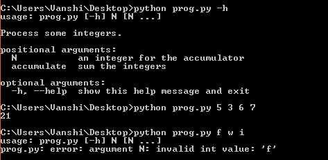
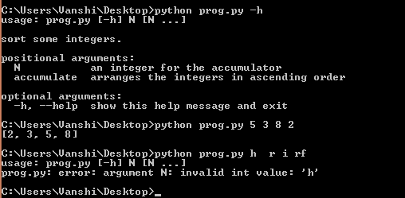
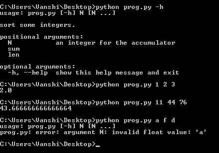

# Python 中使用 argparse 的命令行选项和参数解析

> 原文: [https://www.geeksforgeeks.org/command-line-option-and-argument-parsing-using-argparse-in-python/](https://www.geeksforgeeks.org/command-line-option-and-argument-parsing-using-argparse-in-python/)

命令行参数是那些在程序调用过程中与调用语句一起传递的值。通常，Python 使用 `sys.argv` 数组来处理这样的参数，但是在这里我们描述如何通过使用 `argparse` 模块来使它变得更加足智多谋和用户友好。

## 参数解析模块

Python 中的 `argparse` 模块有助于在命令行环境中创建程序，这种方式不仅易于编码，而且还能改善交互。当用户给程序无效参数时，`argparse` 模块还会自动生成帮助和使用信息并发出错误。

### 使用参数解析的步骤

1.  **创建解析器:** 导入 `argparse` 模块是处理概念的第一种方式。导入之后，您必须创建一个解析器或 `ArgumentParser` 对象，该对象将存储从 Python 命令行传递的所有必要信息。

    > **语法:** `argparse.ArgumentParser(prog=None, usage=None, description=None, epilog=None, parents=[], formatter_class=argparse.HelpFormatter, prefix_chars='-', fromfile_prefix_chars=None, argument_default=None, conflict_handler='error', add_help=True, allow_abbrev=True)`
    >
    > **参数:**
    >
    > *   `prog` – 程序名称 (默认=`sys.argv[0]`)
    > *   `usage` – 描述程序用法的字符串 (默认: 从添加到解析器的参数生成)
    > *   `description` – 参数帮助前显示的文本 (默认: 无)
    > *   `epilog` – 参数帮助后显示的文本 (默认: 无)
    > *   `parents` – 其参数也应包括在内的 `ArgumentParser` 对象列表
    > *   `formatter_class` – 用于自定义帮助输出的类
    > *   `prefix_chars` – 为可选参数加前缀的字符集 (默认为: ‘-‘)
    > *   `fromfile_prefix_chars` – 为要从中读取附加参数的文件加前缀的字符集 (默认为: 无)
    > *   `conflict_handler` – 解决冲突选项的策略 (通常是不必要的)
    > *   `add_help` – 向解析器添加 `-h`/`--help` 选项 (默认值: `True`)
    > *   `allow_abbrev` – 如果缩写明确，则允许缩写长选项。 (默认: `True`)

2.  **添加参数:** 下一步是用关于程序参数的信息填充 `ArgumentParser`。这意味着对 `add_argument()` 方法的调用。这些信息告诉 `ArgumentParser` 如何从命令行获取参数，并将它们转换为对象。

    > **语法:** `ArgumentParser.add_argument(name or flags...[, action][, nargs][, const][, default][, type][, choices][, required][, help][, metavar][, dest])`
    >
    > **参数:**
    >
    > *   `name or flags` – 选项字符串的名称或列表
    > *   `action` – 在命令行中遇到此参数时要采取的基本操作类型
    > *   `nargs` – 应该消耗的命令行参数数量
    > *   `const` – 某些操作和 `nargs` 选择所需的常量值
    > *   `default` – 如果命令行中缺少参数
    > *   `type` – 命令行参数应转换到的类型。
    > *   `choices` – 参数允许值的容器
    > *   `required` – 命令行选项是否可以省略 (仅限选项)
    > *   `help` – 参数作用的简要说明
    > *   `metavar` – 用法信息中参数的名称
    > *   `dest` – 属性的名称

3.  **解析参数:** 第 2 步中收集的信息在通过 `parse_args()` 解析参数时被存储和使用。数据最初以字符串形式存储在 `sys.argv` 数组中。使用命令行数据调用 `parse_args()` 会先将它们转换为所需的数据类型，然后调用适当的操作以产生结果。

    > **语法:** `argparse.ArgumentParser.parse_args(args=None, namespace=None)`
    >
    > **参数:**
    >
    > *   `args` – 要解析的字符串列表。默认值取自 `sys.argv`。
    > *   `namespace` – 获取属性的对象。默认值是一个新的空命名空间对象

在大多数情况下，这意味着一个简单的 `Namespace` 对象将由命令行解析出的属性构建而成:

```py
Namespace(accumulate=, integers=[ 2, 8, -7, 41 ])
```

这些是处理 `argparse` 时需要熟悉的基本概念。以下是支持此应用程序的一些示例。

**示例 1: 使用 argparse 找到命令行参数的总和**

```py
import argparse

# Initialize the Parser
parser = argparse.ArgumentParser(description ='Process some integers.')

# Adding Arguments
parser.add_argument('integers', metavar ='N',
                    type = int, nargs ='+',
                    help ='an integer for the accumulator')

parser.add_argument(dest ='accumulate',
                    action ='store_const',
                    const = sum,
                    help ='sum the integers')

args = parser.parse_args()
print(args.accumulate(args.integers))
```

**输出:**



**例 2: 按升序排列整数输入的程序**

```py
import argparse

# Initializing Parser
parser = argparse.ArgumentParser(description ='sort some integers.')

# Adding Argument
parser.add_argument('integers',
                    metavar ='N',
                    type = int,
                    nargs ='+',
                    help ='an integer for the accumulator')

parser.add_argument(dest ='accumulate',
                    action ='store_const',
                    const = sorted,
                    help ='arranges the integers in ascending order')

args = parser.parse_args()
print(args.accumulate(args.integers))
```

**输出:**


**例 3: 求输入的命令行数值参数的平均值**

```py
import argparse

# Initializing Parser
parser = argparse.ArgumentParser(description ='sort some integers.')

# Adding Argument
parser.add_argument('integers',
                    metavar ='N',
                    type = float,
                    nargs ='+',
                    help ='an integer for the accumulator')

parser.add_argument('sum',
                    action ='store_const',
                    const = sum)

parser.add_argument('len',
                    action ='store_const',
                    const = len)

args = parser.parse_args()
add = args.sum(args.integers)
length = args.len(args.integers)
average = add / length
print(average)
```

**输出:**
