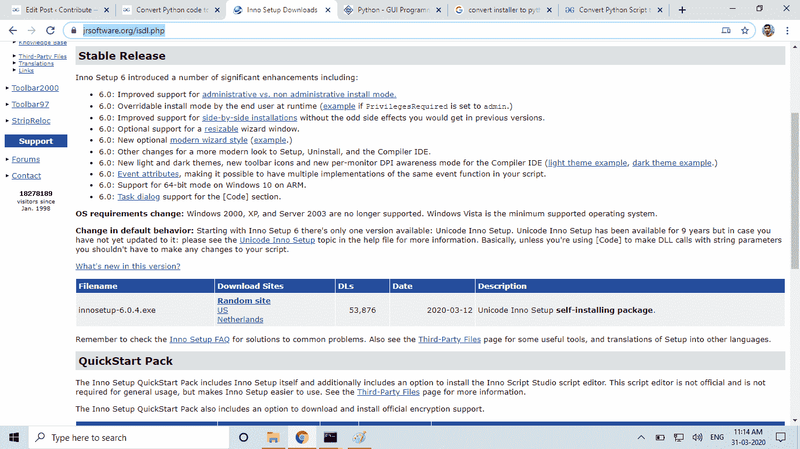
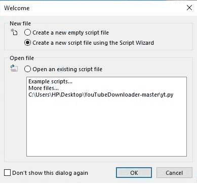
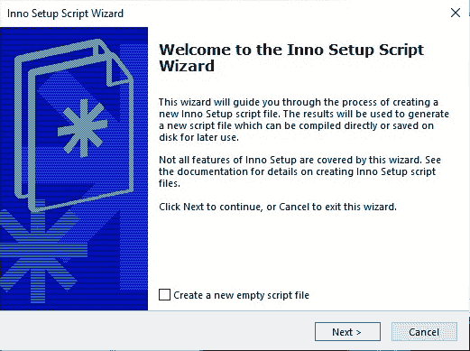
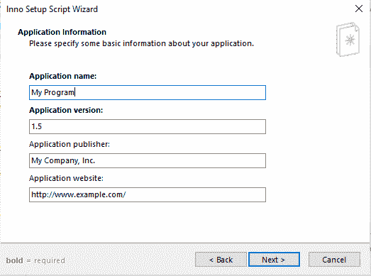
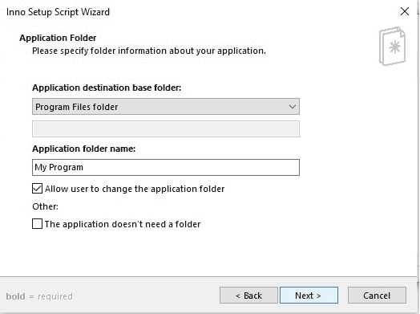
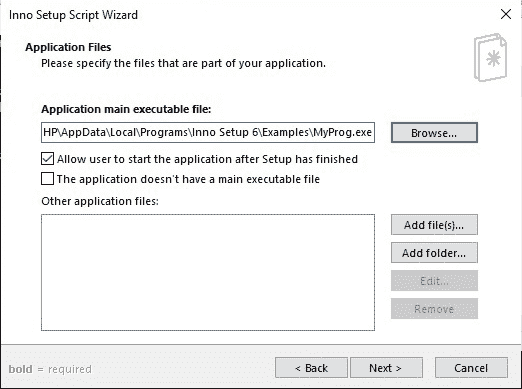
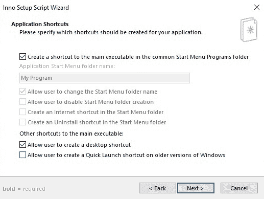
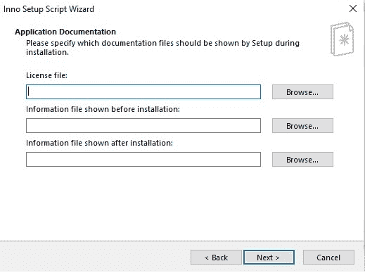
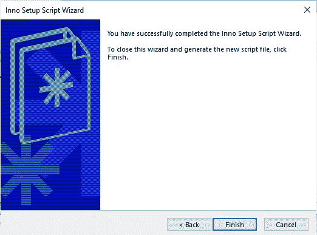

# 使用 Inno Setup 编译器将 Python 代码转换为要在 Windows 上安装的软件

> 原文：[https://www.geeksforgeeks.org/convert-python-code-to-a-software-to-install-on-windows-using-inno-setup-compiler/](https://www.geeksforgeeks.org/convert-python-code-to-a-software-to-install-on-windows-using-inno-setup-compiler/)

用户只能得到任何软件的安装程序，公司没有给用户源代码文件。虽然有些开源软件是有源代码的。我们也可以用 Python 源代码制作一个安装程序，这样你就不用分享你的源代码了。使用任何图形库编写您的 Python 代码，我在这里使用 Tkinter，我们将使用 [`Inno Setup Compiler`](https://jrsoftware.org/isdl.php) 将其转换为 Windows 10 中的安装程序软件。*转产。py to。exe* ，可以访问 [Python 到 exe 转换](https://www.geeksforgeeks.org/convert-python-script-to-exe-file/)。

## 制作安装程序的 `py` 文件

**转换。安装安装程序：** 该步骤包括以下一系列步骤。

**第一步：** 下载 [`Inno Setup Software`](https://jrsoftware.org/isdl.php)。

**第二步：** 选择 *Create new script file using the Script Wizard*。

**第三步：** 填写应用程序信息。

**第四步：** 添加文件和文件夹，点击下一步。

这里我们必须加上。我们使用 `pyinstaller` 从 Python 代码中创建的。浏览 `exe` 文件后，也添加该文件所在的文件夹。

**第五步：** 选择应用程序快捷方式的选项，然后单击下一步。

**第六步：应用文档：** 这些取决于你，如果你想把这个软件作为商业软件使用，那么你可以填充它们，否则就保持原样。单击下一步。

**第七步：** 选择设置语言。

**第八步：编译设置：** 这里你要设置输出设置要存储的文件夹。如果要设置密码，请填写，否则请留下。

**第九步：** 点击 *Finish*。

您的 Windows 安装软件已准备好，现在您可以使用它进行分发。