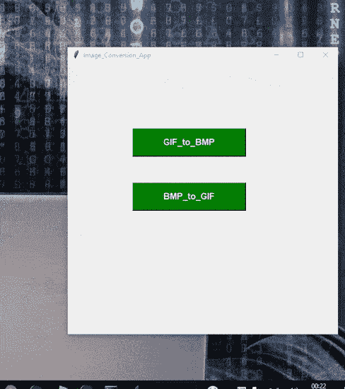

# 在Python中将GIF转换为BMP及反向转换

> 原文：[https://www.geeksforgeeks.org/convert-the-gif-to-bmp-and-its-vice-versa-in-python/](https://www.geeksforgeeks.org/convert-the-gif-to-bmp-and-its-vice-versa-in-python/)

有时我们需要附加图像，并且需要特定扩展名的图像文件。我们拥有不同扩展名的图像，需要用指定的扩展名进行转换。例如，我们将把扩展名为`.bmp`的图像转换为`.gif`，反之亦然。在本文中，我们将把`.GIF`转换为`.BMP`，以及把`.BMP`转换为`.GIF`。

此外，我们将为代码创建图形用户界面，因此我们将需要`Tkinter`库。`Tkinter`是一个绑定到Tk GUI工具包的Python库。它是Tk图形用户界面工具包的标准Python接口，提供了图形用户界面应用程序的接口。

## 所需模块

*   `Tkinter`：`Tkinter`是一个绑定到Tk GUI工具包的Python库。
*   `PIL`：是Python Imaging Library，为Python解释器提供图像编辑功能。

## 逐步实现

### 第一步：导入库

```python
from PIL import Image
```

### 步骤2：BMP转GIF

```python
# 将图像从BMP转换为GIF的语法
img = Image.open("Image.bmp")
img.save("Image.gif")
```

### 步骤3：GIF转BMP

```python
# 将图像从GIF转换为BMP的语法
img = Image.open("Image.gif")
img.save("Image.bmp")
```

## 实现思路

*   在函数`bmp_to_gif`中，我们首先检查所选图像的格式是否为`.bmp`。如果不是，则返回错误。
*   否则，将图像转换为`.gif`格式。
*   为了打开图像，我们使用了`tkinter`中的`FileDialog`函数来帮助打开文件夹中的图像。
*   从`tkinter`导入`filedialog`作为`fd`。
*   GIF到BMP的转换采用相同的方法。

## 完整实现代码

```python
from tkinter import *
from tkinter import filedialog as fd
import os
from PIL import Image
from tkinter import messagebox

root = Tk()

# 为GUI界面命名
root.title("Image_Conversion_App")

# 创建将jpg转换为png的函数
def gif_to_bmp():
    global im

    import_filename = fd.askopenfilename()

    if import_filename.endswith(".gif"):
        im = Image.open(import_filename)
        export_filename = fd.asksaveasfilename(defaultextension=".bmp")
        im.save(export_filename)
        messagebox.showinfo("Success", "File converted to .bmp")
    else:
        messagebox.showerror("Fail!!", "Error Interrupted!!!! Check Again")

def bmp_to_gif():
    import_filename = fd.askopenfilename()
    if import_filename.endswith(".bmp"):
        im = Image.open(import_filename)
        export_filename = fd.asksaveasfilename(defaultextension=".gif")
        im.save(export_filename)
        messagebox.showinfo("Success", "File converted to .gif")
    else:
        messagebox.showerror("Fail!!", "Error Interrupted!!!! Check Again")

button1 = Button(root, text="GIF_to_BMP",
                 width=20, height=2,
                 bg="green", fg="white",
                 font=("helvetica", 12, "bold"),
                 command=gif_to_bmp)

button1.place(x=120, y=120)

button2 = Button(root, text="BMP_to_GIF",
                 width=20, height=2,
                 bg="green", fg="white",
                 font=("helvetica", 12, "bold"),
                 command=bmp_to_gif)

button2.place(x=120, y=220)
root.geometry("500x500+400+200")
root.mainloop()
```

## 输出

