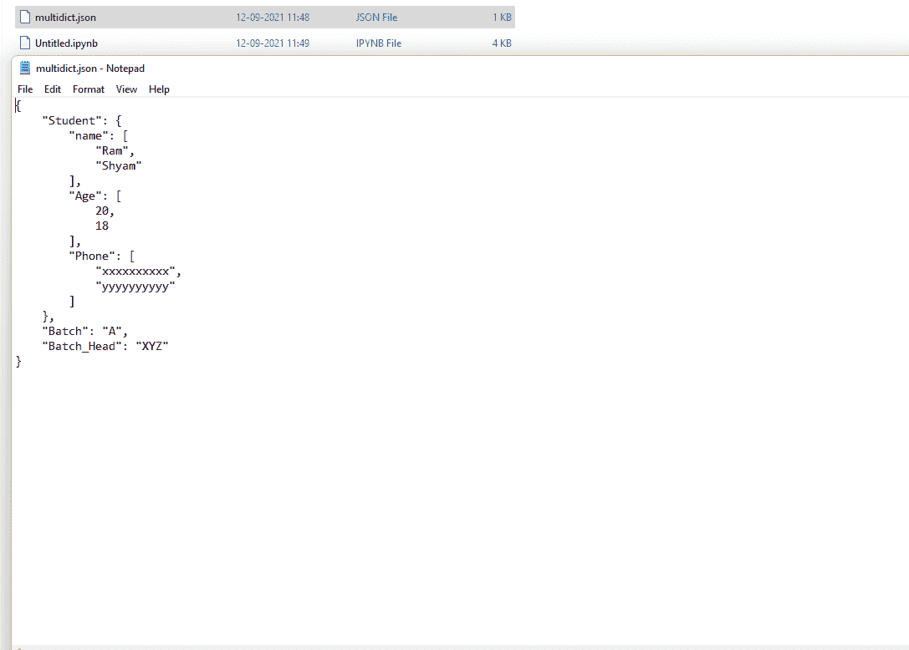

# 将多通道转换为合适的 JSON

> 原文: [https://www.geeksforgeeks.org/converting-multidict-to-proper-json/](https://www.geeksforgeeks.org/converting-multidict-to-proper-json/)

在本文中，我们将了解什么是多信息技术，以及如何在 Python 中将多信息技术转换成 JSON 文件。首先，我们将多数据转换为字典数据类型，最后，我们将该字典转储到一个 JSON 文件中。

## 使用的功能:

*   `json.dump()`: Python 模块中的 JSON 模块提供了一个名为 `dump()` 的方法，将 Python 对象转换成合适的 JSON 对象。这是 `dumps()` 方法的一个小变体。

> **语法:** `json.dump(d, skipkeys=False, ensure_ascii=True, check_circular=True, allow_nan=True, cls=None, indent=None, separators=None)`
>
> **参数:**
>
> `indent`: 提高了 JSON 文件的可读性。可以传递给该参数的可能值是简单的两倍引号(`""`)，任何整数值。简单的双引号使每个键值对出现在新的一行中。
>
> **示例:**
>
> `json.dump(dic, file_name, indent=4)`

*   `MultiDict`: 这是一个存在于多信道 python 模块中的类。

> **语法:**
>
> *   `MultiDict(**kwargs)`
> *   `MultiDict(mapping, **kwargs)`
> *   `MultiDict(iterable, **kwargs)`
>
> **返回:**
>
> *   它将创建一个可变的多维实例。
> *   它具有字典中可用的所有相同功能。
>
> **示例:**
>
> `from multidict import MultiDict`
>
> `dic = [('geek', 1), ('for', 2), ('nerds', 3)]`
>
> `multi_dict = MultiDict(dic)`

## 代码

```py
# import multidict module
from multidict import MultiDict
# import json module
import json

# create multi dict
dic = [('Student.name', 'Ram'), ('Student.Age', 20),
       ('Student.Phone', 'xxxxxxxxxx'),
       ('Student.name', 'Shyam'), ('Student.Age',18),
       ('Student.Phone', 'yyyyyyyyyy'),
       ('Batch', 'A'), ('Batch_Head', 'XYZ')]

multi_dict = MultiDict(dic)
print(type(multi_dict))
print(multi_dict)

# get the required dictionary
req_dic = {}
for key, value in multi_dict.items():

# checking for any nested dictionary
    l = key.split(".")

# if nested dictionary is present
    if len(l) > 1: 
        i = l[0]
        j = l[1]
        if req_dic.get(i) is None:
            req_dic[i] = {}
            req_dic[i][j] = []
            req_dic[i][j].append(value)
        else:
            if req_dic[i].get(j) is None:
                req_dic[i][j] = []
                req_dic[i][j].append(value)
            else:
                req_dic[i][j].append(value)

else:  # if single dictionary is there
        if req_dic.get(l[0]) is None:
            req_dic[l[0]] = value
        else:
            req_dic[l[0]] = value
# save the dict in json format
with open('multidict.json', 'w') as file:
    json.dump(req_dic, file, indent=4)
```

**输出:**

> <class 'multidict.multidict.MultiDict'>
> <MultiDict('Student.name': 'Ram', 'Student.Age': 20, 'Student.Phone': 'xxxxxxxxxx', 'Student.name': 'Shyam', 'Student.Age': 18, 'Student.Phone': 'yyyyyyyyyy', 'Batch': 'A', 'Batch_Head': 'XYZ')>

**JSON 文件输出:**

