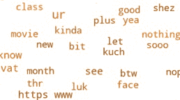

# 使用 Python 将 WhatsApp 聊天数据转换为文字云

> 原文：[https://www.geeksforgeeks.org/converting-whatsapp-chat-data-into-a-word-cloud-using-python/](https://www.geeksforgeeks.org/converting-whatsapp-chat-data-into-a-word-cloud-using-python/)

让我们看看如何使用 **WhatsApp** 聊天文件创建单词云。

将 WhatsApp 聊天文件从 `.txt` 格式转换到 `.csv` 文件。这可以用 `pandas` 来完成。创建一个读取 `.txt` 文件。那个 `.txt` 文件没有像在 `.csv` 文件那样的结构。

然后，通过分隔数据并为每列命名，将数据拆分为列。聊天文件中数据集的第一行包含加密细节，这里不需要。然后，将剩下的 2 个部分命名为 `Date` 和 `Convo`，这两个部分用逗号隔开，即“，”。

```python
df = df.drop(0)
df.columns = ['Date', 'Convo']
```

现在，将 `Convo` 数据集分为 `Time` 和 `Content` 两列，两列之间用连字符即“-”隔开。`Convo` 栏中的数据制作成数据框 `Chat`。

```python
Chat = df["Convo"].str.split("-", n = 1, 
                             expand = True)
df['Time'] = Chat[0]
df['Content'] = Chat[1]
```

`Content` 列被创建到另一个数据集 `Chat1` 中，以将其进一步分成两个列，`User` 和 `Message`，这两个列都由冒号分隔，即“:”。

```python
Chat1 = df["Content"].str.split(":", n = 1, 
                                expand = True)
df['User'] = Chat1[0]
df['Message'] = Chat1[1]
```

现在，删除 `Convo` 列，并将 `Message` 列转换为小写。所有列媒体都省略了单元格，已删除的消息由字符串 `<media omitted>` 和 `this message was deleted` 替换。

```python
df = df.drop(columns = ['Convo'])
df['Message'] = df['Message'].str.lower()
df['Message'] = df['Message'].str.replace('<media omitted>', 
                                          'Media Shared')
df['Message'] = df['Message'].str.replace('this message was deleted', 
                                          'DeletedMsg')
```

最后，数据帧被转换为名为 `new_csv.csv` 的 `.csv` 文件。

```python
df.to_csv("new_csv.csv", index = False)
```

现在我们必须从这个 CSV 文件中制作一个单词云。为此，我们需要 `wordcloud` 和 `matplotlib.pyplot` 包。使用 `new_csv.csv` 文件从中读取数据并创建一个数据框。创建一组停止词和一个变量来存储从词云函数生成的所有数据。从包含所有聊天文本的 `Message` 列中提取数据，并将其转换为小写字符串。

```python
# importing the modules
import matplotlib.pyplot as plt
from wordcloud import WordCloud, STOPWORDS

# reading the csv file as a DataFrame
df1 = pd.read_csv("new_csv.csv")

# defining the stop words
stopwords = set(STOPWORDS)
words = ''.join(df1.Message.astype(str)).lower()

# making the word cloud
wordcloud = WordCloud(stopwords = stopwords, 
                      min_font_size = 10,
                      background_color = 'white', 
                      width = 800,
                      height = 800,
                      color_func = random_color_func).generate(words)
```

这里，函数 `random_color_func` 用于为单词渲染随机的橙色。这是通过改变 `hsl`（色调、饱和度、亮度）值来实现的。

```python
def random_color_func(word = None, 
                      font_size = None, 
                      position = None,  
                      orientation = None, 
                      font_path = None, 
                      random_state = None):
    h = int(360.0 * 21.0 / 255.0)
    s = int(100.0 * 255.0 / 255.0)
    l = int(100.0 * float(random_state.randint(60, 120)) / 255.0)
```

然后使用 `plt` 来绘制单词 `wordcloud` 变量中的单词并可视化。

```python
plt.figure(figsize = (8, 8), facecolor = None)
plt.imshow(wordcloud, interpolation = "bilinear")
plt.axis("off")
plt.tight_layout(pad = 0)
plt.show()
```



完整的代码如下：

```python
import pandas as pd
import matplotlib.pyplot as plt
from wordcloud import WordCloud, STOPWORDS

df = pd.read_csv(r"WhatsAppChat.txt", 
                 header = None, 
                 error_bad_lines = False, 
                 encoding = 'utf8')
df = df.drop(0)
df.columns = ['Date', 'Convo']
Chat = df["Convo"].str.split("-", n = 1, 
                             expand = True)
df['Time'] = Chat[0]
df['Content'] = Chat[1]
Chat1 = df["Content"].str.split(": ", n = 1, 
                                expand=True)
df['User'] = Chat1[0]
df['Message'] = Chat1[1]
df = df.drop(columns = ['Convo'])
df['Message'] = df['Message'].str.lower()
df['Message'] = df['Message'].str.replace('< media omitted >', 'Media Shared')
df['Message'] = df['Message'].str.replace('this message was deleted', 'DeletedMsg')
df.to_csv("new_csv.csv", index = False)

def random_color_func(word = None, 
                      font_size = None, 
                      position = None,  
                      orientation = None, 
                      font_path = None, 
                      random_state = None):
    h = int(360.0 * 21.0 / 255.0)
    s = int(100.0 * 255.0 / 255.0)
    l = int(100.0 * float(random_state.randint(60, 120)) / 255.0)

df1 = pd.read_csv("new_csv.csv")
stopwords = set(STOPWORDS)
words = ''.join(df1.Message.astype(str)).lower()

wordcloud = WordCloud(stopwords = stopwords, 
                      min_font_size = 10, 
                      background_color = 'white', 
                      width = 800, 
                      height = 800, 
                      color_func = random_color_func).generate(words)

plt.figure(figsize = (8, 8), facecolor = None)
plt.imshow(wordcloud, interpolation = "bilinear")
plt.axis("off")
plt.tight_layout(pad = 0)
plt.show()
```