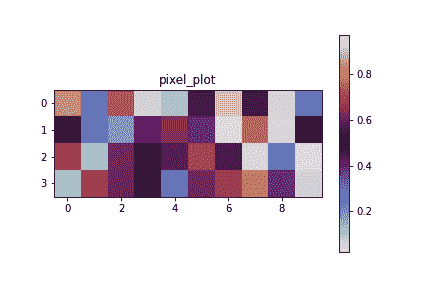
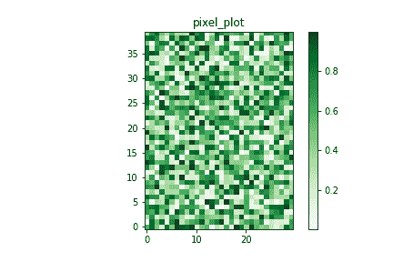
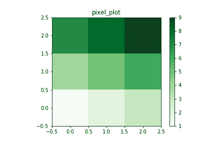

# 用 Python 创建 2D 像素图

> 原文: [https://www.geeksforgeeks.org/create-2d-pixel-plot-in-python/](https://www.geeksforgeeks.org/create-2d-pixel-plot-in-python/)

**像素图**是二维数据集的表示。在这些图中，每个像素指的是数据集中不同的值。在本文中，我们将讨论如何从数据生成 2D 像素图。通过使用 [`imshow()`](https://www.geeksforgeeks.org/matplotlib-pyplot-imshow-in-python/) 模块中 [`pyplot`](https://www.geeksforgeeks.org/pyplot-in-matplotlib/) 方法的 `cmap` 和 `interpolation` 参数，可以生成原始数据的像素图。

### 语法:

> `matplotlib.pyplot.imshow(X, cmap=None, norm=None, aspect=None, interpolation=None, alpha=None, vmin=None, vmax=None, origin=None, extent=None, shape=None, filternorm=1, filterrad=4.0, imlim=None, resample=None, url=None, *, data=None, **kwargs)`

### 方法:

使用 Matplotlib 在 python 中创建 2D 像素图的基本步骤如下:

**步骤 1: 导入库**

我们正在从 `matplotlib` 库中导入用于创建数据集的 `NumPy` 库和用于绘制像素图的 `pyplot` 模块。

```python
import numpy as np
import matplotlib.pyplot as plt
```

**步骤 2: 准备数据**

为了绘图，我们需要二维数据。让我们使用 `NumPy` 中的 `random` 方法创建一个 2d 数组。这里，`data1` 数组由三个子数组组成，元素个数不等于 7，而 `data2` 数组由四个子数组组成，每个数组由五个元素组成，随机值范围在 0 到 1 之间。`random` 方法最多接受五个参数。

```python
data1 = np.random.random((3,7))    
data2 = np.random.random((4,5))  
```

我们还可以导入 CSV 文件、文本文件或图像。

*   **步骤 2.1:** 导入文本文件:

```python
data_file = np.loadtxt("myfile.txt")
```

*   **步骤 2.2:** 导入 CSV 文件:

```python
data_file = np.genfromtxt("my_file.csv", delimiter=',')
```

*   **步骤 2.3:** 导入图像:

```python
img = np.load('my_img.png')
```

**步骤 3: 创建绘图**

所有绘图都是相对于轴进行的。在大多数情况下，网格系统上的 `axes` 子图将满足您的需求。因此，我们正在向图中添加轴。给定的数据将被分为用户提供的 `nrows` 和 `ncols`。

```python
pixel_plot = plt.figure()
pixel_plot.add_axes()
axes = plt.subplots(nrows, ncols)
```

**步骤 4: 绘制图**

用于策划阴谋。

```python
plt.plot(pixel_plot)
```

**步骤 5: 自定义一个图:**

我们可以通过为绘图、x 轴、y 轴、数字和各种方式指定标题来自定义绘图。对于像素图，我们可以添加一个确定每个像素值的颜色条。`imshow()` 方法的名为 `interpolation` 的属性具有 `None` 或 `nearest` 属性值，这有助于以像素为单位绘制图形。这里 `cmap` 属性为地图着色。

```python
plt.title("pixel_plot")
pixel_plot = plt.imshow(pixel_plot, cmap='', interpolation='')
plt.colorbar(pixel_plot)
```

**步骤 6: 保存地块**

为了保存透明图像，我们需要将 `transparent` 属性设置为值 `True`，默认情况下为 `False`。

```python
plt.savefig('pixel_plot.png')
plt.savefig('pixel_plot.png', transparent=True)
```

**步骤 7: 展示剧情:**

最后，为了显示一个图，使用了一个简单的函数。

```python
plt.show(pixel_plot)
```

以下是一些描述如何使用 `matplotlib` 生成 2D 像素图的示例。

## 示例

**示例 1:** 在本程序中，我们从使用 `random()` 方法创建的矩阵中生成 2D 像素图。

```python
# importing modules
import numpy as np
import matplotlib.pyplot as plt

# creating a dataset
# data is an array with four sub 
# arrays with 10 elements in each
data = np.random.random((4, 10))

# creating a plot
pixel_plot = plt.figure()

# plotting a plot
pixel_plot.add_axes()

# customizing plot
plt.title("pixel_plot")
pixel_plot = plt.imshow(
  data, cmap='twilight', interpolation='nearest')

plt.colorbar(pixel_plot)

# save a plot
plt.savefig('pixel_plot.png')

# show plot
plt.show(pixel_plot)
```

**输出:**



**示例 2:** 在本例中，我们输入随机生成的三维阵列，并从中生成 2D 像素图。

```python
# importing modules
import numpy as np
import matplotlib.pyplot as plt

# creating a dataset
data = np.random.random((10, 12, 10))

# data is an 3d array  with 
# 10x12x10=1200 elements.
# reshape this 3d array in 2d
# array for plotting
nrows, ncols = 40, 30
data = data.reshape(nrows, ncols)

# creating a plot
pixel_plot = plt.figure()

# plotting a plot
pixel_plot.add_axes()

# customizing plot
plt.title("pixel_plot")
pixel_plot = plt.imshow(
  data, cmap='Greens', interpolation='nearest', origin='lower')

plt.colorbar(pixel_plot)

# save a plot
plt.savefig('pixel_plot.png')

# show plot
plt.show(pixel_plot)
```

**输出:**



**示例 3:** 在本例中，我们手动创建一个 3D 阵列并生成其像素图。

```python
# importing modules
import numpy as np
import matplotlib.pyplot as plt

# creating a dataset
data = np.random.random((10, 12, 10))

# data is an 3d array 
# with 10x12x10=1200 elements.
# reshape this 3d array in 2d
# array for plotting
nrows, ncols = 40, 30
data = [[1, 2, 3], [4, 5, 6], [7, 8, 9]]

# creating a plot
pixel_plot = plt.figure()

# plotting a plot
pixel_plot.add_axes()

# customizing plot
plt.title("pixel_plot")
pixel_plot = plt.imshow(
  data, cmap='Greens', interpolation='nearest', origin='lower')

plt.colorbar(pixel_plot)

# save a plot
plt.savefig('pixel_plot.png')

# show plot
plt.show(pixel_plot)
```

**输出:**

