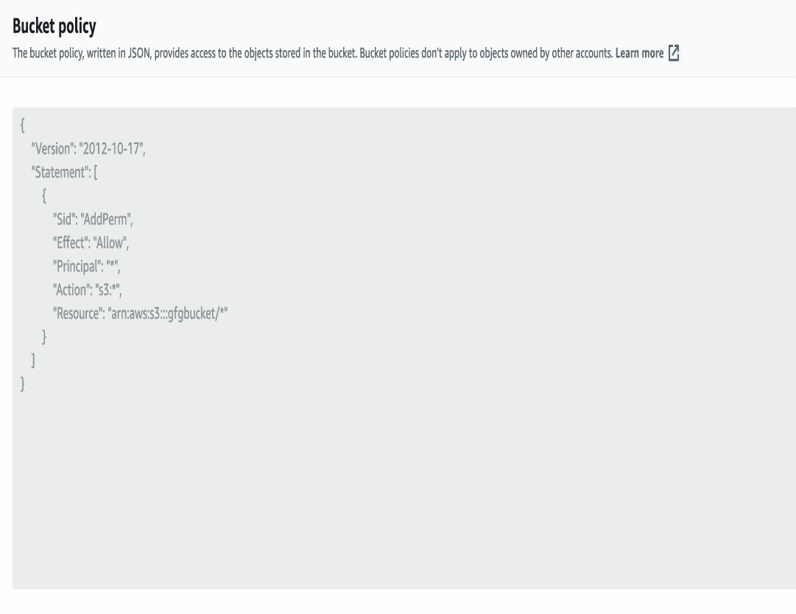

# 用 Python 在 AWS S3 桶中创建桶策略

> 原文：[https://www.geeksforgeeks.org/create-bucket-policy-in-aws-s3-bucket-with-python/](https://www.geeksforgeeks.org/create-bucket-policy-in-aws-s3-bucket-with-python/)

S3 Bucket 的桶策略意味着可以应用于特定桶的权限和操作。AWS S3 有一个可选策略，可用于限制或授予对 S3 存储桶资源的访问权限。需要注意的是，桶策略是以 JSON 格式定义的。

要在 Python 中创建桶策略，我们将遵循以下步骤：

## 步骤 1：导入库

创建桶策略的第一步是我们需要导入 Python SDK `boto3`。这将为我们提供访问 AWS 资源的方法。而对于策略字符串的转储，我们还需要导入 `json`。

```py
import json
import boto3
```

## 步骤 2：创建策略字符串

第二步将是我们需要创建一个策略字符串。策略字符串是键值对字典。其中第一个关键字将是版本。第二个键是语句中的语句第一个键是 `Sid`，它将存储如何键入我们要添加的策略。第二个键是 `Effect`，它将存储访问状态，第三个键是 `Principal`，它将存储谁有权访问，第四个键是 `Action`，它将决定我们可以执行什么类型的操作，以及我们将应用此策略的资源中的最后一个参数 `Resource`。

**示例：**

```py
bucket_policy = {
        "Version": "2012-10-17",
        "Statement": [
            {
                "Sid": "AddPerm",
                "Effect": "Allow",
                "Principal": "*",
                "Action": ["s3:*"],
                "Resource": ["arn:aws:s3:::gfgbucket/*"]
            }
        ]
    }
```

## 步骤 3：转换为 JSON 字符串

第三步需要转换 JSON 中的桶策略字符串。

```py
json.dumps(bucket_policy)
```

## 步骤 4：应用桶策略

第四步将为放桶策略到桶我们需要调用 `put_bucket_policy()` 函数。该函数将第一个参数作为桶名，第二个参数作为策略字符串。

```py
put_bucket_policy(Bucket, policy)
```

## 步骤 5：验证

最后一步是去 AWS -> S3 -> 桶 -> 权限 -> 桶策略和验证。

## 完整代码

```py
import json
import boto3
BUCKET_NAME='gfgbucket'
def create_bucket_policy():
    bucket_policy = {
        "Version": "2012-10-17",
        "Statement": [
            {
                "Sid": "AddPerm",
                "Effect": "Allow",
                "Principal": "*",
                "Action": ["s3:*"],
                "Resource": ["arn:aws:s3:::gfgbucket/*"]
            }
        ]
    }

    policy_string = json.dumps(bucket_policy)

    s3_client().put_bucket_policy(
        Bucket=BUCKET_NAME,
        Policy=policy_string
    )
```

**输出：**

