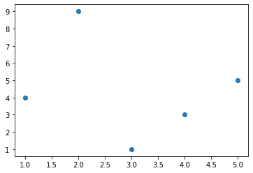
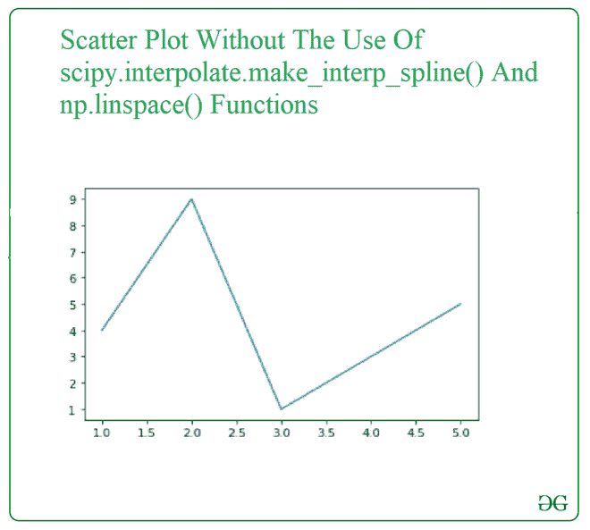
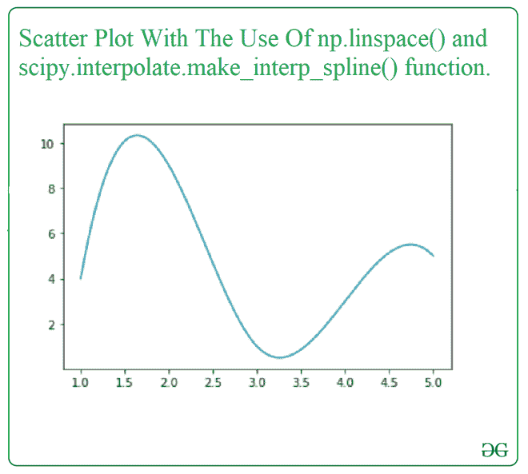

# 使用 Python 使用平滑线创建散点图

> 原文: [https://www.geeksforgeeks.org/create-scatter-plot-with-smooth-line-using-python/](https://www.geeksforgeeks.org/create-scatter-plot-with-smooth-line-using-python/)

曲线可以被平滑，以达到可视化的良好近似的想法。在本文中，我们将在 SciPy 库的帮助下用平滑线绘制散点图。要绘制平滑的散点图，我们使用以下函数:

*   来自 `scipy` 库中的 `scipy.interpolate.make_interp_spline()` 计算插值 B 样条的系数。通过从 `scipy` 库中导入该函数并添加参数，可以更容易地获得散点图的平滑线。

> **语法:**
>
> `scipy.interpolate.make_interp_spline(x, y, k=3, t=None, bc_type=None, axis=0, check_finite=True)`
>
> **参数:**
>
> *   `x`: - 脓肿
> *   `y`: - 坐标
> *   `k`: - B 样条度
> *   `t`: - 节
> *   `bc_type`: - 边界条件
> *   `axis`: - 插值轴
> *   `check_finite`: - 是否检查输入数组是否只包含有限的数字
>
> **返回:** 一个度数为 `k`，节数为 `t` 的 `BSpline` 对象

*   `np.linspace()` 函数是从 `NumPy` 库中导入的，用于获取指定间隔内均匀分布的数字，用于绘制平滑的直线散点图。

> **语法:**
>
> `numpy.linspace(start, stop, num=50, endpoint=True, retstep=False, dtype=None, axis=0)`
>
> **参数:**
>
> *   `start`: - 序列的起始值。
> *   `stop`: - 序列的结束值。
> *   `num`: - 要生成的样本数量。
> *   `endpoint`: - 如果为真，`stop` 是最后一个样本。
> *   `retstep`: - 如果为 `True`，则返回 `(样本, 步长)`，其中步长是样本之间的间距。
> *   `dtype`: - 输出数组的类型。
> *   `axis`: - 结果中存储样本的轴。
>
> **返回:** 封闭区间内等间距样本数的数组

**接近**

*   导入模块
*   创建或加载数据
*   创建散点图
*   从散点图的点创建平滑曲线
*   显示图

让我们从一个样本散点图开始。

**例:**

### 蟒蛇 3

```py
import numpy as np
import matplotlib.pyplot as plt

x = np.array([1, 2, 3, 4, 5])
y = np.array([4, 9, 1, 3, 5])

plt.scatter(x, y)
plt.show()
```

**输出:**



现在让我们通过连接散点图的点来可视化散点图，这样就可以出现一条不平坦的曲线，也就是说不平滑，这样差异就可以很明显了。

**示例:**

### 蟒蛇 3

```py
import numpy as np
import matplotlib.pyplot as plt

x = np.array([1, 2, 3, 4, 5])
y = np.array([4, 9, 1, 3, 5])

plt.plot(x, y)
plt.show()
```

**输出:**



现在，我们将使用 `np.linspace()` 和 `scipy.interpolate.make_interp_spline()` 函数查看与上面相同的示例。

**示例:**

### 蟒蛇 3

```py
import numpy as np
import matplotlib.pyplot as plt
from scipy.interpolate import make_interp_spline

x = np.array([1, 2, 3, 4, 5])
y = np.array([4, 9, 1, 3, 5])

xnew = np.linspace(x.min(), x.max(), 300)
gfg = make_interp_spline(x, y, k=3)
y_new = gfg(xnew)

plt.plot(xnew, y_new)
plt.show()
```

**输出:**

