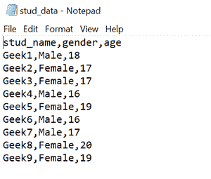
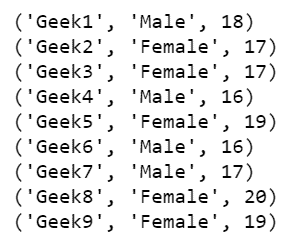

# 用 Python 从 CSV 创建 SQLite 数据库

> 原文：[https://www.geeksforgeeks.org/creating-a-sqlite-database-from-csv-with-python/](https://www.geeksforgeeks.org/creating-a-sqlite-database-from-csv-with-python/)

**先决条件：**

*   [Pandas](https://www.geeksforgeeks.org/pandas-tutorial/)
*   [SQLite](https://www.geeksforgeeks.org/introduction-to-sqlite/)

SQLite 是一个实现轻量级关系数据库管理系统的软件库。与 PostgreSQL、MySQL、Oracle 等其他关系数据库管理系统不同，它不需要服务器来运行。应用程序直接与 SQLite 数据库交互。SQLite 通常用于小型应用程序，尤其是嵌入式系统和移动应用程序。要与 Python 中的 SQLite 数据库交互，需要 `sqlite3` 模块。

## 方法

*   导入模块
*   创建数据库并建立连接

为了建立连接，我们使用 `sqlite3.connect()` 函数，该函数返回一个连接对象。传递要在此函数中创建的数据库的名称。SQLite 数据库的完整状态存储在一个带有 `.db` 扩展名的文件中。如果未指定路径，则在当前工作目录中创建新数据库。

**语法：**

```python
sqlite3.connect('database_name.db')
```

*   使用 `read_csv()` 导入 CSV

**语法：**

```python
pandas.read_csv('file_name.csv')
```

*   把内容写到新的表格里

函数 `to_sql()` 根据数据帧的记录创建一个新表。在这个函数中传递表名和连接对象。表格的列名与 CSV 文件的标题相同。默认情况下，dataframe 索引作为列写入。只需将 `index` 参数切换为 `False`，即可删除该列。此外，`if_exists` 参数指定了在表名已经被使用的情况下的行为。它可以引发错误（`fail`）、追加新值（`append`）或替换现有表（`replace`）。

```python
pandas.DataFrame.to_sql(table_name, connection_object, if_exists, index)
```

*   检查表格内容

创建一个游标对象，并执行标准的 `SELECT` 语句来获取新创建的表的内容。

*   关闭连接

**正在使用的 CSV 文件：** `stud_data.csv`



## 程序

```py
# Import required libraries
import sqlite3
import pandas as pd

# Connect to SQLite database
conn = sqlite3.connect(r'C:\User\SQLite\University.db')

# Load CSV data into Pandas DataFrame
stud_data = pd.read_csv('stud_data.csv')
# Write the data to a sqlite table
stud_data.to_sql('student', conn, if_exists='replace', index=False)

# Create a cursor object
cur = conn.cursor()
# Fetch and display result
for row in cur.execute('SELECT * FROM student'):
    print(row)
# Close connection to SQLite database
conn.close()
```

**输出：**

