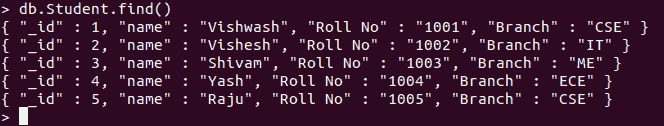

# Pymongo 中 `insert()`、`insertOne()` 和 `insertMany()` 的区别

> 原文：[https://www.geeksforgeeks.org/difference-between-insert-insertone-and-insertmany-in-pymongo/](https://www.geeksforgeeks.org/difference-between-insert-insertone-and-insertmany-in-pymongo/)

**[MongoDB](https://www.geeksforgeeks.org/mongodb-and-python/)** 是一个 NoSql 数据库，可以用来存储不同应用需要的数据。Python 可以用来访问 MongoDB 数据库。Python 需要一个驱动程序来访问数据库。PyMongo 支持从 Python 应用程序与 MongoDB 数据库交互。`pymongo` 包充当 MongoDB 的本机 Python 驱动程序。Pymongo 提供了可在 Python 应用程序中使用的命令，以在 MongoDB 上执行所需的操作。MongoDB 提供了三种将记录或文档插入数据库的方法，如下所示：

## 1. `insert()`

用于将一个或多个文档插入集合。如果集合不存在，则 `insert()` 会先创建集合，然后插入指定的文档。

> **语法**
> `db.collection.insert(<文档或文档数组>, { writeConcern: <文档>, ordered: <布尔值> })`
>
> **参数**
> *   `<文档>`：要存储在数据库中的文档或记录。
> *   `writeConcern`：可选。
> *   `ordered`：可选。可以设置为 `true` 或 `false`。
>
> **返回值**：分别用于单次或批量插入的 `WriteResult` 对象或 `BulkWriteResult` 对象。

**示例：**

```python
# importing Mongoclient from pymongo
from pymongo import MongoClient

myclient = MongoClient("mongodb://localhost:27017/")

# database
db = myclient["GFG"]

# Created or Switched to collection names: College
collection = db["College"]

mylist = [
  { "_id": 1, "name": "Vishwash", "Roll No": "1001", "Branch":"CSE"},
  { "_id": 2, "name": "Vishesh", "Roll No": "1002", "Branch":"IT"},
  { "_id": 3, "name": "Shivam", "Roll No": "1003", "Branch":"ME"},
  { "_id": 4, "name": "Yash", "Roll No": "1004", "Branch":"ECE"},
]

# Inserting the entire list in the collection
collection.insert(mylist)
```

**输出：**


## 2. `insertOne()`

用于向数据库插入单个文档或记录。如果集合不存在，则 `insertOne()` 方法会先创建集合，然后插入指定的文档。

> **语法**
> `db.collection.insertOne(<文档>, { writeConcern: <文档> })`
>
> **参数**
> *   `<文档>`：要存储在数据库中的文档或记录。
> *   `writeConcern`：可选。
>
> **返回值**：返回插入数据库的文档的 `_id`。

**注意**：Pymongo 中对应的命令是 `insert_one()`。

**示例：**

```python
# importing Mongoclient from pymongo
from pymongo import MongoClient

# Making Connection
myclient = MongoClient("mongodb://localhost:27017/")

# database
db = myclient["GFG"]

# Created or Switched to collection names: GeeksForGeeks
collection = db["Student"]

# Creating Dictionary of records to be inserted
record = { "_id": 5,
          "name": "Raju",
          "Roll No": "1005",
          "Branch": "CSE"}

# Inserting the record1 in the collection by using collection.insert_one()
rec_id1 = collection.insert_one(record)
```

**输出：**



## 3. `insertMany()`

> **语法**
> `db.collection.insertMany([<文档1>, <文档2>, ...], { writeConcern: <文档>, ordered: <布尔值> })`
>
> **参数**
> *   `<文档>`：要存储在数据库中的文档或记录。
> *   `writeConcern`：可选。
> *   `ordered`：可选。可以设置为 `true` 或 `false`。
>
> **返回值**：返回插入数据库的文档的 `_ids`。

**注意**：Pymongo 中对应的命令是 `insert_many()`。

**示例：**

```python
# importing Mongoclient from pymongo
from pymongo import MongoClient

myclient = MongoClient("mongodb://localhost:27017/")

# database
db = myclient["GFG"]

# Created or Switched to collection names: GeeksForGeeks
collection = db["College"]

mylist = [
  { "_id": 6, "name": "Deepanshu", "Roll No": "1006", "Branch":"CSE"},
  { "_id": 7, "name": "Anshul", "Roll No": "1007", "Branch":"IT"}
]

# Inserting the entire list in the collection
collection.insert_many(mylist)
```

**输出：**


## 比较

| `insert()` | `insertOne()` | `insertMany()` |
| :--- | :--- | :--- |
| Pymongo 等效命令是 `insert()` | Pymongo 等效命令是 `insert_one()` | Pymongo 的等效命令是 `insert_many()` |
| 在 mongo 引擎的较新版本中已弃用 | 用于较新版本的 mongo 引擎 | 用于较新版本的 mongo 引擎 |
| 分别为写关注错误和非写关注错误引发 `WriteResult.writeConcernError` 和 `WriteResult.writeError` | 引发 `writeError` 或 `writeConcernError` 异常。 | 引发 `BulkWriteError` 异常。 |
| 与 `db.collection.explain()` 兼容 | 与 `db.collection.explain()` 不兼容 | 与 `db.collection.explain()` 不兼容 |
| 如果 `ordered` 设置为 `true`，并且任何文档都报告错误，则不会插入其余文档。如果 `ordered` 设置为 `false`，则即使出现错误，也会插入剩余的文档。 | 如果报告了文档的错误，则不会将其插入数据库 | 如果 `ordered` 设置为 `true`，并且任何文档都报告错误，则不会插入其余文档。如果 `ordered` 设置为 `false`，则即使出现错误，也会插入剩余的文档。 |
| 返回包含操作状态的对象。 | 返回插入文档的 `insert_id` | 返回插入文档的 `insert_ids` |