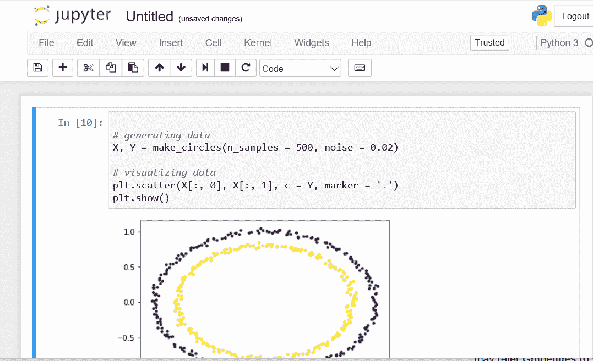
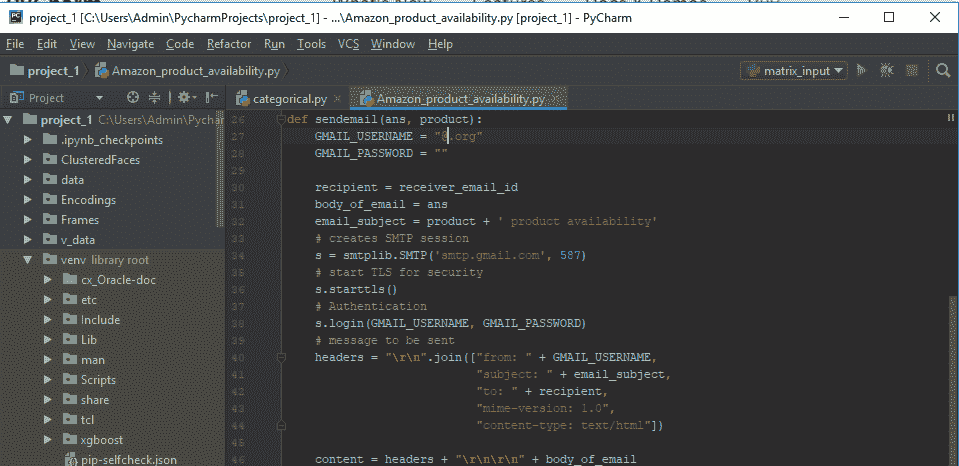

# Jupyter 和 PyCharm 的区别

> 原文：[https://www.geeksforgeeks.org/difference-between-jupyter-and-pycharm/](https://www.geeksforgeeks.org/difference-between-jupyter-and-pycharm/)

## Jupyter Notebook

[`Jupyter Notebook`](https://jupyter.org/) 是一个开源 IDE，用来创建 Jupyter 文档，可以用实时代码创建和共享。此外，它是一个基于网络的交互式计算环境。Jupyter 笔记本可以支持数据科学中流行的各种语言，如 `Python`、`Julia`、`Scala`、`R` 等。

## PyCharm

[`PyCharm`](https://www.jetbrains.com/pycharm/) 是由 JetBrains 开发的一款 IDE，专门为 `Python` 打造。它具有代码分析、集成单元测试器、集成 `Python` 调试器、支持 web 框架等多种功能。PyCharm 在机器学习中特别有用，因为它支持 `Pandas`、`Matplotlib`、`Scikit-Learn`、`NumPy` 等库。

## 差异对比

| 编号 | Jupyter | PyCharm |
| :--- | :--- | :--- |
| 1 | Jupyter 笔记本是一个基于网络的交互式计算平台。 | PyCharm 是一个智能的代码编辑器。 |
| 2 | 笔记本结合了实时代码、方程式、叙事文本、可视化、交互式仪表盘和其他媒体。 | 编辑器为 `Python`、`JavaScript`、`CoffeeScript`、`TypeScript`、`CSS`、流行模板语言等提供一流的支持。利用语言感知的代码完成、错误检测和动态代码修复！ |
| 3 | 它可以归类为“数据科学笔记本”中的一个工具。 | PyCharm 归入“集成开发环境（`IDE`）”下。 |
| 4 | 使用块提供内嵌代码执行。 | 提供智能自动完成。 |
| 5 | 提供在线绘图支持。 | 提供智能代码分析。 |
| 6 | 它可以自定义主题，支持内核和 `LaTeX`。 | 它提供强大的重构、`virtualenv` 集成和 `Git` 集成。 |
| 7 | 与 PyCharm 相比，它非常灵活。 | 与 Jupyter 和慢启动相比，它不是很灵活。 |
| 8 | 像 `GitHub`、`Python`、`Dropbox`、`Scala`、`TensorFlow` 等工具与 Jupyter 集成。 | `Python`、`Django`、`Anaconda`、`Wakatime`、`Kite` 等工具与 PyCharm 集成。 |
| 9 | 像 Ruangguru、Delivery Hero SE、trivago、Intuit、Hepsiburada 等公司正在使用 Jupyter。 | 像 Lyft、Bepro 公司、trivago、Hepsiburada、Picnic Tech 等公司都在使用 PyCharm。 |