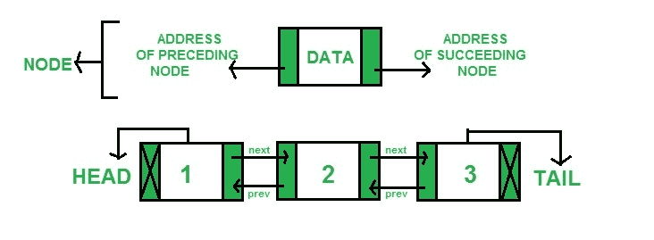

# Python 中 llist 模块的 dllist 类

> 原文：[https://www.geeksforgeeks.org/dllist-class-of-llist-module-in-python/](https://www.geeksforgeeks.org/dllist-class-of-llist-module-in-python/)

`llist` 是 CPython 的扩展模块，提供了基本的链表结构。它们出列的速度比标准列表快得多。

## 双向链表

这是一种链表，其中每个节点存储数据和两个地址（前后节点的地址）。一个简单得多的定义是，在双向链表中，每个节点都指向它前面的节点以及紧接其后的节点。
下图解释的更好：


在 `llist` 中，有一个 `dllist` 对象可以帮助成功实现双链表。

## 数据列表对象

`class llist.dllist([iterable])`
返回从提供的 iterable 初始化的新双链表。如果没有给定 iterables，则生成链表，但链表是空的。

```py
import llist
from llist import dllist

lst = llist.dllist(['first', 'second', 'third'])
print(lst)
```

**输出：**

```py
dllist([first, second, third])
```

`dllist` 支持以下属性：

*   `first`：只读属性，打印列表的第一个元素，如果列表为空则为 `None`。

    ```py
    print(lst.first)
    ```

    **输出：**

    ```py
    dllistnode(first)
    ```

*   `last`：只读属性，返回列表的最后一个元素（尾节点），如果列表为空则为 `None`。

    ```py
    print(lst.last)
    ```

    **输出：**

    ```py
    dllistnode(third)
    ```

*   `size`：只读属性，返回列表的大小。

    ```py
    print(lst.size)
    ```

    **输出：**

    ```py
    3
    ```

`dllist` 还支持以下方法：

*   `append(x)`：将 `x` 添加到列表的右侧，并返回插入的 `dllist` 节点。如果 `x` 已经是一个 `dllist` 节点，则创建一个新节点并用从 `x` 提取的值初始化。

    ```py
    lst.append('fourth')
    print(lst)
    ```

    **输出：**

    ```py
    dllist([first, second, third, fourth])
    ```

*   `appendleft(x)`：将 `x` 添加到列表的左侧，并返回插入的 `dllist` 节点。如果 `x` 已经是一个 `dllist` 节点，则创建一个新节点并用从 `x` 提取的值初始化。

    ```py
    lst.appendleft('fourth')
    print(lst)
    ```

    **输出：**

    ```py
    dllist([fourth, first, second, third])
    ```

*   `appendright(x)`：将 `x` 添加到列表的右侧，并返回插入的 `dllist` 节点。如果 `x` 已经是一个 `dllist` 节点，则创建一个新节点并用从 `x` 提取的值初始化。

    ```py
    lst.appendright('fourth')
    print(lst)
    ```

    **输出：**

    ```py
    dllist([first, second, third, fourth])
    ```

*   `clear()`：从列表中移除所有节点。

    ```py
    lst.clear()
    print(lst)
    ```

    **输出：**

    ```py
    dllist()
    ```

*   `extend([iterable])`：将可迭代对象中的元素添加到列表的右侧。

    ```py
    lst.extend(['fourth', 'fifth'])
    print(lst)
    ```

    **输出：**

    ```py
    dllist([first, second, third, fourth, fifth])
    ```

*   `extendleft([iterable])`：将可迭代对象中的元素添加到列表的左侧。

    ```py
    lst.extendleft(['fourth', 'fifth'])
    print(lst)
    ```

    **输出：**

    ```py
    dllist([fifth, fourth, first, second, third])
    ```

*   `extendright([iterable])`：将可迭代对象中的元素添加到列表的右侧。

    ```py
    lst.extendright(['fourth', 'fifth'])
    print(lst)
    ```

    **输出：**

    ```py
    dllist([first, second, third, fourth, fifth])
    ```

*   `insert()`：将提供的元素添加到列表中。通常用于在列表中的任意点插入元素，为此需要提供在其之前插入的元素。

    ```py
    lst.insert('fourth')
    node = lst.nodeat(2)
    lst.insert('fifth', node)
    print(lst)
    ```

    **输出：**

    ```py
    dllist([first, second, fifth, third, fourth])
    ```

*   `nodeat(index)`：返回指定索引处的节点。允许使用负地址。

    ```py
    print(lst.nodeat(2))
    print(lst.nodeat(-2))
    ```

    **输出：**

    ```py
    dllistnode(third)
    dllistnode(second)
    ```

*   `pop()`：从列表的右侧移除并返回一个元素的值。

    ```py
    lst.pop()
    print(lst)
    ```

    **输出：**

    ```py
    dllist([first, second])
    ```

*   `popleft()`：从列表的左侧移除并返回一个元素的值。

    ```py
    lst.popleft()
    print(lst)
    ```

    **输出：**

    ```py
    dllist([second, third])
    ```

*   `popright()`：从列表的右侧移除并返回一个元素的值。

    ```py
    lst.popright()
    print(lst)
    ```

    **输出：**

    ```py
    dllist([first, second])
    ```

*   `remove()`：从列表中移除指定的节点并返回存储在其中的元素。

    ```py
    node = lst.nodeat(1)
    lst.remove(node)
    print(lst)
    ```

    **输出：**

    ```py
    dllist([first, third])
    ```

*   `rotate(n)`：如果 `n` 为正，则将列表向右旋转 `n` 步；如果为负，则向左旋转 `n` 步。

    ```py
    lst.rotate(4)
    print(lst)
    ```

    **输出：**

    ```py
    dllist([third, first, second])
    ```

除了这些方法之外，`dllist` 还支持迭代、`cmp(lst1, lst2)`、富比较运算符、常数时间 `len(lst)`、`hash(lst)` 和下标引用 `lst[1234]` 用于按索引访问元素。

**让我们进一步讨论 `llist` 中更多与 `dllist` 相关的对象：**

### 1. `dllistnode`

在双向链表中实现一个节点，如果提供了值，可以选择初始化这个节点。

```py
node = llist.dllistnode('zeroth')
print(node)
```

**输出：**

```py
dllistnode(zeroth)
```

此对象还支持以下属性：

*   `next`：只读属性，打印列表中的下一个节点。
*   `prev`：只读属性，打印列表中的上一个节点。
*   `value`：打印列表中存储的值。

```py
node = lst.nodeat(1)
print(node.next)
print(node.prev)
print(node.value)
```

**输出：**

```py
dllistnode(third)
dllistnode(first)
second
```

### 2. `dllistiterator`

返回一个新的双向链表迭代器。这些对象不是由用户创建的，而是由 `dllist` 的 `__iter__()` 方法返回的，用于保存迭代状态。迭代 `dllistiterator` 接口将直接产生存储在节点中的值。

```py
import llist
from llist import dllist

lst = llist.dllist(['first', 'second', 'third'])

for value in lst:
  print(value)
```

**输出：**

```py
first
second
third
```