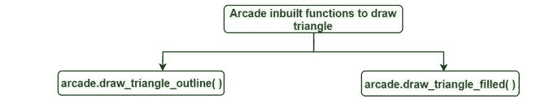
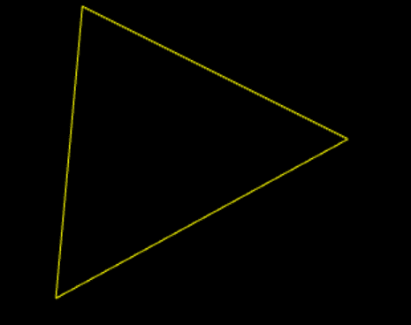
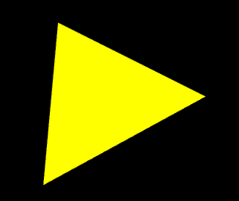

# 使用 Python 中的 Arcade 绘制三角形

> 原文：[https://www.geeksforgeeks.org/draw-a-triangle-using-arcade-in-python/](https://www.geeksforgeeks.org/draw-a-triangle-using-arcade-in-python/)

Arcade 是一个 Python 库，用于开发二维游戏。Arcade 需要 OpenGL 3.3+的支持。在 Arcade 中，基本的绘图不需要关于如何定义函数或类或如何循环的知识，简单地说，我们有用于绘制图元的内置函数。

用于绘制三角形的 Arcade 内置功能：



## `arcade.draw_triangle_outline()`

此功能用于绘制三角形的轮廓。

> **语法：**`arcade.draw_triangle_outline(x1, y1, x2, y2, x3, y3, color, border_width)`
>
> **参数：**
>
> *   `x1`：第一个坐标的 x 值。
> *   `y1`：第一个坐标的 y 值。
> *   `x2`：第二坐标 x 值。
> *   `y2`：第二坐标 y 值。
> *   `x3`：第三坐标 x 值。
> *   `y3`：第三坐标 y 值。
> *   `color`：三角形的轮廓颜色。
> *   `border_width`：边框的宽度，以像素为单位。默认为 1。

让我们看一个例子来更好地理解它的功能。

### 示例

```py
#import module
import arcade

# Open the window. Set the window title and
# dimensions (width and height)
arcade.open_window(600, 600, "Draw a triangle for GfG ")

# set background color
arcade.set_background_color(arcade.color.BLACK)

# Start the render process.
arcade.start_render()

# triangle function
arcade.draw_triangle_outline(300, 200,
                             80, 80,
                             100, 300,
                             arcade.color.YELLOW, 1)

# finished drawing
arcade.finish_render()

# display everything
arcade.run()
```

**输出：**



## `arcade.draw_triangle_filled()`

此功能用于绘制一个用颜色填充的三角形。

> **语法：**`arcade.draw_triangle_filled(x1, y1, x2, y2, x3, y3, color)`
>
> **参数：**
>
> *   `x1`：第一个坐标的 x 值。
> *   `y1`：第一个坐标的 y 值。
> *   `x2`：第二坐标 x 值。
> *   `y2`：第二坐标 y 值。
> *   `x3`：第三坐标 x 值。
> *   `y3`：第三坐标 y 值。
> *   `color`：要用三角形填充的颜色。

### 示例

```py
# import
import arcade

# Open the window. Set the window title and
# dimensions (width and height)
arcade.open_window(600, 600, "Draw a triangle for GfG ")

# set background color
arcade.set_background_color(arcade.color.BLACK)

# Start the render process.
arcade.start_render()

# draw triangle
arcade.draw_triangle_filled(300, 200,
                            80, 80,
                            100, 300,
                            arcade.color.YELLOW)

# finish drawing
arcade.finish_render()

# display everything
arcade.run()
```

**输出：**

