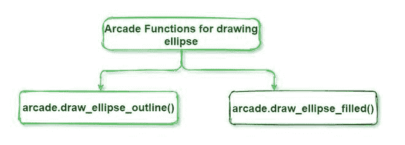

# 使用 Python 中的 Arcade 库绘制椭圆

> 原文: [https://www.geeksforgeeks.org/draw-an-ellipse-using-arcade-library-in-python/](https://www.geeksforgeeks.org/draw-an-ellipse-using-arcade-library-in-python/)

**先决条件:** [Arcade 库](https://www.geeksforgeeks.org/arcade-library-in-python/)

`arcade`库是一个现代 Python 模块，用于开发具有迷人图形和声音的 2D 视频游戏。这是一个面向对象的库。它可以像集成开发环境中的任何其他 Python 包一样安装。

`arcade`模块有两个内置的椭圆绘制功能，即`arcade.draw_ellipse_outline()`和`arcade.draw_ellipse_filled()`。这是`arcade`模块中的一个加分点，不然你一定注意到了，在`turtle`这样的 Python 模块中，你需要创建一个函数来绘制任何原始设计。



## `arcade.draw_ellipse_outline()`

此方法用于绘制椭圆的轮廓。

> **语法:** `arcade.draw_ellipse_outline(center_x, center_y, width, height, color, border_width, tilt_angle, num_segments)`
>
> **1. `center_x`:** 作为椭圆中心的 x 位置。
> **2. `center_y`:** 椭圆中心的 y 位置。
> **3. `width`:** 椭圆的宽度。
> **4. `height`:** 椭圆的高度。
> **5. `color`:** 用于定义借助`arcade.color`功能制作椭圆轮廓的颜色。
> **6. `border_width`:** 椭圆轮廓的宽度，以像素为单位。
> **7. `tilt_angle`:** 倾斜椭圆的角度，单位为度。
> **8. `num_segments`:** 组成此椭圆的三角形线段数。默认值为 -1，这显然意味着 arcade 将根据椭圆的大小计算线段的数量。

**上述方法的实施:**

```python
# Import required modules
import arcade

# Specify Parameters
SCREEN_WIDTH = 600
SCREEN_HEIGHT = 800
SCREEN_TITLE = "Welcome to GeeksForGeeks "

# Open the window
arcade.open_window(SCREEN_WIDTH, SCREEN_HEIGHT, SCREEN_TITLE)

# Set the background color
arcade.set_background_color(arcade.color.BABY_BLUE)

# Start drawing
arcade.start_render()

# Draw ellipse
arcade.draw_ellipse_outline(
    400, 363, 250, 130, arcade.color.AMBER, 10, 180, -1)

# Finish drawing
arcade.finish_render()

# Display everything
arcade.run()
```

**输出:**


## `arcade.draw_ellipse_filled()`

此方法用于绘制填充椭圆。

> **语法:** `arcade.draw_ellipse_filled(center_x, center_y, width, height, color, tilt_angle, num_segments)`
>
> **1. `center_x`:** 作为椭圆中心的 x 位置。
> **2. `center_y`:** 椭圆中心的 y 位置。
> **3. `width`:** 椭圆的宽度。
> **4. `height`:** 椭圆的高度。
> **5. `color`:** 用于定义借助`arcade.color`功能制作椭圆轮廓的颜色。
> **6. `tilt_angle`:** 倾斜椭圆的角度，单位为度。
> **7. `num_segments`:** 组成此椭圆的三角形线段数。默认值为 -1，这显然意味着 arcade 将根据椭圆的大小计算线段的数量。

除了`border_width`外，其他参数均与`arcade.draw_ellipse_outline()`相同。在`arcade`中，我们不需要边框宽度。

**上述方法的实施:**

```python
# Import required modules
import arcade

# Specify Parameters
SCREEN_WIDTH = 600
SCREEN_HEIGHT = 800
SCREEN_TITLE = "Welcome to GeeksForGeeks "

# Open the window
arcade.open_window(SCREEN_WIDTH, SCREEN_HEIGHT, SCREEN_TITLE)

# Set the background color
arcade.set_background_color(arcade.color.BABY_BLUE)

# start drawing
arcade.start_render()

# Draw ellipse
arcade.draw_ellipse_filled(400, 363, 250, 130, arcade.color.AMBER, 180, -1)

# Finish drawing
arcade.finish_render()

# Display everything
arcade.run()
```

**输出:**

