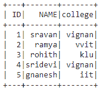
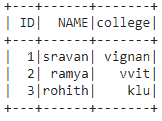
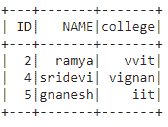
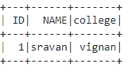
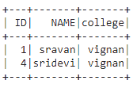

# 根据列表中的匹配值过滤 PySpark 数据框中的一行

> 原文：[https://www.geeksforgeeks.org/filtering-a-row-in-pyspark-dataframe-based-on-matching-values-from-a-list/](https://www.geeksforgeeks.org/filtering-a-row-in-pyspark-dataframe-based-on-matching-values-from-a-list/)

在本文中，我们将在 Pyspark 数据框中使用 `isin()`，根据列表中的匹配值过滤数据框中的行。

`isin():` 这是用来查找给定数据帧中包含的元素，它会取元素并得到与数据匹配的元素。

> **语法：** `isin([element1, element2, ..., element n])`

**创建数据框进行演示：**

## Python 3

```py
# importing module
import pyspark

# importing sparksession
from pyspark.sql import SparkSession

# creating sparksession
# and giving an app name
spark = SparkSession.builder.appName('sparkdf').getOrCreate()

# list  of students  data  with null values
# we can define null values with none
data = [[1, "sravan", "vignan"],
        [2, "ramya", "vvit"],
        [3, "rohith", "klu"],
        [4, "sridevi", "vignan"],
        [5, "gnanesh", "iit"]]

# specify column names
columns = ['ID', 'NAME', 'college']

# creating a dataframe from the lists of data
dataframe = spark.createDataFrame(data, columns)

dataframe.show()
```

**输出：**



## 方法 1：使用 `filter()` 方法

它用于检查条件并给出结果，两者是相似的。

> **语法：** `dataframe.filter(条件)`
> 
> 其中，条件是数据帧条件。

这里我们将使用所有讨论的方法。

> **语法：** `dataframe.filter((dataframe.column_name).isin([list_of_elements])).show()`
> 
> **在哪里，**
> 
> *   `column_name` 就是列
> *   `elements` 是列中存在的值
> *   `show()` 用于显示结果数据帧

**示例 1：** 使用 `filter()` 子句获取特定的 ID。

### Python 3

```py
# get the ID : 1,2,3 from dataframe
dataframe.filter((dataframe.ID).isin([1,2,3])).show()
```

**输出：**



**示例 2：** 获取 ID 在 1 和 3 中不存在

### Python 3

```py
# get the ID : not in 1 and 3 from dataframe
dataframe.filter(~(dataframe.ID).isin([1, 3])).show()
```

**输出：**



**示例 3：** 从数据框中获取名称。

### Python 3

```py
# get name as sravan
dataframe.filter((
  dataframe.NAME).isin(['sravan'])).show()
```

**输出：**



## 方法 2：使用 `where()` 方法

`where()` 用于检查条件并给出结果。

> **语法：** `dataframe.where(条件)`
> 
> **其中，** 条件是数据帧条件

**带有 `where` 子句的整体语法：**

> `dataframe.where((dataframe.column_name).isin([elements])).show()`
> 
> **在哪里，**
> 
> *   `column_name` 就是列
> *   `elements` 是列中存在的值
> *   `show()` 用于显示结果数据帧

**示例：** 获取带有 `where()` 子句的特定学院

### Python 3

```py
# get college as vignan
dataframe.where((
  dataframe.college).isin(['vignan'])).show()
```

**输出：**

