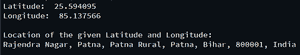

# 使用 Python

## 找到指定经纬度的位置

> 原文: [使用 Python 查找指定经纬度的位置](https://www.geeksforgeeks.org/find-the-location-with-specified-latitude-and-longitude-using-python/)

在本文中，我们将使用 `geopy` 模块编写一个 Python 脚本来查找指定经纬度的地址。`geopy` 模块使定位地址、城市、国家、地标和邮政编码的坐标变得更加容易。

**安装:**

要安装 `geopy` 模块，请在您的终端中运行以下命令。

```py
pip install geopy
```

**分步方法:**

*   导入 `geopy` 模块。
*   初始化 `Nominatim` API，从输入字符串中获取位置。
*   用 `geolocator.geocode()` 方法获取位置。

**以下是基于上述方法的程序:**

## Python 3

```py
# Import module
from geopy.geocoders import Nominatim

# Initialize Nominatim API
geolocator = Nominatim(user_agent="geoapiExercises")

# Assign Latitude & Longitude
Latitude = "25.594095"
Longitude = "85.137566"

# Displaying Latitude and Longitude
print("Latitude: ", Latitude)
print("Longitude: ", Longitude)

# Get location with geocode
location = geolocator.geocode(Latitude+","+Longitude)

# Display location
print("\nLocation of the given Latitude and Longitude:")
print(location)
```

**输出:**

