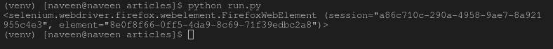

# find_element_by_id() 驱动方法 – Selenium Python

> 原文: [https://www.geeksforgeeks.org/find_element_by_id-driver-method-selenium-python/](https://www.geeksforgeeks.org/find_element_by_id-driver-method-selenium-python/)

Selenium 的 Python 模块是为使用 Python 执行自动化测试而构建的。Selenium Python 绑定提供了一个简单的应用编程接口，可以使用 Selenium Web Driver 编写功能/验收测试。安装完 selenium 并参考 – [使用 get 方法导航链接](https://www.geeksforgeeks.org/navigating-links-using-get-method-selenium-python/) 后，您可能希望使用 Selenium Python 探索更多功能。在使用 geeksforgeeks 等 selenium 打开页面后，您可能希望自动单击某些按钮或自动填写表单或任何此类自动任务。

本文围绕如何使用 Selenium Web Driver 的定位策略抓取或定位网页中的元素展开。更具体地说，本文将讨论 `find_element_by_id()`。使用这种策略，将返回 id 属性值与定位器匹配的第一个元素。如果没有元素具有匹配的 id 属性，将引发 `NoSuchElementException`。

**语法：**

```py
driver.find_element_by_id("id_of_element")
```

**示例：**

例如，考虑此页面源代码：

```html
<html>
  <body>
    <form id="loginForm">
      <input name="username" type="text" />
      <input name="password" type="password" />
      <input name="continue" type="submit" value="Login" />
    </form>
  </body>
</html>
```

现在，在您创建了驱动程序之后，您可以使用以下方式抓取一个元素：

```py
login_form = driver.find_element_by_id('loginForm')
```

## 如何在 Selenium 中使用 driver.find_element_by_id() 方法？

让我们尝试实际实现这个方法，并获取一个元素实例。让我们尝试使用其 id “gsc-i-id2” 来抓取搜索表单输入。

创建一个名为 `run.py` 的文件来演示 `find_element_by_id` 方法：

```py
# Python program to demonstrate
# selenium

# import webdriver
from selenium import webdriver

# create webdriver object
driver = webdriver.Firefox()

# enter keyword to search
keyword = "geeksforgeeks"

# get geeksforgeeks.org
driver.get("https://www.geeksforgeeks.org/")

# get element
element = driver.find_element_by_id("gsc-i-id2")

# print complete element
print(element)
```

现在使用以下命令运行：

```bash
Python run.py
```

首先，它会用 geeksforgeeks 打开 firefox 窗口，然后选择元素并将其打印在终端上，如下所示。

**浏览器输出：**


**终端输出：**



## 用于定位单个元素的更多定位器

| 定位器 | 描述 |
| --- | --- |
| [`find_element_by_id`](https://www.geeksforgeeks.org/find_element_by_id-driver-method-selenium-python/) | 将返回 id 属性值与定位器匹配的第一个元素。 |
| [`find_element_by_name`](https://www.geeksforgeeks.org/find_element_by_name-driver-method-selenium-python/?ref=rp) | 将返回 name 属性值与定位器匹配的第一个元素。 |
| [`find_element_by_xpath`](https://www.geeksforgeeks.org/find_element_by_xpath-driver-method-selenium-python/?ref=rp) | 将返回 xpath 语法与定位器匹配的第一个元素。 |
| [`find_element_by_link_text`](https://www.geeksforgeeks.org/find_element_by_link_text-driver-method-selenium-python/?ref=rp) | 将返回链接文本值与定位器匹配的第一个元素。 |
| [`find_element_by_partial_link_text`](https://www.geeksforgeeks.org/find_element_by_partial_link_text-driver-method-selenium-python/?ref=rp) | 将返回第一个具有与定位器匹配的部分链接文本值的元素。 |
| [`find_element_by_tag_name`](https://www.geeksforgeeks.org/find_element_by_tag_name-driver-method-selenium-python/?ref=rp) | 将返回具有给定标签名的第一个元素。 |
| [`find_element_by_class_name`](https://www.geeksforgeeks.org/find_element_by_class_name-driver-method-selenium-python/?ref=rp) | 将返回具有匹配类属性名的第一个元素。 |
| [`find_element_by_css_selector`](https://www.geeksforgeeks.org/find_element_by_css_selector-driver-method-selenium-python/?ref=rp) | 将返回具有匹配 CSS 选择器的第一个元素。 |