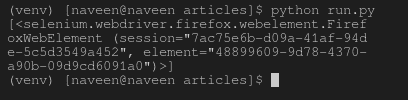

# find_elements_by_tag_name() 驱动方法 – Selenium Python

> 原文: [https://www.geeksforgeeks.org/find_elements_by_tag_name-driver-method-selenium-python/](https://www.geeksforgeeks.org/find_elements_by_tag_name-driver-method-selenium-python/)

Selenium 的 Python 模块是为使用 Python 执行自动化测试而构建的。Selenium Python 绑定提供了一个简单的 API，可以使用 Selenium WebDriver 编写功能/验收测试。安装 Selenium 元素并使用[get 方法](https://www.geeksforgeeks.org/navigating-links-using-get-method-selenium-python/)查看后，您可能想探索更多 Selenium Python 元素。在使用 geeksforgeeks 等打开页面后，您可能希望自动单击某些按钮或自动填写表单或任何此类自动任务。

本文围绕如何使用 Selenium WebDriver 的定位策略抓取或定位网页中的元素展开。更具体地说，本文将讨论 `find_elements_by_tag_name()`。此方法返回具有指定元素类型的列表。

要抓取单个第一个元素，请参阅 – [`find_element_by_tag_name()` 驱动程序方法 – Selenium Python](http://find_element_by_tag_name() driver method – Selenium Python)

## 语法

```py
driver.find_elements_by_tag_name("tag name")
```

## 示例

例如，考虑此页面来源：

### HTML

```html
<html>
 <body>
  <form id="loginForm">
   <input name="1" type="text" />
   <input name="1" type="password" />
   <input name="1" type="submit" value="Login" />
  </form>
 </body>
<html>
```

现在，在您创建了驱动程序之后，您可以使用以下代码抓取一个元素：

```py
login_form = driver.find_elements_by_tag_name('form')
```

## 如何在 Selenium 中使用 `driver.find_elements_by_tag_name()` 方法？

让我们尝试实际实现这个方法，并获取一个元素实例。让我们尝试使用标签 “h2” 来抓取帖子的标题。

创建一个名为 `run.py` 的文件来演示 `find_elements_by_tag_name` 方法：

### Python 3

```py
# Python program to demonstrate
# selenium

# import webdriver
from selenium import webdriver

# create webdriver object
driver = webdriver.Firefox()

# enter keyword to search
keyword = "geeksforgeeks"

# get geeksforgeeks.org
driver.get("https://www.geeksforgeeks.org/")

# get elements
elements = driver.find_elements_by_tag_name("h2")

# print complete elements list
print(element)
```

现在使用以下命令运行：

```bash
Python run.py
```

首先，它会用 geeksforgeeks 打开 Firefox 窗口，然后选择元素并将其打印在终端上，如下所示。

**浏览器输出：**


**终端输出：**

