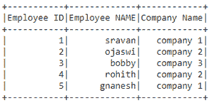

# 获取 PySpark 数据框中特定单元格的值

> 原文: [https://www.geeksforgeeks.org/get-value-of-a-particular-cell-in-pyspark-dataframe/](https://www.geeksforgeeks.org/get-value-of-a-particular-cell-in-pyspark-dataframe/)

在本文中，我们将获取 `pyspark` 数据框中特定单元格的值。

为此，我们将使用 `collect()` 函数获取数据框中的所有行。我们可以指定 `collect()` 函数的索引（单元格位置）。

创建用于演示的数据帧：

## Python 3

```py
# importing module
import pyspark

# importing sparksession from pyspark.sql module
from pyspark.sql import SparkSession

# creating sparksession and giving an app name
spark = SparkSession.builder.appName('sparkdf').getOrCreate()

# list  of employee data with 5 row values
data =[["1","sravan","company 1"],
       ["2","ojaswi","company 2"],
       ["3","bobby","company 3"],
       ["4","rohith","company 2"],
       ["5","gnanesh","company 1"]]

# specify column names
columns=['Employee ID','Employee NAME',
         'Company Name']

# creating a dataframe from the lists of data
dataframe = spark.createDataFrame(data,columns)

# display dataframe
dataframe.show()
```

**输出：**



**`collect()`：** 用于从列表格式的数据框中获取所有行的数据。

> **语法：** `dataframe.collect()`

## 示例 1：演示 `collect()` 函数的 Python 程序

```py
# display dataframe using collect()
dataframe.collect()
```

**输出：**

> [Row(Employee ID='1', Employee NAME='sravan', Company Name='Company 1'),
> Row(Employee ID='2', Employee NAME='ojaswi', Company Name='Company 2'),
> Row(Employee ID='3', Employee NAME='bobby', Company Name='Company 3'),
> Row(Employee ID='4', Employee NAME='rohith', Company Name='Company 2'),
> Row(Employee ID='5', Employee NAME='gnanesh', Company Name='Company 1')]

## 示例 2：获取特定行

为了获得特定的行，我们可以使用索引方法和 `collect()`。在 `pyspark` 数据框中，索引从 0 开始。

> **语法：** `dataframe.collect()[index_number]`

```py
# display dataframe using collect()
print("First row :",dataframe.collect()[0])

print("Third row :",dataframe.collect()[2])
```

**输出：**

> First row: Row(Employee ID='1', Employee NAME='sravan', Company Name='Company 1')
> Third row: Row(Employee ID='3', Employee NAME='bobby', Company Name='Company 3')

## 示例 3：获取特定单元格

我们必须指定行和列索引以及 `collect()` 函数。

> **语法：** `dataframe.collect()[row_index][column_index]`
> 其中，`row_index` 是行号，`column_index` 是列号

这里我们从数据框的单元格中访问值。

```py
# first row - second column
print("first row - second column  :",
      dataframe.collect()[0][1])

# Third  row - Third column
print("Third  row - Third column  :",
      dataframe.collect()[2][1])

# Third  row - Third column
print("Third  row - Third column  :",
      dataframe.collect()[2][2])
```

**输出：**

```py
first row - second column  : sravan
Third  row - Third column  : bobby
Third  row - Third column  : company 3
```