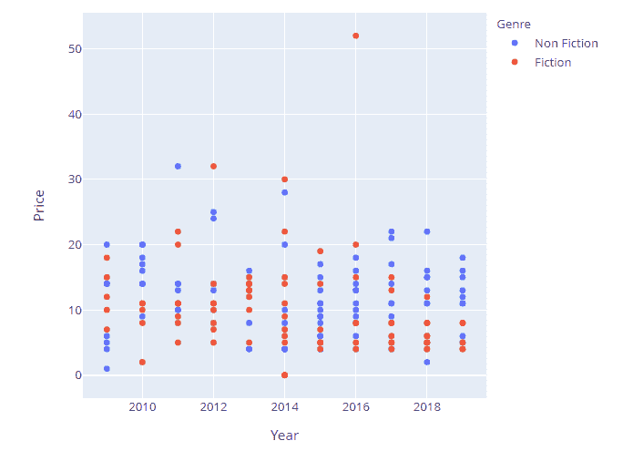
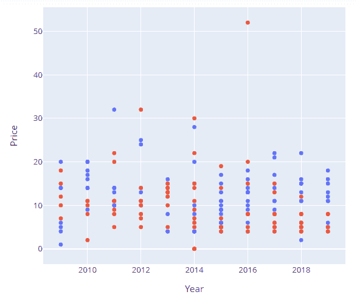

# 用 Python 在 plotly express 中隐藏图例

> 原文：[https://www.geeksforgeeks.org/hide-legend-in-plotly-express-in-python/](https://www.geeksforgeeks.org/hide-legend-in-plotly-express-in-python/)

在本文中，我们将讨论如何使用 Python 在 plotly express 中隐藏图例。

使用中的数据集：[`bestsellers4`](https://media.geeksforgeeks.org/wp-content/cdn-uploads/20211115164236/bestsellers4.csv)

当一个对象的变化必须参照另一个对象来描述时，默认情况下会出现图例。图例使图形更容易阅读，因为它包含所用颜色代码或键的描述。

## 创建一个常规图表以进行对比

这里我们将使用数据框创建一个散点图。为此，我们将从给定的数据集创建数据帧。

### Python 3

```py
# import libraries
import plotly.express as px
import pandas as pd

# read dataset
data = pd.read_csv("bestsellers.csv")

fig = px.scatter(data, x="Year", y="Price", 
                 color="Genre")

fig.show()
```

**输出：**



## 在 plotly express 中隐藏图例

现在，要隐藏图例，需要调用 `update_layout()` 函数，并将 `showlegend` 参数设置为 `False`。这个简单的语句足以完成工作。

> **语法：**
>
> `update_layout(showlegend=False)`

### Python 3

```py
# import libraries
import plotly.express as px
import pandas as pd

# read dataset
data = pd.read_csv("bestsellers.csv")

fig = px.scatter(data, x="Year", y="Price",
                 color="Genre")
fig.update_layout(showlegend = False)

fig.show()
```

**输出：**

