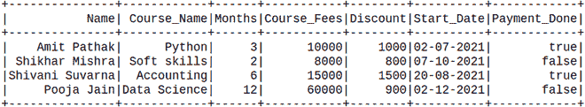
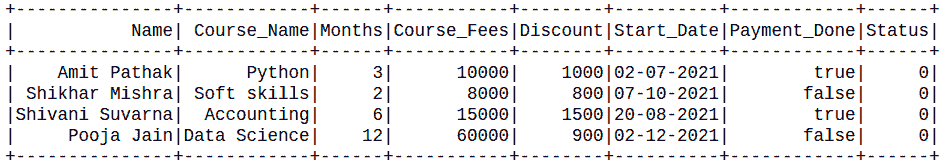
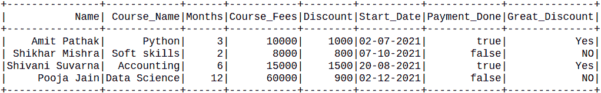
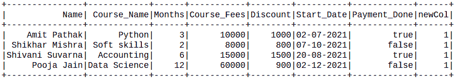

# 如何在 PySpark DataFrame 中添加常量列？

> 原文: [https://www.geeksforgeeks.org/how-to-add-a-constant-column-in-a-pyspark-dataframe/](https://www.geeksforgeeks.org/how-to-add-a-constant-column-in-a-pyspark-dataframe/)

在本文中，我们将看到如何在 PySpark DataFrame 中添加一个常量列。

可以这样做:
*   使用 `lit()`
*   使用 SQL 查询。

创建用于演示的数据框:

```py
# Create a spark session
from pyspark.sql import SparkSession
from pyspark.sql.functions import lit
spark = SparkSession.builder.appName('SparkExamples').getOrCreate()

# Create a spark dataframe
columns = ["Name", "Course_Name",
           "Months",
           "Course_Fees", "Discount",
           "Start_Date", "Payment_Done"]
data = [
    ("Amit Pathak", "Python", 3,
     10000, 1000, "02-07-2021", True),
    ("Shikhar Mishra", "Soft skills",
     2, 8000, 800, "07-10-2021", False),
    ("Shivani Suvarna", "Accounting", 6,
     15000, 1500, "20-08-2021", True),
    ("Pooja Jain", "Data Science", 12,
     60000, 900, "02-12-2021", False),
]
df = spark.createDataFrame(data).toDF(*columns)

# View the dataframe
df.show()
```

**输出:**



## 方法 1: 使用 `lit()`

在这些方法中，我们将使用 `lit()` 函数，这里我们可以使用 `select` 方法将常量列 "literal_values_1" 添加为值 1。`lit()` 函数将向所有行插入常量值。我们将使用 `withColumn()` 选择数据框:

> **语法:** `df.withColumn("NEW_COL", lit(value))`

**例 1:** 在列中增加常数值。

```py
df.withColumn('Status', lit(0)).show()
```

**输出:**



**例 2:** 基于另一列添加常数值。

```py
from pyspark.sql.functions import when, lit, col

df.withColumn(
  "Great_Discount", when(col("Discount") >=1000,lit(
    "Yes")).otherwise(lit("NO"))).show()
```

**输出:**



## 方法二: 使用 SQL 查询

在这里，我们将在 PySpark 中使用 SQL 查询，我们将在 `createTempView()` 的帮助下创建表的临时视图，并且这个临时视图的生命周期一直到 `SparkSession` 的生命周期。`registerTempTable()` 将创建临时表，如果它不可用，或者如果它可用，则替换它。

然后在创建表之后，选择将所有值作为字符串的表 by SQL 子句。

```py
df.registerTempTable('table')
newDF = spark.sql('select *, 1 as newCol from table')
newDF.show()
```

**输出:**

