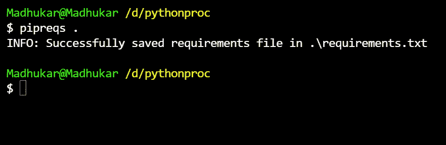
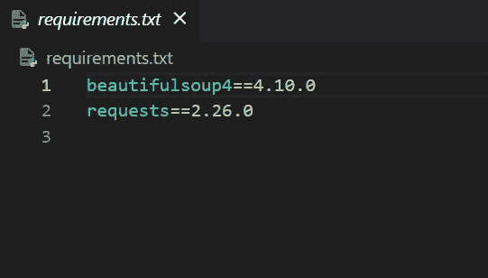
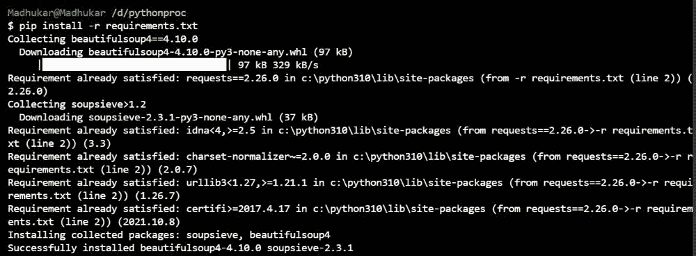

# 如何从Python脚本自动安装所需的包？

> 原文：[https://www.geeksforgeeks.org/how-to-automatically-install-required-packages-from-a-python-script/](https://www.geeksforgeeks.org/how-to-automatically-install-required-packages-from-a-python-script/)

当在Python中工作，不得不使用你不知道的库或者使用一台新的PC时，逐个安装所有的库是一项非常繁忙的工作。每次都要找出库的名字，一个一个安装。但是如果我们知道像`pipreqs`这样的库，它会自动安装运行程序所需的所有库，这将使我们的工作变得非常容易，我们可以专注于代码，而不是浪费时间一个接一个地安装库。

## 什么是`pipreqs`？

这是一个Python库，它根据任何项目的导入生成`requirements.txt`文件，然后您可以一次安装所有这些文件。

## 安装`pipreqs`

在你的电脑上运行这个命令来安装`pipreqs`库。

```py
pip install pipreqs
```

### 步骤1

转到您的Python脚本所在的目录，例如，假设我们将这段代码放在目录中。

```py
import os
import requests
import urllib.request
from bs4 import BeautifulSoup
print('GFG is the best')
```

### 步骤2

在该目录中运行以下命令，该命令将创建一个需求文件。

```py
pipreqs
```



在我们的例子中，需求文件看起来像这样。



这表明我们的系统中不存在`requests`和`beautifulsoup4`库，我们必须安装它们来运行我们的程序。

### 步骤3

现在运行此命令，安装运行程序所需的所有库。

```py
pip install -r requirements.txt
```



安装所有库。

现在，如果我们运行代码，它将成功运行代码。