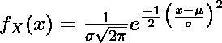

# 在 Python 中给定均值和标准差的情况下，如何计算正态分布中的概率？

> 原文：[https://www.geeksforgeeks.org/how-to-calculate-probability-in-a-normal-distribution-given-mean-and-standard-deviation-in-python/](https://www.geeksforgeeks.org/how-to-calculate-probability-in-a-normal-distribution-given-mean-and-standard-deviation-in-python/)

正态分布是实值随机变量的一种连续概率分布。它基于平均值和标准偏差。概率分布函数计算分布中单个点的可能性。计算正态分布的概率密度函数的一般公式是



在这里，
*   `μ` 是均值
*   `σ` 是分布的标准偏差
*   `x` 是数字

为其计算 PDF，我们可以使用 [SciPy](https://docs.scipy.org/doc/scipy/reference/generated/scipy.stats.norm.html) 模块计算正态分布中的概率。

### 安装：
> `pip install scipy`

### 使用的功能：
我们将使用 `scipy.stats.norm.pdf()` 方法计算一个数字 `x` 的概率分布。

> **语法：** `scipy.stats.norm.pdf(x, loc=None, scale=None)`
>
> **参数：**
> *   ``x``：阵列状物体，需要计算概率。
> *   ``loc``：可选（默认值=0），代表分布的平均值。
> *   ``scale``：可选（默认=1），代表分布的标准差。
>
> **返回：** 作为数组对象在 `x` 处计算的概率密度函数。

在 `scipy` 中，用于计算平均值和标准偏差的函数分别是 `mean()` 和 `std()`。

*   对于均值
**语法：**
> `mean(data)`

*   对于标准偏差
**语法：**
> `std(data)`

### 方法
*   导入模块
*   创建必要的数据
*   为函数提供所需的值
*   显示值

### 示例

```py
from scipy.stats import norm
import numpy as np

data_start = -5
data_end = 5
data_points = 11
data = np.linspace(data_start, data_end, data_points)

mean = np.mean(data)
std = np.std(data)

probability_pdf = norm.pdf(3, loc=mean, scale=std)
print(probability_pdf)
```

**输出：**
> `0.0804410163156249`