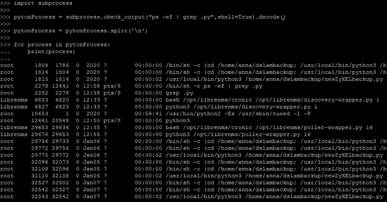
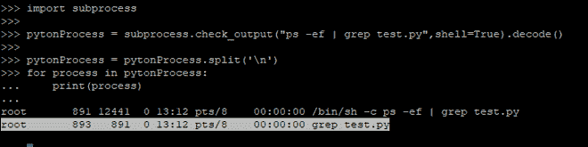
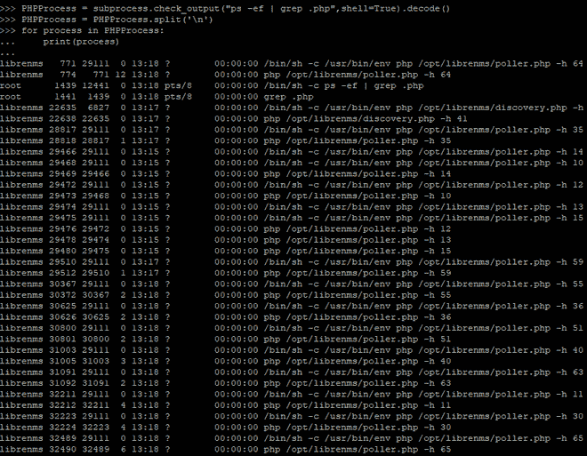

# 如何用 Python 检查 Linux 中有没有脚本在运行？

> 原文: [https://www.geeksforgeeks.org/how-to-check-any-script-is-running-in-linux-using-python/](https://www.geeksforgeeks.org/how-to-check-any-script-is-running-in-linux-using-python/)

Python 是当今一种强大且呈指数级增长的编程语言。有多种方法可以检查哪个脚本在 Linux 环境的后台运行。其中之一就是使用 Python 中的 `subprocess` 模块。`subprocess` 用于通过创建新流程，通过 Python 代码运行新程序。在本文中，我们将看到如何使用 Python 检查任何脚本是否正在后台 Linux 中运行。

**要求:**

*   Python >=2.7，>= 3.0
*   点

**subprocess 安装:**

```
pip install subprocess.run
```

我们将使用 `subprocess.check_output()` 方法来获取所有正在运行的进程。

> **语法:** `subprocess.check_output(args, * stdin=None, stderr=None, shell=False, cwd=None, encoding=None, errors=None, universal_newlines=None, timeout=None, text=None, **other_popen_kwargs)`
>
> **该运行命令带有参数并返回输出。**
>
> `stderr=subprocess.STDOUT` 用于捕获结果中的标准错误。

**例 1:**

在下面的代码中，我们将在后台 Linux 中运行所有的 `.py` 脚本。

## Python 3

```
import subprocess

pytonProcess = subprocess.check_output("ps -ef | grep .py",shell=True).decode()
pytonProcess = pytonProcess.split('\n')

for process in pytonProcess:
    print(process)
```

**输出:**



**例 2:**

在下面的例子中，我们将检查特定的脚本是否在后台运行。

## Python 3

```
import subprocess

pytonProcess = subprocess.check_output("ps -ef | grep test.py",shell=True).decode()
pytonProcess = pytonProcess.split('\n')

for process in pytonProcess:
    print(process)
```

**输出:**



**例 3:**

在下面的代码中，我们将获得在后台 Linux 中运行的所有 PHP 脚本。

## Python 3

```
import subprocess

pytonProcess = subprocess.check_output("ps -ef | grep .php",shell=True).decode()
PHPProcess = pytonProcess.split('\n')

for process in PHPProcess:
    print(process)
```

**输出:**

