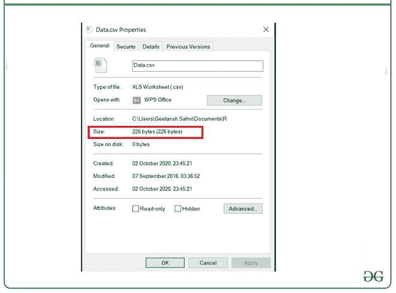
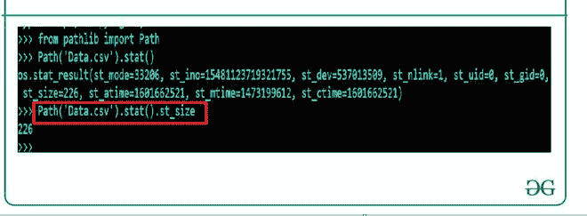
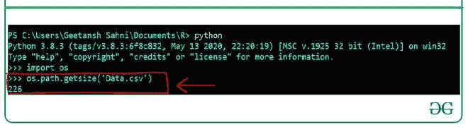

# 如何在 Python 中检查文件大小？

> 原文: [https://www.geeksforgeeks.org/how-to-check-file-size-in-python/](https://www.geeksforgeeks.org/how-to-check-file-size-in-python/)

**先决条件:**

*   `OS`
*   [`pathlib`](https://www.geeksforgeeks.org/pathlib-module-in-python/#:~:text=Pathlib%20module%20in%20Python%20provides,pure%20paths%20and%20concrete%20paths.)

给定一个文件，这里的任务是生成一个 Python 脚本来打印它的大小。本文解释了两种方法。

## 接近

*   导入模块
*   获取文件大小

## 正在使用的文件

**名称:** `Data.csv`

**大小:** 226 字节



## 方法 1: 使用 `pathlib`

`Path().stat().st_size()` 函数来自 `pathlib` 模块，用于获取任何类型文件的大小。该函数的输出将以字节为单位表示文件的大小。

**语法:**

```python
Path('filename').stat().st_size()
```

**示例:**

```python
from pathlib import Path

sz = Path('Data.csv').stat().st_size

print(sz)
```

**输出:**



## 方法 2: 使用 `os` 模块

`os.path.getsize()` 函数与 `os` 库配合使用。在导入这个库的帮助下，我们可以用这个函数来获取任何类型文件的大小。该函数的输出将是文件的大小（以字节为单位）。

**语法:**

```python
os.path.getsize(filename)
```

**示例:**

```python
import os

sz = os.path.getsize("Data.csv")

print(sz)
```

**输出:**



我们得到的结果是 226 字节。