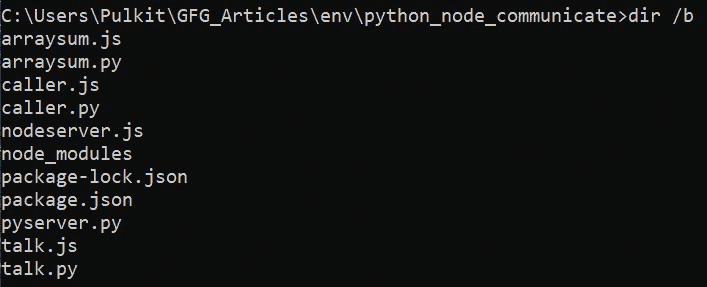

# Python 和 Node.js 之间如何进行 JSON 数据的通信？

> 原文: [https://www.geeksforgeeks.org/how-to-communicate-json-data-between-python-and-node-js/](https://www.geeksforgeeks.org/how-to-communicate-json-data-between-python-and-node-js/)

下面的文章介绍了如何在 Python 和 Node.js 之间传递 JSON 数据。假设我们使用的是 Node.js 应用程序，我们希望利用一个只有 Python 才有的特定库，反之亦然。我们应该能够将结果从一种语言共享到另一种语言，为了实现这一点，我们将使用 JSON，因为它与语言无关。

## 进场:

1.  为每种语言设置一个服务器，并使用旧的 GET 和 POST 请求使用 JSON 共享数据。
2.  从 Node.js 调用一个 Python 后台进程，反之亦然，并在这两种情况下监听进程的 `stdout` 流。

## 项目结构:

下面使用的所有文件都存在于如下所示的同一个目录中。



文件结构

## 1. 使用服务器:

这类似于使用第三方应用编程接口服务的方法，其中我们向远程服务器发出获取数据的 GET 请求，并发出发送数据的 POST 请求。唯一的区别是我们将在本地运行服务器（这也适用于具有所需网址的远程服务器）。

### Node.js 转 Python:

当我们在 Node.js 工作，想用 Python 处理一些数据的时候。

在下面的例子中，我们将为 Python 设置一个服务器，并从 Node.js 发出请求。我们正在使用 `Flask` 框架，因为这是在 Python 中设置服务器并在 Node.js 中发出请求的最简单方法。我们将需要一个 `request-promise` 包。

#### 模块安装:

*   使用以下命令为 Python 安装 `flask` 模块:
    ```py
    pip install flask
    ```
*   使用以下命令为 Node.js 安装 `request-promise` 模块:
    ```py
    npm install request-promise
    ```

#### 示例:

计算包含整数的数组的和，并将结果返回给 Node.js。

##### pyserver.py

```py
from flask import Flask
import json

# Setup flask server
app = Flask(__name__)

# Setup url route which will calculate
# total sum of array.
@app.route('/arraysum', methods = ['POST'])
def sum_of_array():
    data = request.get_json()
    print(data)

    # Data variable contains the
    # data from the node server
    ls = data['array']
    result = sum(ls) # calculate the sum

    # Return data in json format
    return json.dumps({"result":result})

if __name__ == "__main__":
    app.run(port=5000)
```

使用以下命令运行 `pyserver.py` 服务器。

```py
python pyserver.py
```

这将在 `http://127.0.0.1:5000/` 启动服务器。现在我们从 Node.js 向 `http://127.0.0.1:5000/arraysum` 发出 POST 请求。

##### talk.js

```py
var request = require('request-promise');

async function arraysum() {

    // This variable contains the data
    // you want to send
    var data = {
        array: [1, 2, 3, 4, 5, 6, 7, 8, 9, 10]
    }

    var options = {
        method: 'POST',

        // http:flaskserverurl:port/route
        uri: 'http://127.0.0.1:5000/arraysum',
        body: data,

        // Automatically stringifies
        // the body to JSON
        json: true
    };

    var sendrequest = await request(options)

        // The parsedBody contains the data
        // sent back from the Flask server
        .then(function (parsedBody) {
            console.log(parsedBody);

            // You can do something with
            // returned data
            let result;
            result = parsedBody['result'];
            console.log("Sum of Array from Python: ", result);
        })
        .catch(function (err) {
            console.log(err);
        });
}

arraysum();
```

通过以下命令运行该脚本。

```py
node talk.js
```

#### 输出:

```py
{ result: 55 }
Sum of Array from Python:  55
```

### Python 到 Node.js:

当我们在 Python 中工作，想在 Node.js 中处理一些数据的时候。

这里我们将颠倒上述过程，使用 `express` 在 Node.js 中启动服务器，使用 Python 中的 `requests` 包。

#### 模块安装:

*   使用以下命令为 Python 安装 `requests` 模块:
    ```py
    pip install requests
    ```
*   使用以下命令为 Node.js 安装 `express` 和 `body-parser` 模块:
    ```py
    npm install express
    npm install body-parser
    ```

##### nodeserver.js

```py
var express = require('express');
var bodyParser = require('body-parser');

var app = express();

app.use(bodyParser.json());
app.use(bodyParser.urlencoded({ extended: false }));

app.post("/arraysum", (req, res) => {

    // Retrieve array form post body
    var array = req.body.array;
    console.log(array);

    // Calculate sum
    var sum = 0;
    for (var i = 0; i < array.length; i++) {
        if (isNaN(array[i])) {
            continue;
        }
        sum += array[i];
    }
    console.log(sum);

    // Return json response
    res.json({ result: sum });
});

// Server listening to PORT 3000
app.listen(3000);
```

使用以下命令运行 `nodeserver.js` 服务器。

```py
node nodeserver.js
```

这将在 `http://127.0.0.1:3000/` 启动服务器。现在我们从 Python 向 `http://127.0.0.1:3000/arraysum` 发出 POST 请求。

##### talk.py

```py
import requests

# Sample array
array = [1,2,3,4,5,6,7,8,9,10]

# Data that we will send in post request.
data = {'array':array}

# The POST request to our node server
res = requests.post('http://127.0.0.1:3000/arraysum', json=data)

# Convert response data to json
returned_data = res.json()

print(returned_data)
result = returned_data['result']
print("Sum of Array from Node.js:", result)
```

## 2. 使用进程调用:

这种方法涉及从一种语言调用另一种语言的脚本，并直接读取其 `stdout` 流以获取结果。这在我们需要在本地环境中快速集成或利用特定库时非常有用。

### Node.js 调用 Python:

当我们在 Node.js 中，想直接调用一个 Python 脚本并获取其输出时。

我们将使用 Node.js 的 `child_process` 模块来执行 Python 脚本，并捕获其 `stdout` 流。

#### 示例:

创建一个 Python 脚本来计算数组的和，然后从 Node.js 调用它。

##### calculate_sum.py

```py
import sys
import json

def sum_array(arr):
    return sum(arr)

if __name__ == "__main__":
    # 从标准输入读取 JSON 数据
    input_data = sys.stdin.read()
    data = json.loads(input_data)
    array = data['array']
    result = sum_array(array)
    # 将结果以 JSON 格式输出到 stdout
    print(json.dumps({'result': result}))
```

##### call_python.js

```py
const { spawn } = require('child_process');

// 要发送给 Python 脚本的数据
const dataToSend = {
    array: [1, 2, 3, 4, 5, 6, 7, 8, 9, 10]
};

// 启动 Python 进程
const pythonProcess = spawn('python', ['calculate_sum.py']);

// 将数据通过 stdin 发送给 Python 进程
pythonProcess.stdin.write(JSON.stringify(dataToSend));
pythonProcess.stdin.end();

// 接收 Python 进程的输出
pythonProcess.stdout.on('data', (data) => {
    const result = JSON.parse(data.toString());
    console.log('从 Python 接收到的结果:', result.result);
});

// 处理错误
pythonProcess.stderr.on('data', (data) => {
    console.error(`错误: ${data}`);
});
```

运行 Node.js 脚本:

```py
node call_python.js
```

#### 输出:

```py
从 Python 接收到的结果: 55
```

### Python 调用 Node.js:

当我们在 Python 中，想直接调用一个 Node.js 脚本并获取其输出时。

我们将使用 Python 的 `subprocess` 模块来执行 Node.js 脚本，并捕获其 `stdout`。

#### 示例:

创建一个 Node.js 脚本来计算数组的和，然后从 Python 调用它。

##### calculate_sum.js

```py
// 从标准输入读取数据
let inputData = '';
process.stdin.on('data', (chunk) => {
    inputData += chunk;
});

process.stdin.on('end', () => {
    const data = JSON.parse(inputData);
    const array = data.array;
    const sum = array.reduce((acc, val) => acc + val, 0);
    // 将结果以 JSON 格式输出到 stdout
    console.log(JSON.stringify({ result: sum }));
});
```

##### call_node.py

```py
import subprocess
import json

# 要发送给 Node.js 脚本的数据
data_to_send = {
    'array': [1, 2, 3, 4, 5, 6, 7, 8, 9, 10]
}

# 启动 Node.js 进程
process = subprocess.Popen(
    ['node', 'calculate_sum.js'],
    stdin=subprocess.PIPE,
    stdout=subprocess.PIPE,
    stderr=subprocess.PIPE,
    text=True
)

# 发送数据并获取输出
stdout, stderr = process.communicate(input=json.dumps(data_to_send))

if stderr:
    print(f"错误: {stderr}")
else:
    result = json.loads(stdout)
    print(f"从 Node.js 接收到的结果: {result['result']}")
```

运行 Python 脚本:

```py
python call_node.py
```

#### 输出:

```py
从 Node.js 接收到的结果: 55
```

## 总结

本文介绍了两种在 Python 和 Node.js 之间通过 JSON 数据进行通信的方法：

1.  **服务器方式**：通过设置 HTTP 服务器（Python 使用 `Flask`，Node.js 使用 `express`），使用 POST 请求进行数据交换。这种方法更接近生产环境中的微服务架构。
2.  **进程调用方式**：通过子进程直接调用另一种语言的脚本，并通过标准输入/输出流传递 JSON 数据。这种方法更轻量，适合本地集成或脚本化任务。

选择哪种方法取决于具体的应用场景、性能要求和部署环境。两种方法都利用了 JSON 作为语言无关的数据交换格式，实现了跨语言的数据共享和功能调用。