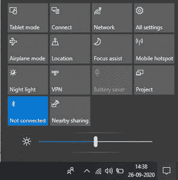

# 如何用 Python 控制笔记本电脑屏幕亮度？

> 原文：[https://www.geeksforgeeks.org/how-to-control-laptop-screen-brightness-using-python/](https://www.geeksforgeeks.org/how-to-control-laptop-screen-brightness-using-python/)

为了控制屏幕的亮度，我们使用`screen-brightness-control`库。屏幕亮度控制库只有一个类，功能很少。最有用的功能如下：

1.  `get_brightness()`
2.  `set_brightness()`
3.  `fade_brightness()`
4.  `list_monitors()`

## 安装

我们可以通过运行以下`pip`命令来安装软件包：

```py
pip install screen-brightness-control
```

## 示例 1：如何获得屏幕亮度

`get_brightness()`方法返回当前亮度级别。

> **语法：** `get_brightness(display=None, method=None, verbose_error=False)`
>
> **参数：**
>
> *   `display`：您希望调整的具体显示。这可以是显示器的名称、型号、序列号或索引。
> *   `method`：要使用的 OS 特定方法。在 Windows 上，这可以是`"wmi"`（用于笔记本电脑显示器）或`"vcp"`（用于台式机显示器）。在 Linux 上，这可以是`"light"`、`"xrandr"`、`"ddcutil"`或`"xbacklight"`。
> *   `verbose_error`：一个布尔值，用于控制任何错误消息应该包含多少细节。
>
> **返回：** 当前亮度等级。

```py
# importing the module
import screen_brightness_control as sbc

# get current brightness value
current_brightness = sbc.get_brightness()
print(current_brightness)

# get the brightness of the primary display
primary_brightness = sbc.get_brightness(display=0)
print(primary_brightness)
```

**输出：** 假设亮度是这样的：



那么输出将是：

```py

```

根据检测到的监视器数量，输出可以是列表或整数。

## 示例 2：如何设置屏幕亮度

`set_brightness()`方法改变屏幕亮度。

> **语法：** `set_brightness(value, display=None, method=None, force=False, verbose_error=False, no_return=False)`
>
> **参数：**
>
> *   `value`：设置亮度的级别。可以是整数或字符串。
> *   `display`：您希望调整的具体显示。这可以是显示器的名称、型号、序列号或索引。
> *   `method`：具体要用的 OS 方法。在 Windows 上，这可以是`"wmi"`（用于笔记本电脑显示器）或`"vcp"`（用于台式机显示器）。在 Linux 上，这可以是`"light"`、`"xrandr"`、`"ddcutil"`或`"xbacklight"`。
> *   `force`（仅限 Linux）：如果设置为`False`，则亮度永远不会设置为小于 1，因为在 Linux 上，这通常会关闭屏幕。如果设置为`True`，它将绕过此检查。
> *   `verbose_error`：一个布尔值，用于控制任何错误消息应该包含多少细节。
> *   `no_return`：如果为`False`，该功能将返回亮度设置值。如果为`True`，此函数不返回任何内容，这稍微快一些。

```py
# importing the module
import screen_brightness_control as sbc

# get current brightness value
print(sbc.get_brightness())

#set brightness to 50%
sbc.set_brightness(50)

print(sbc.get_brightness())

#set the brightness of the primary display to 75%
sbc.set_brightness(75, display=0)

print(sbc.get_brightness())
```

**输出：**

```py

```

根据检测到的监视器数量，输出可以是列表或整数。

## 示例 3：如何淡化亮度

`fade_brightness()`方法会将亮度逐渐淡入一个值。

> **语法：** `fade_brightness(finish, start=None, interval=0.01, increment=1, blocking=True)`
>
> **参数：**
>
> *   `finish`：要渐变到的亮度值。
> *   `start`：开始的值。如果未指定，则默认为当前亮度。
> *   `interval`：亮度每一步之间的时间间隔。
> *   `increment`：每一步改变亮度的量。
> *   `blocking`：如果设置为`False`，它会在新线程中淡化亮度。

```py
# importing the module
import screen_brightness_control as sbc

# get current brightness value
print(sbc.get_brightness())

# fade brightness from the current brightness to 50%
sbc.fade_brightness(50)
print(sbc.get_brightness())

# fade the brightness from 25% to 75%
sbc.fade_brightness(75, start = 25)
print(sbc.get_brightness())

# fade the brightness from the current
# value to 100% in steps of 10%
sbc.fade_brightness(100, increment = 10)
print(sbc.get_brightness())
```

**输出：**

```py

```

## 示例 4：如何列出可用的显示器

`list_monitors()`方法返回所有检测到的监视器的名称列表。

> **语法：** `list_monitors(method=None)`
>
> **参数：**
>
> *   `method`：具体要用的 OS 方法。在 Windows 上，这可以是`"wmi"`（用于笔记本电脑显示器）或`"vcp"`（用于台式机显示器）。在 Linux 上，这可以是`"light"`、`"xrandr"`、`"ddcutil"`或`"xbacklight"`。

```py
# import the library
import screen_brightness_control as sbc

# get the monitor names
monitors = sbc.list_monitors()
print(monitors)

# now use this to adjust specific screens by name
sbc.set_brightness(25, display=monitors[0])
```

**输出：**

```py
["BenQ GL2450H", "Dell U2211H"]
```

显示器的名称和数量会因插入电脑的设备而异。