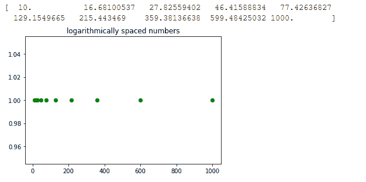

# 如何用 Python 用对数刻度创建等间距数字列表？

> 原文：[https://www.geeksforgeeks.org/how-to-create-a-list-of-uniformly-spaced-numbers-using-a-logarithmic-scale-with-python/](https://www.geeksforgeeks.org/how-to-create-a-list-of-uniformly-spaced-numbers-using-a-logarithmic-scale-with-python/)

在本文中，我们将使用对数刻度创建一个均匀间隔的数字列表。这意味着在对数标度上，两个相邻样本之间的差异是相同的。使用 Python Numpy 库中的两个不同函数可以实现这个目标。

## 使用的功能

*   `numpy.logspace`：此函数返回在对数刻度上均匀缩放的数字。

    > **参数：**
    > *   `start`：序列的起始值是 `base ** start`
    > *   `stop`：如果 `endpoint` 为真，则序列的结束值为 `base ** stop`
    > *   `num`（可选）：指定要生成的样本数量
    > *   `endpoint`（可选）：它可以是真或假，默认值为真
    > *   `base`（可选）：指定日志序列的基数。默认值为 10。
    > *   `dtype`（可选）：指定输出数组的类型
    > *   `axis`（可选）：结果中存储样本的轴。
    >
    > **返回：** 返回对数刻度上等距分布的样本数组。

*   `numpy.geomspace`：这个函数类似于 `logspace` 函数，区别只是直接指定了端点。在输出样本中，每个输出都是通过将先前的输出乘以相同的常数获得的。

    > **参数：**
    > *   `start`：是序列的起始值
    > *   `stop`：如果 `endpoint` 为真，则它是序列的结束值
    > *   `num`（可选）：指定要生成的样本数量
    > *   `endpoint`（可选）：它可以是真或假，默认值为真
    > *   `dtype`（可选）：指定输出数组的类型
    > *   `axis`（可选）：结果中存储样本的轴。
    >
    > **返回：** 返回对数刻度上等距分布的样本数组。

## 示例 1

本示例使用 `logspace` 函数。在本例中，起点作为 1 传递，终点作为 3 传递，基数为 10。所以序列的起点将是 `10**1 = 10`，序列的终点将是 `10**3 = 1000`。

```python
# importing the library
import numpy as np
import matplotlib.pyplot as plt

# Initializing variable
y = np.ones(10)

# Calculating result
res = np.logspace(1, 3, 10, endpoint = True)

# Printing the result
print(res)

# Plotting the graph
plt.scatter(res, y, color = 'green')
plt.title('logarithmically spaced numbers')
plt.show()
```

**输出：**



## 示例 2

本示例使用 `geomspace` 函数生成与上一示例相同的列表。这里我们直接通过了 10 和 1000 作为起点和终点。

```python
# importing the library
import numpy as np
import matplotlib.pyplot as plt

# Initializing variable
y = np.ones(10)

# Calculating result
res = np.geomspace(10, 1000, 10, endpoint = True)

# Printing the result
print(res)

# Plotting the graph
plt.scatter(res, y, color = 'green')
plt.title('logarithmically spaced numbers')
plt.show()
```

**输出：**


## 示例 3

在此示例中，`endpoint` 被设置为 `False`，因此它将生成 `n+1` 个样本，并且仅返回前 `n` 个样本，即 `stop` 将不包含在序列中。

```python
# importing the library
import numpy as np
import matplotlib.pyplot as plt

# Initializing variable
y = np.ones(10)

# Calculating result
res = np.logspace(1, 3, 10, endpoint = False)

# Printing the result
print(res)
```

**输出：**

```
[ 10.          15.84893192  25.11886432  39.81071706  63.09573445
 100.         158.48931925 251.18864315 398.10717055 630.95734448]
```