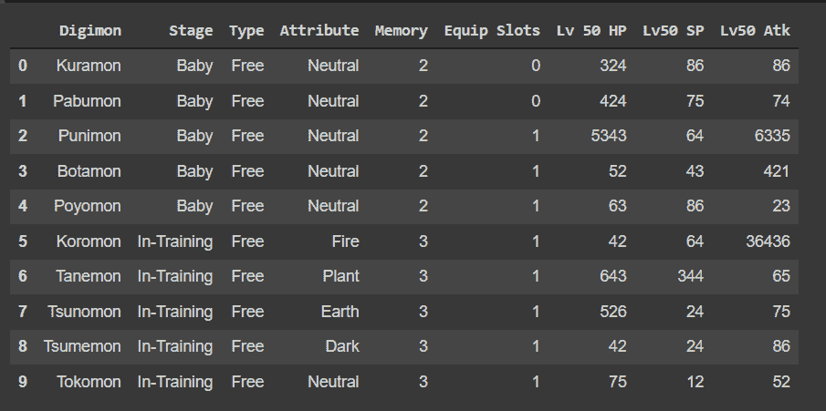
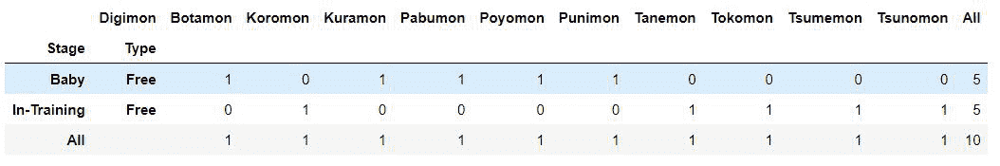
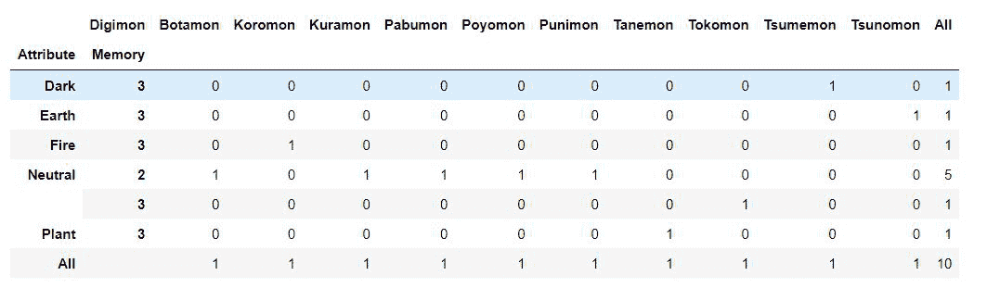

# 如何用 Python 从字典创建交叉表？

> 原文: [https://www.geeksforgeeks.org/how-to-create-crosstabs-from-a-dictionary-in-python/](https://www.geeksforgeeks.org/how-to-create-crosstabs-from-a-dictionary-in-python/)

在本文中，我们将看到如何在 Python 中从字典创建交叉表。`pandas`交叉表功能建立了一个交叉列表，可以显示特定数据组出现的频率。

该方法用于计算两个(或多个)因素的简单交叉列表。默认情况下，会计算因子的频率表，除非传递了值数组和聚合函数。

> 语法: `pandas.crosstab(index, columns, values=None, rownames=None, colnames=None, aggfunc=None, margins=False, margins_name='All', dropna=True, normalize=False)`
>
> 论据:
>
> *   `index`: 类似数组、系列或数组/系列列表，行中的分组依据值。
> *   `columns`: 类似数组、系列或数组/系列列表，列中的分组依据值。
> *   `values`: 类似数组的可选值数组，根据因子进行聚合。要求指定`aggfunc`。
> *   `rownames`: 序列，默认无，如果传递，必须与传递的行数组数匹配。
> *   `colnames`: 序列，默认为无，如果传递，必须与传递的列数组数匹配。
> *   `aggfunc`: 函数，可选，如果指定，还需要指定`values`。
> *   `margins`: 布尔值，默认为 `False`，添加行/列边距(小计)。
> *   `margins_name`: `str`，默认为`"All"`，当 `margins` 为 `True` 时，将包含总计的行/列的名称。
> *   `dropna`: `bool`，默认为 `True`，不包括条目全部为 `NaN` 的列。

```
*** QuickLaTeX cannot compile formula:

*** Error message:
Error: Nothing to show, formula is empty
```

## 分步实施:

### 第一步: 创建字典。

```py
raw_data = {'Digimon': ['Kuramon', 'Pabumon', 'Punimon',
                        'Botamon', 'Poyomon', 'Koromon', 
                        'Tanemon', 'Tsunomon', 'Tsumemon', 
                        'Tokomon'],
            'Stage': ['Baby', 'Baby', 'Baby', 'Baby', 'Baby',
                      'In-Training', 'In-Training', 'In-Training',
                      'In-Training', 'In-Training'],
            'Type': ['Free', 'Free', 'Free', 'Free', 'Free', 'Free',
                     'Free', 'Free', 'Free', 'Free'],
            'Attribute': ['Neutral', 'Neutral', 'Neutral',
                          'Neutral', 'Neutral', 'Fire', 'Plant',
                          'Earth', 'Dark', 'Neutral'],
            'Memory': [2, 2, 2, 2, 2, 3, 3, 3, 3, 3],
            'Equip Slots': [0, 0, 1, 1, 1, 1, 1, 1, 1, 1],
            'Lv 50 HP': [324, 424, 5343, 52, 63, 42,
                         643, 526, 42, 75],
            'Lv50 SP': [86, 75, 64, 43, 86, 64, 344,
                        24, 24, 12],
            'Lv50 Atk': [86, 74, 6335, 421, 23, 36436, 
                         65, 75, 86, 52]}
print(raw_data)
```

输出:

> {'Digimon': ['Kuramon', 'Pabumon', 'Punimon', 'Botamon', 'Poyomon', 'Koromon', 'Tanemon', 'Tsunomon', 'Tsumemon', 'Tokomon'], 'Stage': ['Baby', 'Baby', 'Baby', 'Baby', 'Baby', 'In-Training', 'In-Training', 'In-Training', 'In-Training', 'In-Training'], 'Type': ['Free', 'Free', 'Free', 'Free', 'Free', 'Free', 'Free', 'Free', 'Free', 'Free'], 'Attribute': ['Neutral', 'Neutral', 'Neutral', 'Neutral', 'Neutral', 'Fire', 'Plant', 'Earth', 'Dark', 'Neutral'], 'Memory': [2, 2, 2, 2, 2, 3, 3, 3, 3, 3], 'Equip Slots': [0, 0, 1, 1, 1, 1, 1, 1, 1, 1], 'Lv 50 HP': [324, 424, 5343, 52, 63, 42, 643, 526, 42, 75], 'Lv50 SP': [86, 75, 64, 43, 86, 64, 344, 24, 24, 12], 'Lv50 Atk': [86, 74, 6335, 421, 23, 36436, 65, 75, 86, 52]}

```
*** QuickLaTeX cannot compile formula:

*** Error message:
Error: Nothing to show, formula is empty
```

### 第二步: 使用 `pandas` 的 `DataFrame` 功能创建数据框。

```py
import pandas as pd
raw_data_df = pd.DataFrame(raw_data,columns= ['Digimon','Stage',
                                            'Type', 'Attribute',
                                            'Memory','Equip Slots',
                                            'Lv 50 HP','Lv50 SP',
                                            'Lv50 Atk'])
print(raw_data_df)
```

输出:



### 第三步: 使用交叉表。

```py
import pandas as pd
raw_data_df=pd.DataFrame(raw_data,columns= ['Digimon','Stage',
                                            'Type',
                                            'Attribute','Memory',
                                            'Equip Slots',
                                            'Lv 50 HP','Lv50 SP',
                                            'Lv50 Atk'])
print(raw_data_df)
```

输出:



您也可以向交叉表添加多个索引(行)。这可以通过将变量列表传递给交叉表函数来实现，如果您想按区域和季度细分项目，您可以将它们传递给 `index` 参数。

```py
raw_data_fd = pd.crosstab(
    [raw_data_df['Attribute'], raw_data_df['Memory']],
  raw_data_df['Digimon'], margins=True)
raw_data_fd
```

输出

