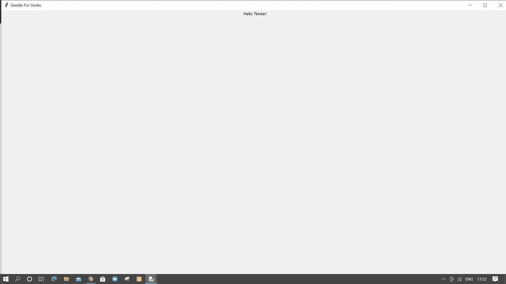

# 如何在 Tkinter 中创建全屏窗口？

> 原文: [https://www.geeksforgeeks.org/how-to-create-full-screen-window-in-tkinter/](https://www.geeksforgeeks.org/how-to-create-full-screen-window-in-tkinter/)

**先决条件:** [Tkinter](https://www.geeksforgeeks.org/python-gui-tkinter/)

使用标准 python 库创建 GUI 应用程序，有两种方法可以在 tkinter 中创建全屏窗口。

## 方法一：使用 `attributes()` 函数

**语法：**

```py
window_name.attributes('-fullscreen', True)
```

我们将 `attributes()` 的参数 `'-fullscreen'` 设置为 `True`，将窗口大小设置为全屏，否则设置为 `False`。

**步骤：**

*   导入 tkinter 包
*   用窗口名称创建 tkinter 窗口
*   将窗口属性全屏设置为真
*   给窗口命名，这里是“Geeks For Geeks”
*   创建带有文本“Hello Tkinter”的标签（仅在此向用户显示）
*   使用 `pack()` 放置标签小部件
*   通过调用 `mainloop()` 关闭窗口的循环

**缺点：**

我们得到一个没有工具栏的输出 tkinter 窗口。这个缺点被下一个方法覆盖了。

**程序**

```py
# importing tkinter for gui
import tkinter as tk

# creating window
window = tk.Tk()

# setting attribute
window.attributes('-fullscreen', True)
window.title("Geeks For Geeks")

# creating text label to display on window screen
label = tk.Label(window, text="Hello Tkinter!")
label.pack()

window.mainloop()
```

**输出：**


## 方法二：使用 `geometry()` 函数

我们得到一个输出 tkinter 窗口，上面有工具栏和窗口标题。

**语法：**

```py
width = window_name.winfo_screenwidth()
height = window_name.winfo_screenheight()
window_name.geometry("%dx%d" %(width, height))
```

我们可以将 `geometry()` 的参数设置为与我们原始窗口的屏幕宽度和高度相同，以获得我们的全屏 tkinter 窗口，而不会使工具栏不可见。我们可以分别使用 `winfo_screenwidth()` 和 `winfo_screenheight()` 函数得到我们桌面屏幕的宽度和高度。

**步骤：**

*   导入 tkinter 包
*   用窗口名称创建 tkinter 窗口
*   分别使用 `width` 变量的 `winfo_screenwidth()` 和 `height` 变量的 `winfo_screenheight()` 获取桌面屏幕的宽度和高度。
*   通过设置与 `width x height` 相等的尺寸，使用 `geometry()` 设置 tkinter 窗口的大小。
*   给窗口命名，这里是“Geeks For Geeks”
*   创建带有文本“Hello Tkinter”的标签（仅在此向用户显示）
*   使用 `pack()` 放置标签小部件
*   通过调用 `mainloop()` 关闭窗口的循环

**程序：**

```py
# importing tkinter gui
import tkinter as tk

#creating window
window=tk.Tk()

#getting screen width and height of display
width= window.winfo_screenwidth()
height= window.winfo_screenheight()
#setting tkinter window size
window.geometry("%dx%d" % (width, height))
window.title("Geeeks For Geeks")
label = tk.Label(window, text="Hello Tkinter!")
label.pack()

window.mainloop()
```

**输出：**

