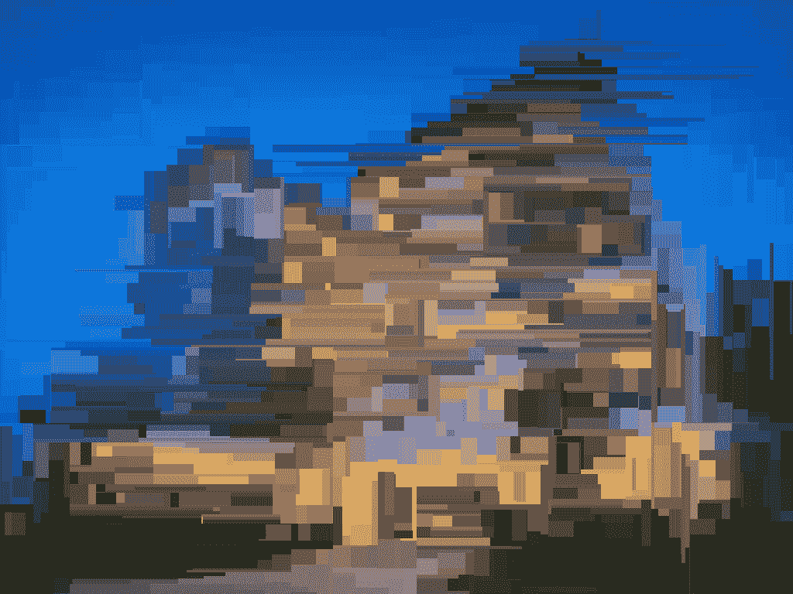
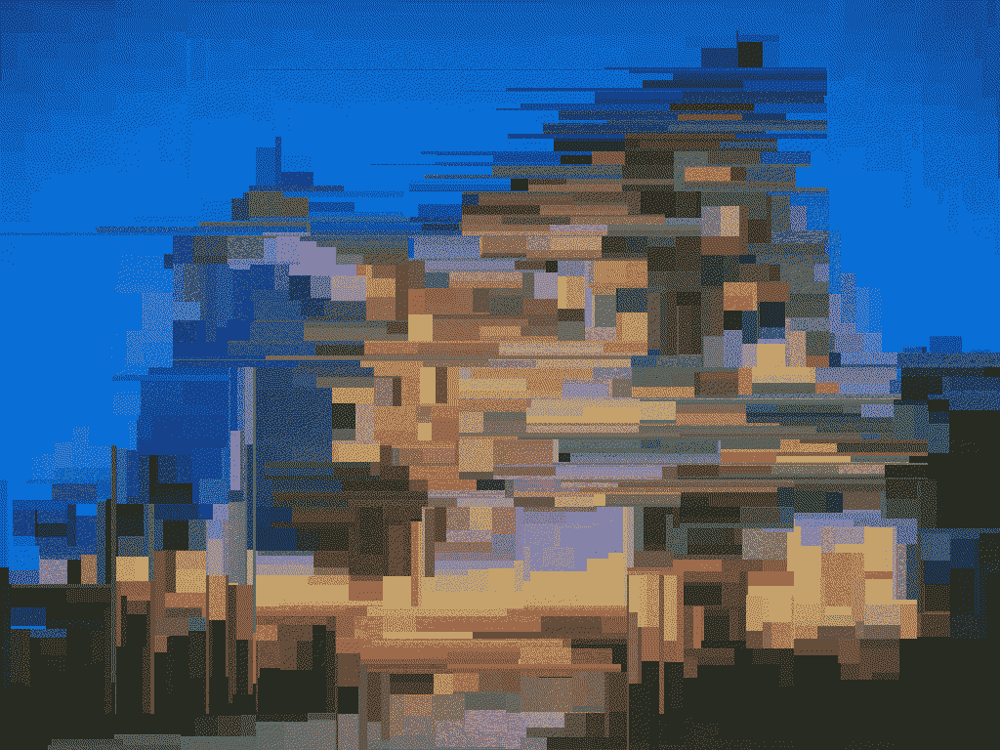

# 如何使用 Python 中的 Block_Distortion 模块对图像进行扭曲？

> 原文：[https://www.geeksforgeeks.org/how-to-distort-image-using-block_distortion-module-in-python/](https://www.geeksforgeeks.org/how-to-distort-image-using-block_distortion-module-in-python/)

在本文中，我们将讨论如何使用 Python 对图像执行块失真。我们将使用一个名为 `block_distortion` 的模块。让我们看一下这个模块的简介。

## 块失真模块

*   它对图像应用块失真效果。
*   它可以选择制作静态和动态图像（`.gif`）版本的图像。
*   可以控制失真量。

## 安装

要安装此模块，请在终端中键入以下命令。

> `pip install block_distortion`

## 扭曲静止图像

`distort_image()` 函数用于扭曲图像。

**语法：**

> `distort_image(image, split=2000)`

> **参数：**
> `split` = 要执行的分割（扭曲）数量，默认为 2000。分割越多，图像越平滑。

**使用的图像：**


### Python 3

```python
from skimage import img_as_ubyte
from skimage.io import imread, imsave
from block_distortion import distort_image

# read image
input_image = imread('hotel.jpeg')

# distort the read image
distorted = distort_image(input_image)

# save to required path the converted binary image
imsave("./block-hotel.png", img_as_ubyte(distorted))
```

**输出：**



## 扭曲 GIF 图像

`animate_image()` 方法用于执行所需的 gif 变形。

**语法：**

> `animate_image(split=2000, frames=100)`

> **参数：**
> `split` = 要执行的分割（扭曲）数量，默认为 2000。分割越多，图像越平滑。
> `frames` = 为 gif 图像创建的帧数。默认为 100。

> `write_frames_to_gif(path=curr, animate_image, duration=100)`

> **参数：**
> `path`: 保存文件的位置。
> `duration`: gif 中每一帧的持续时间。（单位：毫秒）默认为 100。

### Python 3

```python
from skimage.io import imread
from block_distortion import animate_image, write_frames_to_gif

# read the image
input_image = imread("hotel.jpeg")

# convert to .gif after block distortion
frames = animate_image(input_image)

# write gif to output path
write_frames_to_gif("./block-anim-hotel.gif", frames, duration=100)
```

**输出：**

