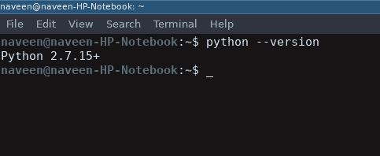
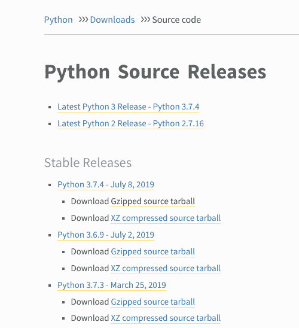

# 如何在 Linux 上下载安装 Python 最新版本？

> 原文：[https://www.geeksforgeeks.org/how-to-download-and-install-python-latest-version-on-linux/](https://www.geeksforgeeks.org/how-to-download-and-install-python-latest-version-on-linux/)

Python 是一种广泛使用的通用高级编程语言。本文将作为如何在 Linux 操作系统上下载并安装 Python 最新版本的完整教程。

在包括以下操作系统在内的每个 Linux 系统上：
*   Ubuntu
*   Linux Mint
*   Debian
*   openSUSE
*   CentOS
*   Fedora
*   Arch Linux

你会发现 Python 已经安装好了。您可以从终端使用以下命令进行检查：
```py
$ python --version
```
要检查 python 2.x.x 的最新版本：
```py
$ python2 --version
```
要检查最新版本的 python 3.x.x：
```py
$ python3 --version
```



通常不会是最新版本的 Python。可以有多种方法在 Linux 系统上安装 Python，这完全取决于您的 Linux 发行版。

对于几乎每一个 Linux 系统，下面的命令肯定会起作用：
```py
$ sudo add-apt-repository ppa:deadsnakes/ppa
$ sudo apt-get update
$ sudo apt-get install python3.7
```

## 在 Linux 上下载并安装 Python 最新版本

要从 Python 源代码安装最新版本，请执行以下步骤。

### 从 python.org 下载 Python 最新版本

*   首先，打开浏览器，访问 [https://www.python.org/downloads/source/](https://www.python.org/downloads/source/)。
    
*   在 `Stable Releases` 部分下找到 `Download Gzipped source tarball`（截至现在，最新的稳定版本是 Python 3.7.4）。

您可以在一个命令中完成上述所有步骤：
```py
$ wget https://www.python.org/ftp/python/3.7.4/Python-3.7.4.tgz
```

### 在 Linux 上安装 Python 3.7.4 最新版本

要在 Linux 上成功安装 Python，请输入以下命令获取先决条件和其他源文件：
```py
$ sudo apt-get update
$ sudo apt-get upgrade
$ sudo apt-get install -y make build-essential libssl-dev zlib1g-dev libbz2-dev libreadline-dev libsqlite3-dev wget curl llvm libncurses5-dev libncursesw5-dev xz-utils tk-dev
```

现在我们都准备好解压从 Python 官网下载的文件。使用终端中的 `cd` 命令移动到下载目录，然后输入以下命令：
```py
$ tar xvf Python-3.6.5.tgz
$ cd Python-3.6.5
$ ./configure --enable-optimizations --with-ensurepip=install
$ make -j 8
$ sudo make altinstall
```

宾果游戏..！！最新版本的 Python 语言安装在您的 Linux 系统上。您可以使用以下命令进行确认：
```py
$ python --version
```

## 如何在 Linux 中将 Python 3 设置为默认版本？

人们可以在他们的 Linux 系统中使用上面提到的各种技术轻松安装 Python。但是怎么设置为默认呢？这样每当你在终端的任何地方输入 `python` 时，它总是执行 `python3`。下面是一个简单的命令，您可以通过它将 Python3 设置为默认版本。

打开终端并输入：
```py
$ sudo alias python=python3
```

现在执行的任何代码都会自动将 `python3` 作为默认版本。