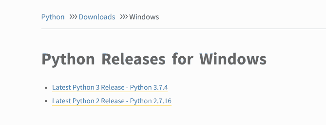
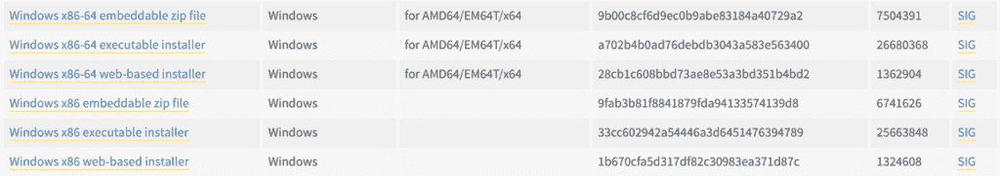
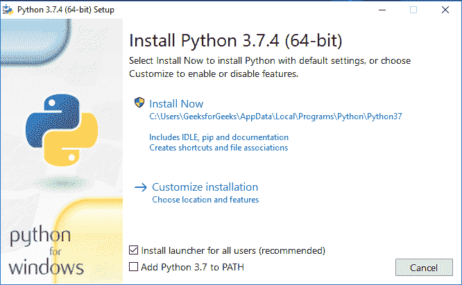
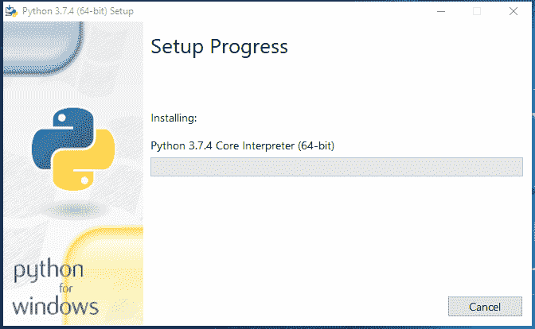
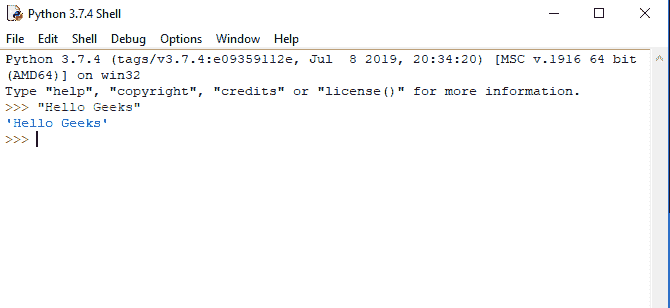

# 如何在 Windows 上下载安装 Python 最新版本

> 原文: [https://www.geeksforgeeks.org/how-to-download-and-install-python-latest-version-on-windows/](https://www.geeksforgeeks.org/how-to-download-and-install-python-latest-version-on-windows/)

Python 是一种广泛使用的通用高级编程语言。本文将作为如何在 Windows 操作系统上**下载并安装 Python 最新版本的完整教程**。由于 Windows 没有预装 Python，所以需要显式安装。在 Windows 中，没有安装 Python 的通用库，因此需要像其他任何 GUI 应用程序一样下载。这里我们将定义如何在 Windows 上安装 Python 的分步教程。

## 从 python.org 下载 Python 最新版本

首先，第一步是打开浏览器并访问 [https://www.python.org/downloads/windows/](https://www.python.org/downloads/windows/)。

在**视窗 Python 版本**下找到**最新 Python 3 版本 – Python 3.7.4**（目前最新的稳定版本是 `Python 3.7.4`）。

在此页面上，移动到 **Files** 部分，对于 64 位系统点击 **Windows x86-64 executable installer**，对于 32 位系统点击 **Windows x86 executable installer**。

## 在 Windows 上安装 Python 3.7.4 最新版本

从下载文件夹运行 Python 安装程序。

确保勾选 **将 Python 3.7 添加到路径** 选项，否则您将不得不手动配置环境变量。

将开始在 Windows 上安装 Python。

安装完成后，点击 **关闭**。

答对了..！！Python 已安装。现在进入 Windows 开始菜单，输入 `IDLE`。

这是 Python 解释器。我们打印了 `Hello`，极客们，Python 工作很顺利。