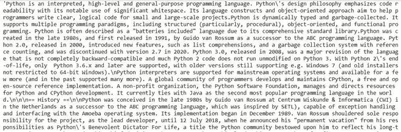
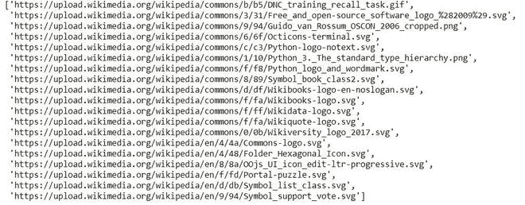

# 如何用 Python 提取维基百科数据？

> 原文：[https://www.geeksforgeeks.org/how-to-extract-wikipedia-data-in-python/](https://www.geeksforgeeks.org/how-to-extract-wikipedia-data-in-python/)

在本文中，我们将学习如何使用 Python 提取维基百科数据，这里我们使用两种方法提取数据。

## 方法一：使用 `wikipedia` 模块

在这个方法中，我们将使用 [`wikipedia`](https://www.geeksforgeeks.org/wikipedia-module-in-python/) 模块来提取数据。维基百科是一个多语言在线百科全书，由志愿者编辑社区使用基于维基的编辑系统创建和维护，是一个开放的合作项目。

安装时，在您的终端上运行该命令。

```py
pip install wikipedia
```

维基百科数据，我们将在这里提取：

- 摘要、标题
- 页面内容
- 获取图片来源和网页网址列表
- 不同的类别

### 逐个提取数据

#### 1. 提取摘要和页面

> 语法：`wikipedia.summary("输入查询")`
> `wikipedia.page("输入查询").title`

### Python 3 示例

```py
import wikipedia

wikipedia.summary("Python (programming language)")
```

**输出：**


#### 2. 页面内容

为了提取文章的内容，我们将使用 `page()` 方法和 `content` 属性来获取实际数据。

> 语法：`wikipedia.page("输入查询").content`

### Python 3 示例

```py
wikipedia.page("Python (programming language)").content
```

**输出：**



#### 3. 从维基百科提取图片

> 语法：`wikipedia.page("输入查询").images`

### Python 3 示例

```py
wikipedia.page("Python (programming language)").images
```

**输出：**



#### 4. 提取当前页面网址

使用 `page()` 方法和 `url` 属性。

> 语法：`wikipedia.page("输入查询").url`

### Python 3 示例

```py
wikipedia.page('"Hello, World!" program').url
```

**输出：**

```py
'https://en.wikipedia.org/wiki/%22Hello,_World!%22_program'
```

#### 5. 获取文章类别列表

使用 `page()` 方法和 `categories` 属性。

> 语法：`wikipedia.page("输入查询").categories`

### Python 3 示例

```py
wikipedia.page('"Hello, World!" program').categories
```