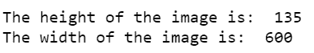
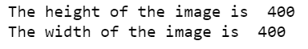

# 如何用 Python 找到图像的宽度和高度？

> 原文：[https://www.geeksforgeeks.org/how-to-find-width-and-height-of-an-image-using-python/](https://www.geeksforgeeks.org/how-to-find-width-and-height-of-an-image-using-python/)

在本文中，我们将讨论如何获得特定图像的高度和宽度。

为了找到图像的高度和宽度，有两种方法。第一种方法是使用 `PIL(枕头)` 库，第二种方法是使用 `OpenCV` 库。

## 方法一：使用 PIL 库

`PIL` 是 Python 图像库的一个重要模块，用于图像处理。它支持多种格式的图像，如“jpeg”、“png”、“ppm”、“tiff”、“bmp”、“gif”。它提供了许多图像编辑功能。图像模块提供了一个同名的类，用于表示 `PIL` 图像。

`PIL.Image.open()` 用来打开图像，然后 `.width` 和 `.height` 属性用于获取图像的高度和宽度。使用 `.size` 属性可以得到同样的结果。

要使用 `Pillow` 库，运行以下命令：

```py
pip install pillow
```

**使用的图像：**


**代码：**

```py
# import required module
from PIL import Image

# get image
filepath = "geeksforgeeks.png"
img = Image.open(filepath)

# get width and height
width = img.width
height = img.height

# display width and height
print("The height of the image is: ", height)
print("The width of the image is: ", width)
```

**输出：**



**备选方案：**

获得高度和宽度的另一种方法是使用 `.size` 属性。

**示例：**

**使用的图像：**


**代码：**

```py
# import required module
from PIL import Image

# get image
filepath = "geeksforgeeks.png"
img = Image.open(filepath)

# get width and height
width,height = img.size

# display width and height
print("The height of the image is: ", height)
print("The width of the image is: ", width)
```

**输出：**


## 方法二：使用 OpenCV 库

Python 中的 `OpenCV` 是一个用于计算机视觉、图像处理等的库。`cv2.imread(filepath)` 函数用于从指定的文件路径加载图像。`.shape` 属性存储每个像素的高度、宽度和通道数的元组。`.shape[:2]` 会得到图像的高度和宽度。

要安装 `OpenCV`，运行以下命令：

```py
pip install opencv-python
```

**使用的图像：**


**代码：**

```py
# import required module
import cv2

# get image
filepath = "geeksforgeeks.jpg"
image = cv2.imread(filepath)
#print(image.shape)

# get width and height
height, width = image.shape[:2]

# display width and height
print("The height of the image is: ", height)
print("The width of the image is: ", width)
```

**输出：**

