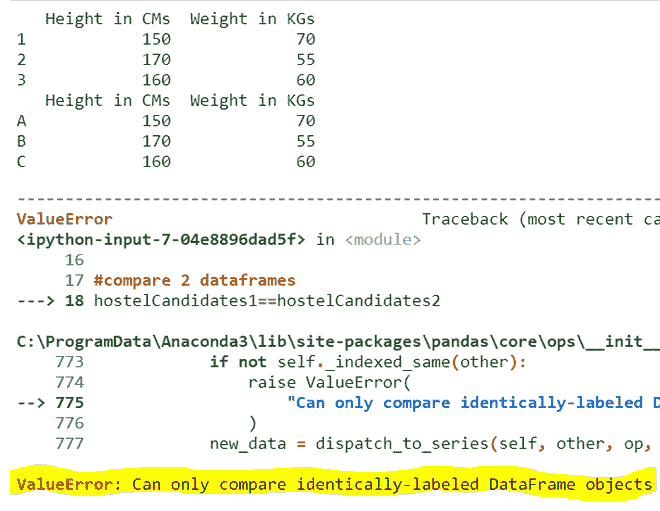
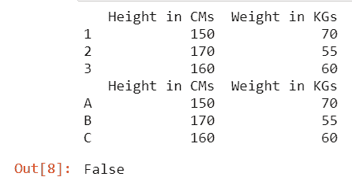
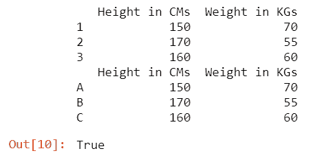
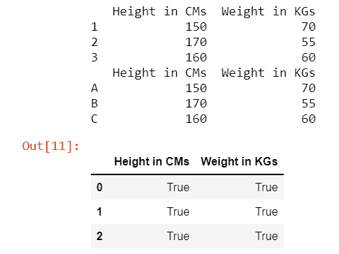

# 如何修复：只能比较标注相同的系列对象

> 原文：[https://www.geeksforgeeks.org/how-to-fix-can-only-compare-identically-labeled-series-objects/](https://www.geeksforgeeks.org/how-to-fix-can-only-compare-identically-labeled-series-objects/)

在本文中，我们将看到如何修复它：只能比较 Python 中相同标记的系列对象。

## 错误原因

只能比较标注相同的系列对象：是`ValueError`，发生在我们比较 2 个不同的`DataFrame`（Pandas 二维数据结构）的时候。如果我们比较具有不同标签或索引的`DataFrame`，则可能会抛出此错误。

### 如何重现错误

```py
# import necessary packages
import pandas as pd

# create 2 dataframes with different indexes
hostelCandidates1 = pd.DataFrame({'Height in CMs': [150, 170, 160],
                                  'Weight in KGs': [70, 55, 60]},
                                 index=[1, 2, 3])

hostelCandidates2 = pd.DataFrame({'Height in CMs': [150, 170, 160],
                                  'Weight in KGs': [70, 55, 60]},
                                 index=['A', 'B', 'C'])

# displaying 2 dataframes
print(hostelCandidates1)
print(hostelCandidates2)

# compare 2 dataframes
hostelCandidates1 == hostelCandidates2
```

**输出：**



即使两个`DataFrame`中的数据相同，但它们的索引不同。因此，为了比较两个`DataFrame`的数据是否相同，我们需要遵循以下方法/解决方案。

## 方法 1：考虑索引

在这里，我们比较`DataFrame`之间的数据和索引标签，以指定它们是否相同。所以**代替`==`使用`equals()`方法**同时进行比较。

```py
# import necessary packages
import pandas as pd

# create 2 dataframes with different indexes
hostelCandidates1 = pd.DataFrame({'Height in CMs':
                                  [150, 170, 160],
                                  'Weight in KGs':
                                  [70, 55, 60]},
                                 index=[1, 2, 3])

hostelCandidates2 = pd.DataFrame({'Height in CMs':
                                  [150, 170, 160],
                                  'Weight in KGs':
                                  [70, 55, 60]},
                                 index=['A', 'B', 'C'])

# displaying 2 dataframes
print(hostelCandidates1)
print(hostelCandidates2)

# compare 2 dataframes
hostelCandidates1.equals(hostelCandidates2)
```

**输出：**



由于数据相同，但这两个`DataFrame`的索引标签不同，因此它返回`False`而不是错误。

## 方法 2：不考虑索引

**要删除`DataFrame`的索引**，请使用**`reset_index()`方法**。通过删除索引，使得解释器只检查数据而不考虑索引值成为一项简单的任务。

> **语法：**`DataFrame名称.reset_index(drop=True)`

**比较数据有 2 种方式：**

*   整个`DataFrame`
*   逐行

**示例 1：** 整个`DataFrame`比较

```py
# import necessary packages
import pandas as pd

# create 2 dataframes with different indexes
hostelCandidates1 = pd.DataFrame({'Height in CMs':
                                  [150, 170, 160],
                                  'Weight in KGs':
                                  [70, 55, 60]},
                                 index=[1, 2, 3])

hostelCandidates2 = pd.DataFrame({'Height in CMs':
                                  [150, 170, 160],
                                  'Weight in KGs':
                                  [70, 55, 60]},
                                 index=['A', 'B', 'C'])

# displaying 2 dataframes
print(hostelCandidates1)
print(hostelCandidates2)

# compare 2 dataframes
hostelCandidates1.reset_index(drop=True).equals(
    hostelCandidates2.reset_index(drop=True))
```

**输出：**



在这里，数据是相同的，即使索引不同，我们也通过消除索引标签来比较`DataFrame`，以便它返回`True`。

**示例 2：** 逐行比较

```py
# import necessary packages
import pandas as pd

# create 2 dataframes with different indexes
hostelCandidates1 = pd.DataFrame({'Height in CMs':
                                  [150, 170, 160],
                                  'Weight in KGs':
                                  [70, 55, 60]},
                                 index=[1, 2, 3])

hostelCandidates2 = pd.DataFrame({'Height in CMs':
                                  [150, 170, 160],
                                  'Weight in KGs':
                                  [70, 55, 60]},
                                 index=['A', 'B', 'C'])

# displaying 2 dataframes
print(hostelCandidates1)
print(hostelCandidates2)

# compare 2 dataframes
hostelCandidates1.reset_index(
    drop=True) == hostelCandidates2.reset_index(drop=True)
```

**输出：**



这种方法有助于我们识别两个`DataFrame`之间的差异，并且不比较其索引标签，因为在比较时会丢弃它们的索引标签。