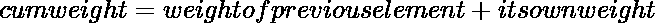

# 如何在 Python 中得到加权随机选择？

> 原文：[https://www.geeksforgeeks.org/how-to-get-weighted-random-choice-in-python/](https://www.geeksforgeeks.org/how-to-get-weighted-random-choice-in-python/)

加权随机选择意味着根据元素的概率从列表或数组中选择随机元素。我们可以给每个元素分配一个概率，并根据这个概率选择元素。通过这种方式，我们可以从列表中选择一个或多个元素，这可以通过两种方式实现。

1.  `random.choices()`
2.  `numpy.random.choice()`

## 使用 `random.choices()` 方法

[`choices()`](https://www.geeksforgeeks.org/random-choices-method-in-python/) 方法从列表中返回多个随机元素并替换。您可以使用 `weights` 参数或 `cum_weights` 参数来衡量每个结果的可能性。

> **语法：** `random.choices(sequence, weights=None, cum_weights=None, k=1)`
>
> **参数：**
> 1.  `sequence` 是一个强制参数，可以是列表、元组或字符串。
> 2.  `weights` 是一个可选参数，用于衡量每个值的可能性。
> 3.  `cum_weights` 是一个可选参数，用于衡量每个值的可能性，但在此情况下，可能性是累积的。
> 4.  `k` 是一个可选参数，用于定义返回列表的长度。

**例 1：**

```python
import random

sampleList = [100, 200, 300, 400, 500]

randomList = random.choices(
  sampleList, weights=(10, 20, 30, 40, 50), k=5)

print(randomList)
```

**输出：**

```python
[200, 300, 300, 300, 400]
```

您也可以使用 `cum_weights` 参数。它代表累积权重。默认情况下，如果我们将使用上述方法并发送 `weights`，该函数会将权重更改为累积权重。所以为了让程序快速使用 `cum_weights`。累积重量通过以下公式计算：



```python
let the relative weight of 5 elements are [5,10,20,30,35]
than there cum_weight will be [5,15,35,65,100]
```

**示例：**

```python
import random

sampleList = [100, 200, 300, 400, 500]
randomList = random.choices(
  sampleList, cum_weights=(5, 15, 35, 65, 100), k=5)

print(randomList)
```

**输出：**

```python
[500, 500, 400, 300, 400]
```

## 使用 `numpy.random.choice()` 方法

如果你使用的是 3.6 版本以上的 Python，那么你必须使用 NumPy 库来实现加权随机数。借助 `choice()` 方法，可以得到一维数组的随机样本，并返回 numpy 数组的随机样本。

> **语法：** `numpy.random.choice(list, k, p=None)`
>
> **`list`：** 是你选择随机数的原始列表。
>
> **`k`：** 是返回列表的大小。即您想要选择的元素数量。
>
> **`p`：** 是各元素的概率。

**注：** 所有元素的概率总和应等于 1。

**示例：**

```python
from numpy.random import choice

sampleList = [100, 200, 300, 400, 500]
randomNumberList = choice(
  sampleList, 5, p=[0.05, 0.1, 0.15, 0.20, 0.5])

print(randomNumberList)
```

**输出：**

```python
[200 400 400 200 400]
```