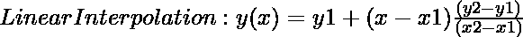
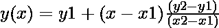

# 如何在 Python 中实现线性插值？

> 原文: [https://www.geeksforgeeks.org/how-to-implement-linear-interpolation-in-python/](https://www.geeksforgeeks.org/how-to-implement-linear-interpolation-in-python/)

当两个相邻点的值已知时，线性插值是确定任何中间点的函数值的技术。线性插值基本上是对落入两个已知值内的未知值的估计。线性插值用于各种学科，如统计学、经济学、价格决定等。为了信息的连续性，它被用来填补统计数据中的空白。

通过使用下面的公式，我们可以对给定的数据点进行线性插值



这里 `(x1, y1)` 是第一个数据点的坐标。而 `(x2, y2)` 是第二个数据点的坐标，其中 `x` 是我们进行插值的点，`y` 是插值的值。

## 例题

让我们举个例子来更好地理解。我们有以下数据值，其中 `x` 表示数字，`y` 是 `x` 平方根的函数，我们的任务是求 `5.5 (x)` 的平方根。

| **x** | 1 | 2 | 3 | 4 | 5 | 6 |
| :--- | :--- | :--- | :--- | :--- | :--- | :--- |
| **y(f(x)=√x)** | 1 | 1.4142 | 1.7320 | 2 | 2.2360 | 2.4494 |

我们可以在这里使用线性插值方法。

1.  从 `x`，即 `(5, 2.2360)` 和 `(6, 2.4494)` 中找出两个相邻的 `(x1, y1)`、`(x2, y2)`。
    > 其中 `x1 = 5`，`x2 = 6`，`y1 = 2.2360`，`y2 = 2.4494`，我们在点 `x = 5.5` 处插值。

2.  使用公式 `y(x) = y1 + (x - x1) * ((y2 - y1) / (x2 - x1))`
    

3.  将这些值放入上述等式后。

```py
y = 2.3427
```

在 `x = 5.5` 时，`Y` 的值将为 `2.3427`。因此，通过使用线性插值，我们可以很容易地确定两个区间之间的函数值。

## 方法 1: 使用公式

使用公式 `y(x) = y1 + (x - x1) * ((y2 - y1) / (x2 - x1))`


### 示例

假设我们有一个城市人口和年份的数据集。

| **x(年)** | 2016 | 2017 | 2018 | 2019 | 2021 |
| :--- | :--- | :--- | :--- | :--- | :--- |
| **y(人口)** | 10001 | 12345 | 74851 | 12124 | 5700 |

这里，`X` 是年份，`Y` 是任何城市的人口。我们的任务是在 `2020` 年找到这个城市的人口。

> 我们选择我们的 `(x1, y1)`，`(x2, y2)` 为 `x1=2019`，`y1=12124`，`x2=2021`，`y2=5700`，`x = 2020`，`y = ?`
> 这里 `(x1, y1)` 和 `(x2, y2)` 是两个相邻的点，`x` 是我们要预测 `y` 总体值的年份。

### Python 3 代码

```py
# Python3 code
# Implementing Linear interpolation
# Creating Function to calculate the
# linear interpolation

def interpolation(d, x):
    output = d[0][1] + (x - d[0][0]) * ((d[1][1] - d[0][1])/(d[1][0] - d[0][0]))
    return output

# Driver Code
data=[[2019, 12124],[2021, 5700]]
year_x=2020

# Finding the interpolation
print("Population on year {} is".format(year_x),
      interpolation(data, year_x))
```

### 输出

```py
Population on year 2020 is 8912.0
```

## 方法 2: 使用 `scipy.interpolate.interp1d`

同样，我们可以使用名为 `scipy.interpolate.interp1d` 的 scipy 库函数实现线性插值。

> **语法**: `scipy.interpolate.interp1d(x, y, kind='linear', axis=-1, copy=True, bounds_error=None, fill_value=nan, assume_sorted=False)`

| 序号 | **参数** | **描述** |
| :--- | :--- | :--- |
| 1. | `x` | 实数的一维数组。 |
| 2. | `y` | 实数的二维数组。 |
| 3. | `kind` | 也就是说，你想要的插值类型可以是 “linear”, “nearest”, “nearest-up”, “zero”, “slinear”, “quadratic”, “cubic”, “previous” 或 “next”。 “zero”, “slinear”, “quadratic” 和 “cubic” 中的一种，默认为 **linear**。 |
| 4. | `axis` | 指定我们插值的 `y` 轴。 |
| 5. | `copy` | 它保存布尔值。如果为真，该类生成 `x` 和 `y` 的内部副本。 |
| 6. | `bounds_error` | 它保存布尔值。如果为真，当试图对 `x` 范围之外的值进行插值时，会引发值错误。 |

### 示例

> 让我们有一个随机数据集:
> `X = [1, 2, 3, 4, 5]`，`Y = [11, 2.2, 3.5, -88, 1]`，我们想求点 `2.5` 处 `Y` 的值。

### Python 3 代码

```py
# Implementation of Linear Interpolation using Python3 code
# Importing library
from scipy.interpolate import interp1d

X = [1,2,3,4,5] # random x values
Y = [11,2.2,3.5,-88,1] # random y values

# test value
interpolate_x = 2.5

# Finding the interpolation
y_interp = interp1d(X, Y)
print("Value of Y at x = {} is".format(interpolate_x),
      y_interp(interpolate_x))
```

### 输出

```py
Value of y at x = 2.5 is 2.85
```