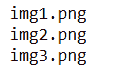
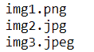
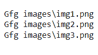

# 如何迭代 Python 中一个文件夹的图像？

> 原文: [https://www.geeksforgeeks.org/how-to-iterate-through-images-in-a-folder-python/](https://www.geeksforgeeks.org/how-to-iterate-through-images-in-a-folder-python/)

在本文中，我们将学习如何在 Python 中遍历文件夹中的图像。

## 方法一：使用 `os.listdir`

### 示例 1：迭代通过 `.png` 文件

*   首先我们导入了 `os` 模块与操作系统进行交互。
*   然后我们从 `os` 中导入 `listdir()` 函数来访问引号中给出的文件夹。
*   然后借助 `os.listdir()` 函数，我们遍历图像，按顺序打印名字。
*   这里我们只提到了 `.png` 文件。使用 `endswith()` 功能加载 png 文件。

```py
# import the modules
import os
from os import listdir

# get the path/directory
folder_dir = "C:/Users/RIJUSHREE/Desktop/Gfg images"
for images in os.listdir(folder_dir):

    # check if the image ends with png
    if (images.endswith(".png")):
        print(images)
```

**输出**:



### 示例 2：迭代各种图像

这里我们已经提到了 `.png`、`.jpg` 和 `.jpeg` 文件。使用 `endswith()` 功能加载这些文件。

```py
# import the modules
import os
from os import listdir

# get the path or directory
folder_dir = "C:/Users/RIJUSHREE/Desktop/Gfg images"
for images in os.listdir(folder_dir):

    # check if the image end swith png or jpg or jpeg
    if (images.endswith(".png") or images.endswith(".jpg")\
        or images.endswith(".jpeg")):
        # display
        print(images)
```

**输出:**



## 方法二：使用 `pathlib` 模块

*   首先，我们从 `pathlib` 导入了 `Path` 模块。
*   然后我们通过 `Path()` 函数指定目录/文件夹，使用它的 `glob('*.png')` 函数迭代此文件夹中存在的所有图像。

```py
# import required module
from pathlib import Path

# get the path/directory
folder_dir = 'Gfg images'

# iterate over files in
# that directory
images = Path(folder_dir).glob('*.png')
for image in images:
    print(image)
```

**输出:**



## 方法三：使用 `glob.iglob()`

*   首先我们导入了 `glob` 模块。
*   然后在 `glob.iglob()` 函数的帮助下，我们遍历图像并按顺序打印名字。
*   这里我们已经提到了 `.png` 文件。使用 `endswith()` 功能加载 png 文件。

```py
# import required module
import glob

# get the path/directory
folder_dir = 'Gfg images'

# iterate over files in
# that directory
for images in glob.iglob(f'{folder_dir}/*'):

    # check if the image ends with png
    if (images.endswith(".png")):
        print(images)
```

**输出**:

