# Python 中如何解析本地 HTML 文件？

> 原文: [https://www.geeksforgeeks.org/how-to-parse-local-html-file-in-python/](https://www.geeksforgeeks.org/how-to-parse-local-html-file-in-python/)

## 先决条件

[Beautiful Soup](https://www.geeksforgeeks.org/implementing-web-scraping-python-beautiful-soup/)

## 解析

解析是指将一个文件或输入划分为若干条信息/数据，这些信息/数据可以存储起来，供我们将来个人使用。有时，我们需要从存储在计算机上的现有文件中获取数据，在这种情况下可以使用解析技术。解析包括用于从文件中提取数据的多种技术，例如修改文件、从文件中移除内容、打印数据、使用递归子生成器方法遍历文件中的数据、从链接中找到标签的子标签、通过网页抓取提取有用信息等。

## 修改文件

使用 `prettify()` 方法可以修改来自 `https://festive-knuth-1279a2.netlify.app/` 的 HTML 代码，使其看起来更好。`prettify()` 使代码看起来像在 VS Code 中使用的标准形式。

**示例:**

```python
# Importing BeautifulSoup class from the bs4 module
from bs4 import BeautifulSoup

# Importing the HTTP library
import requests as req

# Requesting for the website
Web = req.get('https://festive-knuth-1279a2.netlify.app/')

# Creating a BeautifulSoup object and specifying the parser
S = BeautifulSoup(Web.text, 'lxml')

# Using the prettify method
print(S.prettify())
```

**输出:**

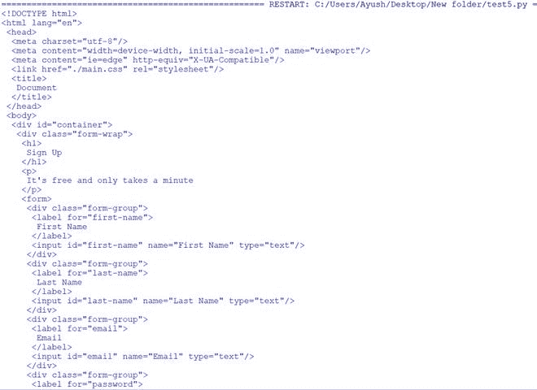 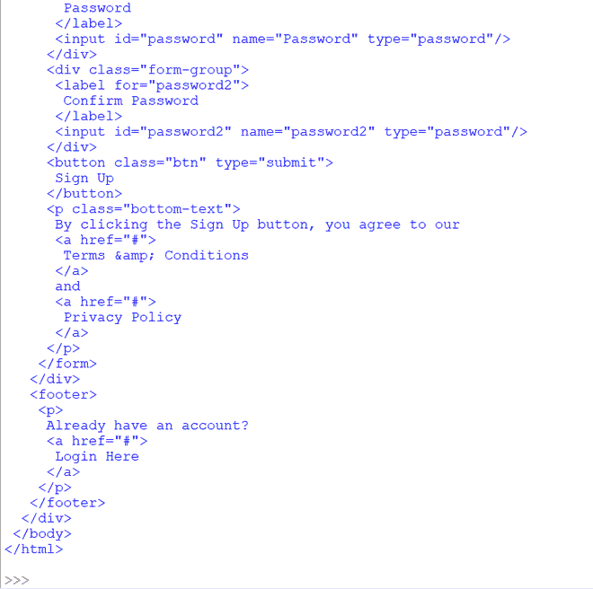

## 移除标签

可以通过使用 `decompose()` 方法和 `select_one()` 方法移除标签。使用 CSS 选择器选择并移除 `li` 标签中的第二个元素，然后使用 `prettify()` 方法修改 `index.html` 文件中的 HTML 代码。

**示例:**

**使用的文件:**

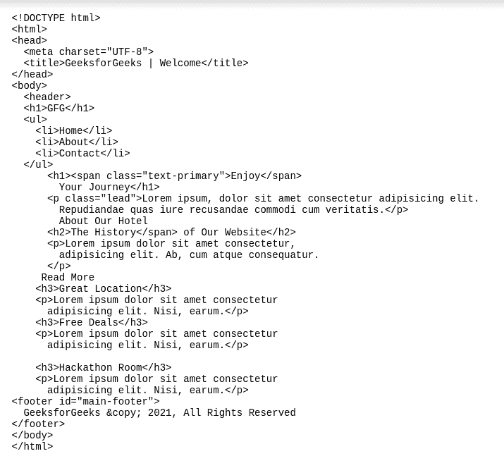

```python
# Importing BeautifulSoup class from the bs4 module
from bs4 import BeautifulSoup

# Opening the html file
HTMLFile = open("index.html", "r")

# Reading the file
index = HTMLFile.read()

# Creating a BeautifulSoup object and specifying the parser
S = BeautifulSoup(index, 'lxml')

# Using the select-one method to find the second element from the li tag
Tag = S.select_one('li:nth-of-type(2)')

# Using the decompose method
Tag.decompose()

# Using the prettify method to modify the code
print(S.body.prettify())
```

**输出:**

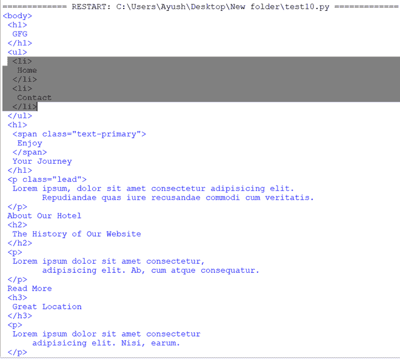 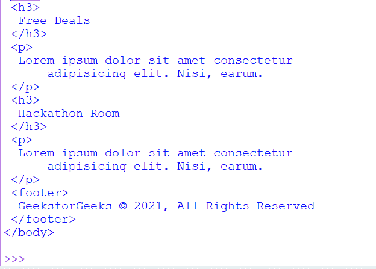

## 查找标签

标签可以正常找到，并使用 `print()` 正常打印。

**示例:**

```python
# Importing BeautifulSoup class from the bs4 module
from bs4 import BeautifulSoup

# Opening the html file
HTMLFile = open("index.html", "r")

# Reading the file
index = HTMLFile.read()

# Creating a BeautifulSoup object and specifying the parser
Parse = BeautifulSoup(index, 'lxml')

# Printing html code of some tags
print(Parse.head)
print(Parse.h1)
print(Parse.h2)
print(Parse.h3)
print(Parse.li)
```

**输出:**

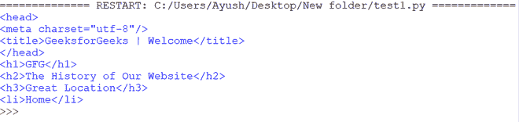

## 遍历标签

`recursiveChildGenerator` 方法用于遍历标签，从文件中递归查找标签内的所有标签。

**示例:**

```python
# Importing BeautifulSoup class from the bs4 module
from bs4 import BeautifulSoup

# Opening the html file
HTMLFile = open("index.html", "r")

# Reading the file
index = HTMLFile.read()

# Creating a BeautifulSoup object and specifying the parser
S = BeautifulSoup(index, 'lxml')

# Using the recursiveChildGenerator method to traverse the html file
for TraverseTags in S.recursiveChildGenerator():
  # Traversing the names of the tags
    if TraverseTags.name:
      # Printing the names of the tags
        print(TraverseTags.name)
```

**输出:**

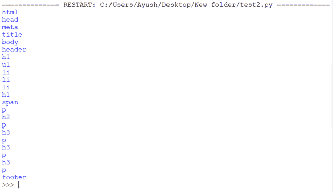

## 解析标签的名称和文本属性

使用标签的 `name` 属性打印其名称，使用 `text` 属性打印其文本。以下代码打印文件中 `ul` 标签的代码、名称和文本。

**示例:**

```python
# Importing BeautifulSoup class from the bs4 module
from bs4 import BeautifulSoup

# Opening the html file
HTMLFile = open("index.html", "r")

# Reading the file
index = HTMLFile.read()

# Creating a BeautifulSoup object and specifying the parser
S = BeautifulSoup(index, 'lxml')

# Printing the Code, name, and text of a tag
print(f'HTML: {S.ul}, name: {S.ul.name}, text: {S.ul.text}')
```

**输出:**

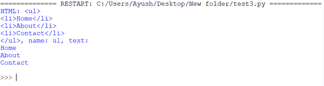

## 查找标签的子标签

`children` 属性用于获取标签的子级。`Children` 属性返回的元素之间可能包含文本节点，我们添加了一个条件 `e.name is not None` 来只打印文件中标签的名称。

**示例:**

```python
# Importing BeautifulSoup class from the bs4 module
from bs4 import BeautifulSoup

# Opening the html file
HTMLFile = open("index.html", "r")

# Reading the file
index = HTMLFile.read()

# Creating a BeautifulSoup object and specifying the parser
S = BeautifulSoup(index, 'lxml')

# Providing the source
Attr = S.html

# Using the Children attribute to get the children of a tag
# Only contain tag names and not the spaces
Attr_Tag = [e.name for e in Attr.children if e.name is not None]

# Printing the children
print(Attr_Tag)
```

**输出:**

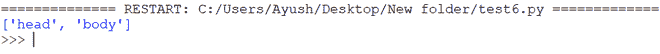

**在标签的所有级别查找孩子:**

`descendants` 属性用于从文件中获取标签的所有后代（所有级别的子代）。

**示例:**

```python
# Importing BeautifulSoup class from the bs4 module
from bs4 import BeautifulSoup

# Opening the html file
HTMLFile = open("index.html", "r")

# Reading the file
index = HTMLFile.read()

# Creating a BeautifulSoup object and specifying the parser
S = BeautifulSoup(index, 'lxml')

# Providing the source
Des = S.body

# Using the descendants attribute
Attr_Tag = [e.name for e in Des.descendants if e.name is not None]

# Printing the children
print(Attr_Tag)
```

**输出:**

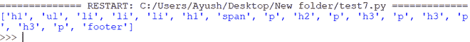

## 查找标签的所有元素

**使用 `find_all()`:**

`find_all` 方法用于从文件中查找 `p` 标签内的所有元素（名称和文字）。

**示例:**

```python
# Importing BeautifulSoup class from the bs4 module
from bs4 import BeautifulSoup

# Opening the html file
HTMLFile = open("index.html", "r")

# Reading the file
index = HTMLFile.read()

# Creating a BeautifulSoup object and specifying the parser
S = BeautifulSoup(index, 'lxml')

# Using the find_all method to find all elements of a tag
for tag in S.find_all('p'):

  # Printing the name, and text of p tag
    print(f'{tag.name}: {tag.text}')
```

**输出:**

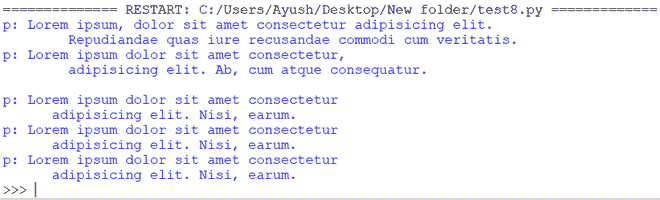

**CSS 选择器查找元素:**

使用 `select()` 方法，通过 CSS 选择器从文件的 `li` 标签中找到第二个元素。

**示例:**

```python
# Importing BeautifulSoup class from the bs4 module
from bs4 import BeautifulSoup

# Opening the html file
HTMLFile = open("index.html", "r")

# Reading the file
index = HTMLFile.read()

# Creating a BeautifulSoup object and specifying the parser
S = BeautifulSoup(index, 'lxml')

# Using the select method
# Prints the second element from the li tag
print(S.select('li:nth-of-type(2)'))
```

**输出:**

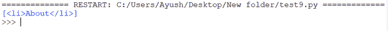