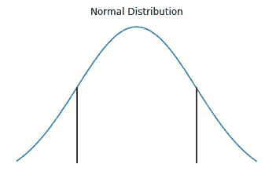
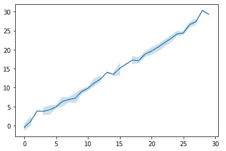
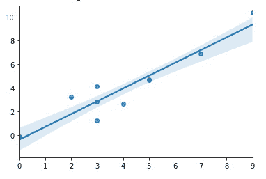
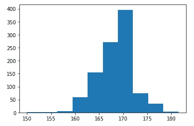

# 如何用 Python 绘制置信区间？

> 原文：[https://www.geeksforgeeks.org/how-to-plot-a-confidence-interval-in-python/](https://www.geeksforgeeks.org/how-to-plot-a-confidence-interval-in-python/)

置信区间是一种从观测数据的统计中计算出来的估计值，它给出了一个可能包含具有特定置信水平的总体参数的数值范围。

平均值的置信区间是总体平均值可能位于的一系列值。如果我对明天的天气做一个-100度到+100度之间的预测，我可以100%确定这是正确的。然而，如果我把温度预测在20.4到20.5摄氏度之间，我就没那么自信了。注意随着间隔的减小，置信度是如何降低的。这同样适用于统计置信区间，但它们也依赖于其他因素。

一个95%的置信区间，会告诉我们，如果从总体中抽取无限数量的样本，计算每次的区间，那么在那些区间的95%中，区间将包含真实的总体均值。因此，对于一个样本，我们可以计算样本平均值，并从中得出一个区间，该区间很可能包含真实的总体平均值。



两条黑线下的区域显示了95%的置信区间。

置信区间是杰吉·内曼在1937年发表的一篇论文中提出的一个概念。置信区间有各种类型，最常用的有：均值的置信区间、中位数的置信区间、均值差的置信区间、比例的置信区间和比例差的置信区间。

让我们看看Python是如何做到这一点的。

## 使用 `lineplot()` 计算置信区间

在Python的数据可视化库Seaborn中提供的`lineplot()`功能最适合显示一段时间内的趋势，但是它也有助于绘制置信区间。

**语法：**

```python
sns.lineplot(x=None, y=None, hue=None, size=None, style=None, data=None, palette=None, hue_order=None, hue_norm=None, sizes=None, size_order=None, size_norm=None, dashes=True, markers=None, style_order=None, units=None, estimator='mean', ci=95, n_boot=1000, sort=True, err_style='band', err_kws=None, legend='brief', ax=None, **kwargs)
```

**参数：**

*   `x`, `y`：输入数据变量；必须是数字。可以直接传递数据或引用数据中的列。
*   `hue`：将产生不同颜色线条的分组变量。可以是分类的，也可以是数字的，尽管颜色映射在后一种情况下会有不同的表现。
*   `style`：分组变量，将产生具有不同破折号和/或标记的线条。可以有数字数据类型，但将始终被视为分类数据类型。
*   `data`：整齐的（“长格式”）数据帧，其中每一列是一个变量，每一行是一个观察值。
*   `markers`：确定如何为不同级别的样式变量绘制标记的对象。
*   `legend`：如何绘制图例。如果“brief”，数字“hue”和“size”变量将以均匀间隔的值的样本表示。

**返回：** 包含绘图的轴对象。

默认情况下，该图在`x`的每个值上聚合多个`y`值，并显示中心趋势的估计值和该估计值的置信区间。

**示例：**

```python
# import libraries
import numpy as np
import seaborn as sns
import matplotlib.pyplot as plt

# generate random data
np.random.seed(0)
x = np.random.randint(0, 30, 100)
y = x+np.random.normal(0, 1, 100)

# create lineplot
ax = sns.lineplot(x, y)
```

在上面的代码中，变量`x`将存储100个从0（包括）到30（不包括）的随机整数，变量`y`将存储100个来自高斯（正态）分布的样本，该分布以0为中心，标准差为1。NumPy运算通常是在一个元素接一个元素的基础上对数组对进行的。在最简单的情况下，两个数组必须具有完全相同的形状，如上例所示。最后，在seaborn库的帮助下，默认以95%的置信区间创建线图。置信区间可以很容易地通过改变参数`ci`的值来改变，该值在[0, 100]的范围内，这里我没有传递这个参数，因此它考虑默认值95。



浅蓝色阴影表示该点周围的置信度。如果置信度较高，阴影线会更粗。

## 使用 `regplot()` 计算置信区间

`seaborn.regplot()`有助于绘制数据和线性回归模型拟合。该功能还允许绘制置信区间。

**语法：**

```python
seaborn.regplot(x=None, y=None, data=None, x_estimator=None, x_bins=None, x_ci='ci', scatter=True, fit_reg=True, ci=95, n_boot=1000, units=None, order=1, logistic=False, lowess=False, robust=False, logx=False, x_partial=None, y_partial=None, truncate=False, dropna=True, x_jitter=None, y_jitter=None, label=None, color=None, marker='o', scatter_kws=None, line_kws=None, ax=None)
```

**参数：** 部分主要参数描述如下：

*   `x`, `y`：这些是输入变量。如果是字符串，这些应该与“data”中的列名相对应。当pandas对象被使用时，轴将被标上系列名称。
*   `data`：这是数据帧，其中每一列是一个变量，每一行是一个观察值。
*   `lowess`：（可选）该参数取布尔值。如果为“true”，则使用“statsmodels”来估计非参数LOWESS模型（局部加权线性回归）。
*   `color`：（可选）应用于所有绘图元素的颜色。
*   `marker`：（可选）用于散点图字形的标记。

**返回：** 包含绘图的轴对象。

基本上，它在散点图中包含一条回归线，有助于看到两个变量之间的任何线性关系。下面的例子将展示如何使用它来绘制置信区间。

**示例：**

```python
# import libraries
import numpy as np
import seaborn as sns
import matplotlib.pyplot as plt

# create random data
np.random.seed(0)
x = np.random.randint(0, 10, 10)
y = x+np.random.normal(0, 1, 10)

# create regression plot
ax = sns.regplot(x, y, ci=80)
```

`regplot()`函数的工作方式与`lineplot()`相同，默认情况下置信区间为95%。通过改变参数`ci`的值，可以很容易地改变置信区间，该值在[0, 100]的范围内。这里我传递了`ci=80`，这意味着不是默认的95%置信区间，而是绘制了80%置信区间。



浅蓝色阴影的宽度表示回归线周围的置信水平。

## 使用自举法计算置信区间

自举法是一种使用随机抽样和替换的测试/度量。它给出了精确度的度量（偏差、方差、置信区间、预测误差等）来抽样估计。它允许使用随机抽样方法来估计大多数统计量的抽样分布。它也可以用于构建假设检验。

**示例：**

```python
# import libraries
import pandas
import numpy
from sklearn.utils import resample
from sklearn.metrics import accuracy_score
from matplotlib import pyplot as plt

# load dataset
x = numpy.array([180,162,158,172,168,150,171,183,165,176])

# configure bootstrap
n_iterations = 1000 # here k=no. of bootstrapped samples
n_size = int(len(x))

# run bootstrap
medians = list()
for i in range(n_iterations):
   s = resample(x, n_samples=n_size);
   m = numpy.median(s);
   medians.append(m)

# plot scores
plt.hist(medians)
plt.show()

# confidence intervals
alpha = 0.95
p = ((1.0-alpha)/2.0) * 100
lower =  numpy.percentile(medians, p)
p = (alpha+((1.0-alpha)/2.0)) * 100
upper =  numpy.percentile(medians, p)

print(f"\n{alpha*100} confidence interval {lower} and {upper}")
```

导入所有必要的库后，创建一个大小为`n=10`的样本`S`，并将其存储在变量`x`中。使用一个简单的循环生成1000个人工样本（`k=1000`），每个样本大小为`m=10`（因为`m <= n`）。这些样本被称为自举样本。计算它们的中位数并存储在列表`medians`中。借助matplotlib库绘制来自1000个自举样本的中位数的直方图，并使用样本统计量的公式计算统计量的总体值的置信区间上限和下限，基于样本数据计算指定置信水平。



95.0的置信区间在161.5和176.0之间。