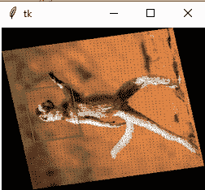

# 如何在 Python-Tkinter 中调整 Image 的大小？

> 原文: [https://www.geeksforgeeks.org/how-to-resize-image-in-python-tkinter/](https://www.geeksforgeeks.org/how-to-resize-image-in-python-tkinter/)

**先决条件:**

*   `tkinter`
*   [Pillow](https://www.geeksforgeeks.org/python-pillow-a-fork-of-pil/)

Python 为开发图形用户界面提供了多个选项。在所有的 GUI 方法中，`Tkinter` 是最常用的方法。它是 Python 附带的 `Tk` 图形用户界面工具包的标准 Python 接口。Python 搭配 `Tkinter` 是创建 GUI 应用程序最快最简单的方法。使用 `Tkinter` 创建图形用户界面是一项简单的任务。

在本文中，我们将学习如何在 `Tkinter` 中使用 Python 调整图像的大小。在 `Tkinter` 中，没有内置的方法或任何包来处理图像。这里我们就用 [**Pillow**](https://www.geeksforgeeks.org/python-pillow-a-fork-of-pil/) 库来处理图像。

## 分步实施

1.  导入所需库。

```python
# Import Module
from tkinter import *
from PIL import Image, ImageTk
```

2.  使用 `Pillow` 库中的 `open()` 方法读取图像。

**语法:**

```python
Image.open("Enter Image File Path", mode='r', **attr)
```

```python
# Read the Image
image = Image.open("Image File Path")
```

3.  使用 [`resize()`](https://www.geeksforgeeks.org/python-pil-image-resize-method/) 方法。它返回该图像的一个调整大小的副本。

**语法:**

```python
Image.resize((width,height) , resample=3, **attr)
```

```python
# Resize the image using resize() method
resize_image = image.resize((width, height))
```

4.  添加标签并添加调整大小的图像。

```python
img = ImageTk.PhotoImage(resize_image)

# create label and add resize image
label1 = Label(image=img)
label1.image = img
label1.pack()
```

## 完整实现代码

```python
# Import Module
from tkinter import *
from PIL import Image, ImageTk

# Create Tkinter Object
root = Tk()

# Read the Image
image = Image.open("Image File Path")

# Resize the image using resize() method
resize_image = image.resize((width, height))

img = ImageTk.PhotoImage(resize_image)

# create label and add resize image
label1 = Label(image=img)
label1.image = img
label1.pack()

# Execute Tkinter
root.mainloop()
```

**输出:**



**250×200**

在上例中，在图像文件路径处输入文件名或路径，并根据需要输入宽度和高度的值。