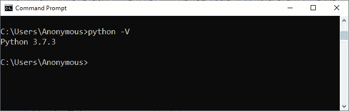
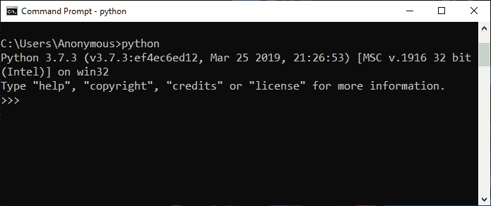
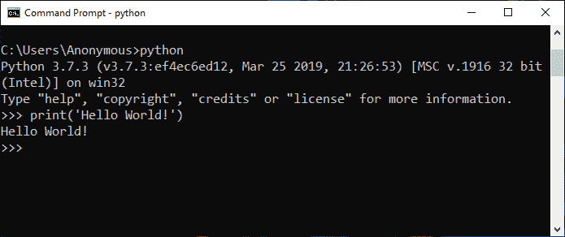
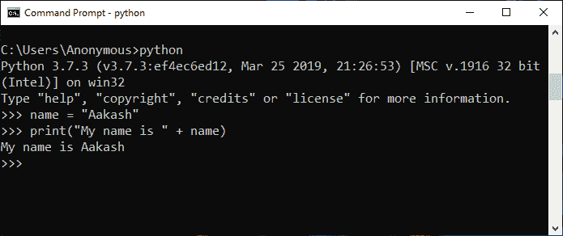
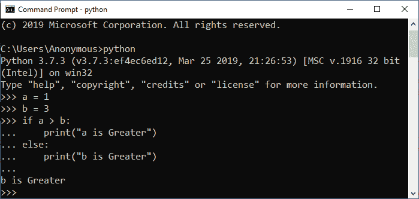
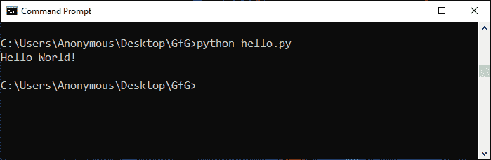
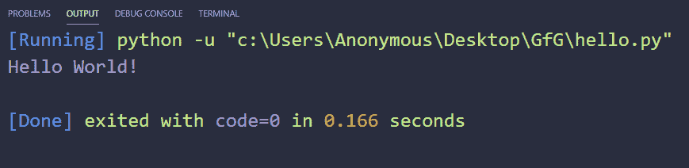
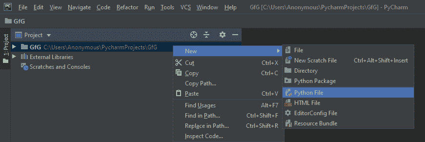
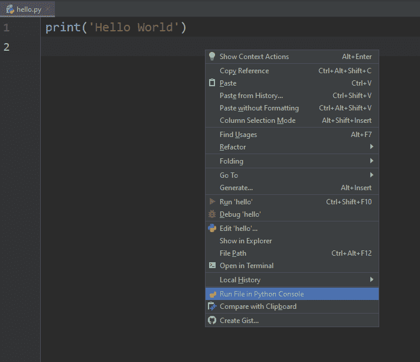
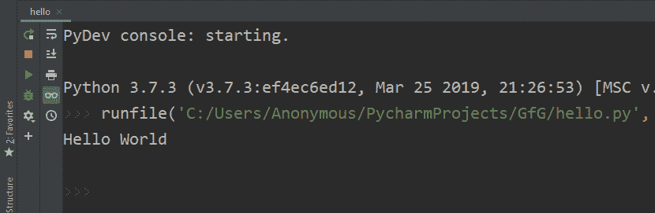

# 如何运行 Python 脚本

> 原文：[https://www.geeksforgeeks.org/how-to-run-a-python-script/](https://www.geeksforgeeks.org/how-to-run-a-python-script/)

[Python](https://www.geeksforgeeks.org/python-programming-language/) 是一种众所周知的高级编程语言。Python 脚本基本上是一个包含用 Python 编写的代码的文件。包含 python 脚本的文件扩展名为`.py`，如果在 windows 机器上运行，也可以扩展名为`.pyw`。要运行 python 脚本，我们需要一个需要下载和安装的 python 解释器。

下面是一个简单的 python 脚本来打印`Hello World!`：

```py
print('Hello World!')
```

这里的`print()`功能是打印出括号内写的任何文字。我们可以使用上面脚本中显示的单引号或双引号来编写我们想要打印的文本。

如果您来自任何其他语言，那么您还会注意到语句末尾没有分号，就像 Python 一样，您不需要指定行尾。此外，我们不需要包含或导入任何文件来运行简单的 python 脚本。

运行 python 脚本的方式不止一种，但是在走向运行 python 脚本的不同方式之前，我们首先要检查系统上是否安装了 [python 解释器](https://www.geeksforgeeks.org/python-language-introduction/)。因此在窗口中，打开`cmd`（命令提示符）并键入以下命令。

```py
python -V 
```

该命令将给出安装的 Python 解释器的版本号，否则将显示一个错误。



## 运行 Python 脚本的不同方法

以下是我们运行 Python 脚本的方法。

1.  交互方式
2.  命令行
3.  文本编辑器（VS 代码）
4.  IDE（PyCharm）

### 1. 交互方式

在交互模式下，您可以按顺序逐行运行脚本。

要进入交互模式，您必须在 windows 机器上打开命令提示符，键入`python`并按下`Enter`。



**示例 1：**
在交互模式下运行以下一行：

```py
print('Hello World !')
```

**输出：**



**例 2：**
在交互模式下，一条一条的运行以下几行：

```py
name = "Aakash"
print("My name is " + name)
```

**输出：**



**例 3：**
在交互模式下，依次运行以下一行：

```py
a = 1
b = 3
if a > b:
    print("a is Greater") 
else:
    print("b is Greater")
```

**输出：**



**注意：** 要退出此模式，请按`Ctrl+Z`，然后按“回车”或键入`exit()`，然后按`Enter`。

### 2. 命令行

要在命令行中运行存储在`.py`文件中的 Python 脚本，我们必须在命令提示符下的文件名前写入`python`关键字。

```py
python hello.py
```

你可以写自己的文件名来代替`hello.py`。

**输出：**



### 3. 文本编辑器（VS Code）

要在像 [VS Code (Visual Studio Code)](https://code.visualstudio.com/) 这样的文本编辑器上运行 Python 脚本，您将需要执行以下操作：

*   进入扩展部分或在 windows 上按`Ctrl+Shift+X`，然后搜索并安装名为`Python`和`Code Runner`的扩展。之后重启`vs code`。
*   现在，创建一个名为`hello.py`的新文件，并在其中写入以下代码：

```py
print('Hello World!')
```

*   然后，在文本区域的任意位置单击鼠标右键，选择显示`Run Code`的选项或按`Ctrl+Alt+N`运行代码。

**输出：**


### 4. IDE（PyCharm）

要在像 PyCharm 这样的 [IDE（集成开发环境）](https://www.jetbrains.com/pycharm/)上运行 Python 脚本，您必须执行以下操作：

*   创建新项目。
*   将该项目命名为`GfG`，然后单击“创建”。
*   选择我们在上一步中指定的项目名称作为根目录。**右键单击**它，转到**新建**并点击`Python file`选项。然后将文件名命名为`hello`（您可以根据项目要求指定任何名称）。这将在项目根目录中创建一个`hello.py`文件。
    **注意：** 您不必指定扩展名，因为它会自动获取。



*   现在编写下面的 Python 脚本来打印消息：

```py
print('Hello World !')
```

*   要运行此 python 脚本，**右键单击**并选择`Run File in Python Console`选项。这将在底部打开一个控制台框并在那里显示输出。我们也可以使用 IDE 右上角的**绿色播放按钮**运行。



**输出：**
