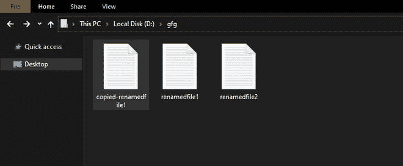
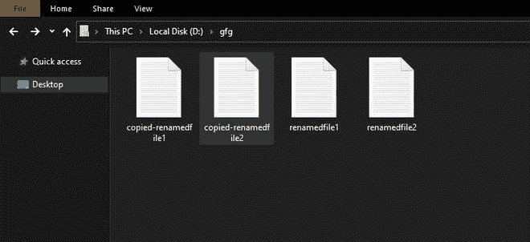

# 如何使用 Python 保存来自用户的文件名为的文件？

> 原文: [https://www.geeksforgeeks.org/how-to-save-file-with-file-name-from-user-using-python/](https://www.geeksforgeeks.org/how-to-save-file-with-file-name-from-user-using-python/)

**先决条件:**
*   [Python 中的文件处理](https://www.geeksforgeeks.org/file-handling-python/)
*   [Python 中文本文件的读写](https://www.geeksforgeeks.org/reading-writing-text-files-python/)

使用 python 文件处理概念可以实现用用户的自定义名称保存文件。Python 提供了处理文件的内置函数。通过创建新文件、重命名现有文件、制作文件副本(另存为)，可以使用用户首选名称保存文件。让我们详细讨论这些。

## 创建新文件

### 方法 1: 使用 `open()` 函数

我们可以使用 `open()` 函数创建一个新文件，访问模式如下所示。

> **语法:**
> `open(filepath, mode)`
>
> **访问模式:**
> *   **只写(`'w'`):** 如果文件不存在，则创建一个新文件进行写入，否则会截断并覆盖现有文件。
> *   **写入和读取(`'w+'`):** 创建一个新文件用于读取&写入，如果该文件不存在，则截断并覆盖现有文件。
> *   **仅追加(`'a'`):** 创建一个新的写入文件，如果该文件不存在，否则正在写入的数据将被插入文件的末尾。
> *   **追加并读取(`'a+'`):** 创建一个新文件进行读取&写入，如果该文件不存在，否则正在写入的数据将被插入文件末尾。

**接近**
*   从用户处获取文件名
*   以提到的访问模式打开文件
*   使用输入的名称创建此文件

**示例:**

```python
# path of this script
directory = "D:\gfg\\"

# get fileName from user
filepath = directory + input("Enter filename: ")

# Creates a new file
with open(filepath, 'w+') as fp:
    pass
```

**输出:**

```python
Enter filename: newgfgfile.txt
```


### 方法 2: 使用 `pathlib` 库

`pathlib` 提供了一组处理文件系统路径的类。我们可以使用 `touch()` 方法在给定路径创建文件，它用当前时间更新文件修改时间，并将 `exist_ok` 标记为 `True`，否则，将引发 **FileExistsError**。

**语法:**
`Path.touch(mode=0o666, exist_ok=True)`

**接近**
*   导入模块
*   从用户处获取文件名
*   使用输入的名称创建文件

**示例:**

```python
# import pathlib module
import pathlib

# path of this script
directory = "D:\gfg\\"

# get fileName from user
filepath = directory + input("Enter filename:")

# To create a file
pathlib.Path(filepath).touch()
```

**输出:**

```python
Enter filename:gfgfile2.txt
```


## 重命名文件

### 方法 1: 使用 `os` 模块

Python 的 `os` 模块包括与操作系统通信的功能。在这里，我们可以使用 `rename()` 方法，用用户指定的名称**保存一个文件。**

**语法:**
`os.rename(src, dest, *, src_dir_fd=None, dst_dir_fd=None)`

**进场:**
*   导入模块
*   获取源文件名
*   获取目标文件名
*   将源文件重命名为目标文件或目录
*   如果目标文件已经存在，操作将失败并显示错误。

**示例:**

```python
# import os library
import os

# get source file name
src = input("Enter src filename:")

# get destination file name
dest = input("Enter dest filename:")

# rename source file name with destination file name
os.rename(src, dest)
```

**输出:**
> Enter src filename: D:\gfg\newgfile.txt
> Enter dest filename: D:\gfg\renamedfile1.txt


### 方法 2: 使用 `pathlib` 库

`pathlib` 还提供了 `rename()` 函数来更改文件名，这或多或少与上面给出的目的相同。

**语法:**
`Path(filepath).rename(target)`

**进场:**
*   导入模块
*   获取源文件名
*   获取目标文件名
*   将源文件或目录重命名为指定的目标
*   将路径的新实例返回到目标。(在 Unix 上，如果目标存在并且用户有权限，它将被替换。)

**示例:**

```python
# import pathlib module
import pathlib

# get source file name
src = input("Enter src filename:")

# get destination file name
target = input("Enter target filename:")

# rename source file name with target file name
pathlib.Path(src).rename(target)
```

**输出:**
> Enter src filename: D:\gfg\gfile2.txt
> Enter target filename: D:\gfg\renamedfile2.txt


## 复制或复制文件

### 方法 1: 使用 `os` 模块

我们可以使用 `popen()` 方法将源文件复制到用户指定名称的目标文件中。

**语法:**
`os.popen(cmd, mode='r', buffering=-1)`

要执行的 `os.popen()` get 命令作为第一个参数，访问模式作为第二个参数，可以读取(`'r'`)或写入(`'w'`)，最后是缓冲区大小。默认模式为读取，0 表示无缓冲，正整数表示缓冲区大小。

**进场:**
*   导入模块
*   获取源文件名
*   获取目标文件名
*   将源复制到目标

**示例:**

```python
# import os module
import os

# get source file name
src = input("Enter src filename:")

# get destination file name
destination = input("Enter target filename:")

# copies source to destination file
os.popen(f"copy {src} {destination}")
```

**输出:**
> Enter src filename: D:\gfg\renamedfile1.txt
> Enter target filename: D:\gfg\copy-renamedfile1.txt



### 方法 2: 使用 `shutil` 模块

`shutil` 模块对文件和文件集合提供了几种高级操作。其 `copyfile()` 方法用于使用用户首选名称重命名文件。

**语法:**
`shutil.copyfile(src_file, dest_file, *, follow_symlinks=True)`

**进场:**
*   导入模块
*   获取源文件名
*   获取目标文件名
*   将源文件复制到新的目标文件。如果两个文件名指定相同的文件，将引发 **SameFileError**，如果目标文件已经存在，将被替换。

**示例:**

```python
# import shutil module
import shutil

# get source file name
src = input("Enter src filename:")

# get destination file name
dest = input("Enter target filename:")

# copies source file to a new destination file
shutil.copyfile(src, dest)
```

**输出:**
> Enter src filename: D:\gfg\renamedfile2.txt
> Enter target filename: D:\gfg\copy-renamedfile2.txt

